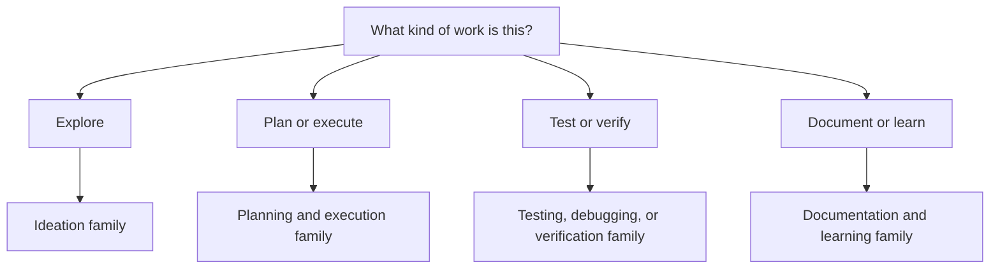

# Skills by intention

!!! info "About this page"
    **What you will learn:** how to choose a skill family without memorizing a long list of entrypoints.

    **For:** developers, tech leads, AI champions, and Harness Engineers.

    **Read this when:** you are introducing skills into a workflow or deciding what should become reusable guidance.

`ml-python-base` currently exposes curated skills from `.github/skills/`, plus optional external skills. Its generated manifest is the operational inventory. The repository does not yet publish a formal family field, so the guide uses intention based groupings as a navigation aid, not as a second runtime taxonomy.

## Families in the current reference set

| Intention | Typical work | Current examples |
| --- | --- | --- |
| Bootstrap | Start or adopt a governed workspace | `bootstrap_project`, `bootstrap_company_brain` |
| Ideation | Explore a problem before committing to a solution | `brainstorm_quick` |
| Planning and execution | Turn intent into an actionable implementation | `generate_migration_plan`, `plan_and_execute_feature` |
| Architecture and design | Establish boundaries and reusable contracts | `create_domain_contract`, `refactor_to_clean_architecture`, `create_mle_agent_package` |
| Testing and debugging | Find failures and create executable checks | `generate_e2e_tests`, `systematic_debugging` |
| Verification | Check module structure and final outcomes | `validate_module_structure`, `verify_changes` |
| Documentation and learning | Explain a change and retain the lesson | `generate_implementation_docs`, `retrospective` |
| Research | Check information that may have changed | `research_current_info` |

External skills are useful when a domain needs them, but they should not silently become a new source of truth. Record their origin, review their instructions, and keep the governed projection reproducible.

## Select by job, not by name

The skill should make a repeatable procedure easier to follow. It should not replace judgment, hide acceptance criteria, or turn every small task into a ceremony. For the implementation details, see the [ml-python-base skills reference](../reference-implementation/ml-python-base/skills.md).

!!! note "Catalog alignment"
    When `ml-python-base` publishes a generated family catalog, this page should consume that catalog. Until then, the names above are derived from the current curated files and are intentionally kept at the family level.
