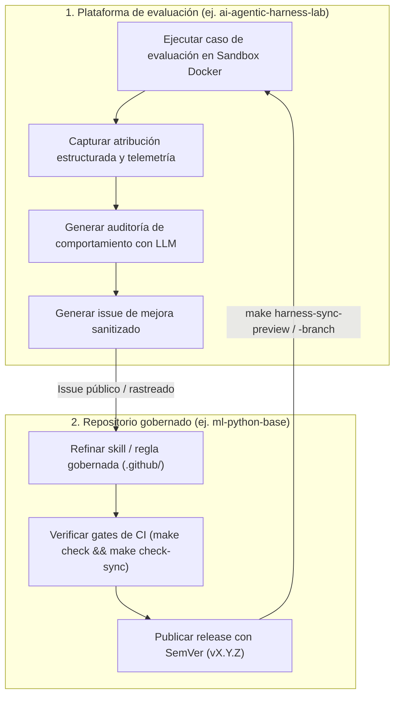
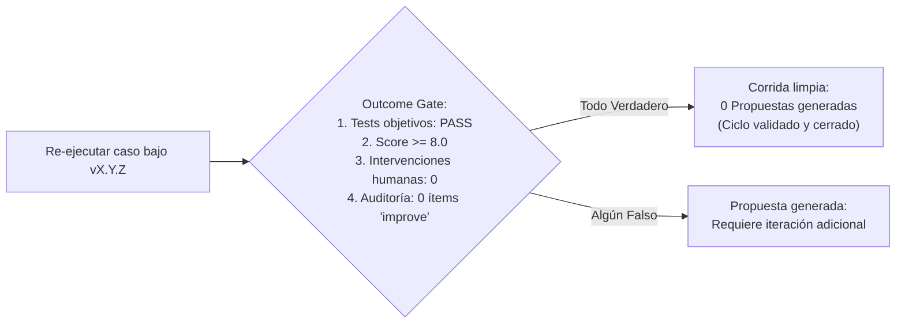

# Mejora continua del harness

La **Mejora continua del harness** es la metodología operativa para traducir la evidencia obtenida en las evaluaciones en mejoras versionadas y verificadas mediante quality gates para el harness de ingeniería.

En lugar de modificar prompts o reglas de manera improvisada en múltiples repositorios, los equipos gestionan su harness de ingeniería con el mismo rigor que una librería compartida de nivel empresarial: mediante **evidencia, seguimiento de issues sanitizados, releases con SemVer y re-medición**.

---

## El ciclo de mejora continua de ciclo cerrado

El ciclo de mejora opera a través de dos fronteras sincronizadas: la **Plataforma de evaluación** y el **Template gobernado de repositorios**:

---

## Los 4 pasos del ciclo de mejora

### 1. Evidencia (Observada en el Lab)
- Ejecuta un benchmark o caso de evaluación interna dentro de un contenedor Docker aislado.
- Revisa el **Panel de atribución** (qué reglas y skills fueron consultadas) y la **Auditoría de comportamiento** (¿el agente cayó en bucles de comandos, violó estándares de estilo o alucinó flags en CLI?).
- Aísla un **síntoma medible** (ej. *"el agente releyó el mismo archivo de configuración 8 veces sin actuar; los comandos repetidos equivalentes deben ser $\le 2$*").

### 2. Generación del issue sanitizado
- Genera un issue en Markdown sanitizado a partir de la ejecución de evaluación.
- **Protocolo de sanitización**: Elimina automáticamente rutas locales, nombres de hosts, tokens de API y variables de entorno privadas.
- El issue resultante define:
  - La **skill o regla objetivo** (`.github/skills/systematic_debugging.md`).
  - El **comportamiento fallido** observado en la corrida.
  - La **propuesta de corrección**.
  - El **criterio cuantitativo de éxito** (`repeated_equivalent_commands <= 2`).

### 3. Iteración y release (En el template gobernado)
- En el repositorio template gobernado, crea una rama de desarrollo.
- Actualiza la skill o regla bajo `.github/`.
- Ejecuta los quality gates locales (`make check`, `make check-sync`) para asegurar que los adaptadores multi-herramienta (`CLAUDE.md`, `AGENTS.md`, `OPENCODE.md`) se regeneren y sincronicen.
- Mergea el PR y crea un tag inmutable con SemVer (ej. `v1.4.0`).

### 4. Re-medición y validación (Cierre del ciclo)
- En la plataforma de evaluación, sincroniza la versión candidata en un worktree aislado de Git.
- Vuelve a ejecutar exactamente el mismo caso de evaluación con el mismo modelo, prompt y parámetros de sandbox.
- Compara la atribución, el consumo de tokens y las auditorías de comportamiento:
  - ¿Desapareció el síntoma medible?
  - ¿Aprobó la suite de tests objetivos?
  - ¿La corrida produjo **cero propuestas de mejora** (outcome gate limpio)?
- Si se valida, promueve el release del harness en todos los repositorios productivos de la organización.

---

## El gate determinista de resultados (Outcome Gate)

Una innovación clave en la gestión del ciclo de vida del harness es el **gate determinista de resultados**:

Una corrida que cumple limpiamente con todos los criterios objetivos y de comportamiento genera automáticamente **cero propuestas**. Cuando re-ejecutar el mismo caso en todo tu tier de modelos (ej. Claude Haiku, Sonnet, Opus) arroja cero propuestas en cada combinación, el ciclo de mejora queda objetivamente cerrado.

---

## Estrategias de sincronización del harness

Al distribuir las mejoras del harness a los repositorios de desarrollo, los equipos emplean tres estrategias controladas:

| Estrategia | Mecanismo | Uso recomendado |
|---|---|---|
| **Preview Dry-Run** | `make harness-sync-preview REF=vX.Y.Z` | Inspección de diffs en modo solo lectura antes de modificar archivos del workspace. |
| **Candidate Worktree** | `make harness-sync-branch REF=vX.Y.Z` | Prepara los cambios en un Git worktree aislado (`.worktrees/candidate-vX.Y.Z`) para verificar gates antes de mergear a `main`. |
| **Sincronización directa** | `make template-sync REF=vX.Y.Z` | Actualización directa para cambios menores no disruptivos en repositorios en desarrollo activo. |

---

### Recursos relacionados
- **[Construir una suite interna de evaluación](internal-evaluation-suite.md)**
- **[De fallos de agentes a casos de regresión](failures-to-regression-cases.md)**
- **[Gobernanza y ownership del equipo](team-governance.md)**
