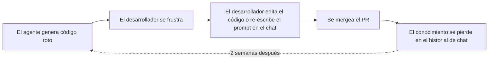
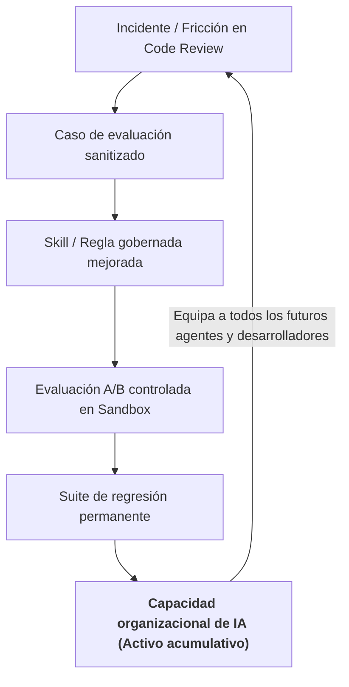

# De fallos de agentes a casos de regresión

Uno de los principios fundamentales de Harness Engineering es tender un puente entre la ingeniería de calidad de software tradicional y el desarrollo asistido por agentes de IA.

En la ingeniería de software madura, los equipos nunca dejan pasar un bug de producción sin escribir un test de regresión. En el desarrollo con agentes, **debemos aplicar exactamente la misma disciplina ante los fallos de la IA.**

---

## La analogía central con la ingeniería de software tradicional

```mermaid
flowchart TD
    subgraph Traditional["Ingeniería de Software Tradicional"]
        direction LR
        B["1. Bug en producción"] --> R1["2. Reproducir localmente"]
        R1 --> T1["3. Escribir test unitario/integrado (Falla)"]
        T1 --> F1["4. Corregir código en la aplicación"]
        F1 --> RT1["5. Commitear test a suite de regresión permanente en CI"]
    end

    subgraph Agentic["Ingeniería con Agentes de IA"]
        direction LR
        AF["1. Fallo / Alucinación del Agente"] --> R2["2. Reproducir en Sandbox"]
        R2 --> T2["3. Crear caso de evaluación reproducible"]
        T2 --> F2["4. Mejorar Regla / Skill / Quality Gate"]
        F2 --> RT2["5. Commitear caso a suite de regresión permanente del Harness"]
    end
```

| Ingeniería de Software Tradicional | Ingeniería de Agentes de IA |
|---|---|
| **Defecto** | El código arroja una excepción no controlada o vulnera la lógica del negocio. | El agente vulnera la arquitectura, ignora reglas de seguridad o entra en bucles erráticos. |
| **Reproducción** | Test unitario o escenario de integración mínimo que reproduce el bug. | Commit base mínimo del repositorio + prompt que reproduce el fallo del agente. |
| **Mecanismo de solución** | Parchear el código fuente en los archivos de la aplicación. | Mejorar una skill gobernada en `.github/skills/`, refinar una regla o añadir un gate. |
| **Verificación** | Correr el test runner (`pytest`, `jest`) para verificar que la prueba pasa. | Ejecutar el caso de evaluación en múltiples corridas dentro de un sandbox aislado. |
| **Prevención** | El test se ejecuta en cada PR mediante CI para prevenir regresiones. | El caso se ejecuta en cada release del harness para prevenir regresiones. |

---

## Por qué el prompting efímero fracasa

Cuando los desarrolladores operan sin un harness gobernado, los errores de los agentes desencadenan un **ciclo de corrección efímero**:

En este modo no ingenieril:
1. El desarrollador invierte tiempo corrigiendo manualmente el problema.
2. La causa raíz (falta de guía en una skill, regla ambigua o ausencia de quality gate) queda sin resolver.
3. La corrección del prompt queda atrapada en el historial privado de chat de ese desarrollador.
4. Otro ingeniero del equipo se enfrenta exactamente al mismo error poco tiempo después.

---

## El flywheel de conocimiento acumulativo

Al convertir cada fallo del agente en un caso de evaluación permanente, el conocimiento de ingeniería **se acumula de forma compuesta** en toda la organización:

### El efecto acumulativo:
- **Mes 1**: 10 casos de evaluación base protegen los límites de la arquitectura principal.
- **Mes 3**: 50 casos codifican migraciones de bases de datos, patrones de concurrencia y restricciones de seguridad.
- **Mes 6**: Más de 200 casos forman un benchmark automatizado. Cuando Anthropic, OpenAI o Google lanzan un nuevo modelo, la organización evalúa todo su stack contra la suite en cuestión de horas, sabiendo con precisión qué skills mejoran y cuáles sufren regresiones antes del despliegue general.

---

## Paso a paso: Convertir un fallo en un caso de regresión

### Paso 1: Capturar y aislar
Cuando un agente produzca un patch incorrecto o se bloquee en un bucle durante el desarrollo:
- Registra el **SHA del commit base** del repositorio.
- Registra el **prompt exacto de la tarea** y los archivos de contexto entregados.
- Registra el **síntoma no deseado** (ej. bloqueo exclusivo de tabla en migración, importaciones circulares, error no manejado).

### Paso 2: Crear el caso de evaluación
Define el caso en tu harness interno de evaluación:
- **Tarea**: El prompt sanitizado que describe el requerimiento.
- **Entorno**: Especificación del contenedor Docker con las versiones exactas de dependencias.
- **Comandos de validación**: Comandos deterministas en terminal (test unitario, linter, check de políticas) que fallen cuando el síntoma esté presente y pasen cuando se resuelva.

### Paso 3: Medir el baseline
Ejecuta el caso entre 5 y 10 veces utilizando el harness y modelo actuales sin modificaciones. Documenta la tasa de éxito del baseline (ej. `2/10 aprobados (20%)`).

### Paso 4: Refinar el harness
Aborda la causa raíz mejorando el sistema alrededor del agente:
- Crea o actualiza una skill modular (ej. `.github/skills/concurrency_debugging.md`).
- Añade una restricción arquitectónica explícita en `.github/standards.md`.
- Incorpora un quality gate automatizado en CI (`make check`).

### Paso 5: Re-evaluar y verificar
Ejecuta el caso entre 5 y 10 veces bajo la condición del harness mejorado (*Tratamiento*). Verifica que la tasa de éxito suba al umbral esperado (ej. `10/10 aprobados (100%)`) y que no se hayan producido bucles de comandos erráticos.

### Paso 6: Bloquear en la suite de regresión
Commitea el caso de evaluación al repositorio interno de evaluación. Toda versión futura del harness o migración de modelo deberá superar este caso antes de ser promovida.

---

### Recursos relacionados
- **[Construir una suite interna de evaluación](internal-evaluation-suite.md)**: Estructuración de casos a escala.
- **[Mejora continua del harness](continuous-harness-improvement.md)**: Flujo completo de propuestas.
- **[Patrón: De fallo a regresión](../patterns/failure-to-regression.md)**: Receta práctica de implementación.
