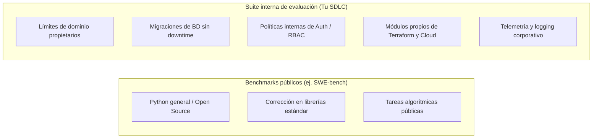
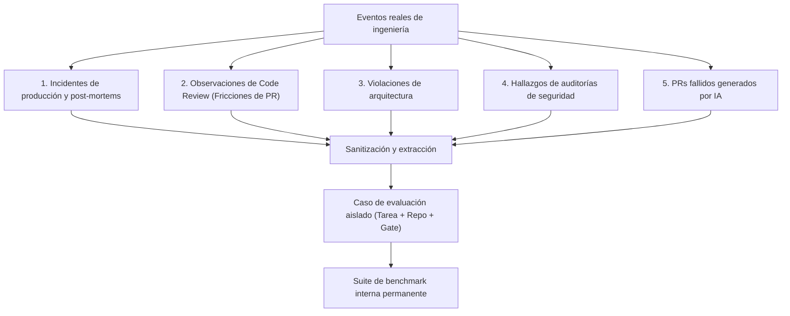

# Construir una suite de evaluación interna

Si bien los benchmarks públicos como **SWE-bench** proporcionan líneas base valiosas para medir la resolución de issues en proyectos abiertos, una organización de ingeniería obtiene su mayor retorno de inversión al construir su propia **suite interna de evaluación**.

Una suite interna de evaluación codifica la arquitectura específica de tu empresa, sus convenciones de diseño, sus restricciones de seguridad y sus lecciones aprendidas en producción en un benchmark reproducible y ejecutable.

---

## Por qué los benchmarks públicos no son suficientes

Los benchmarks públicos evalúan habilidades de programación generales (por ejemplo, corregir un bug en Django o SymPy). Sin embargo, no pueden evaluar si un agente de IA es capaz de operar con éxito dentro de tu entorno de ingeniería específico:



| Dimensión | Benchmarks públicos (SWE-bench) | Suite interna de evaluación |
|---|---|---|
| **Base de código** | Repositorios open source estándar | Patrones y stack tecnológico real de tu empresa |
| **Arquitectura** | Convenciones genéricas del framework | Tu arquitectura en capas (Dominio, App, Infra) |
| **Reglas de seguridad** | Paso de tests unitarios básicos | Seguridad productiva (zero-downtime, sin locks bloqueantes) |
| **Gobernanza** | Ejecución libre de herramientas | Skills gobernadas, MCPs específicos y gates de revisión |
| **Impacto en el negocio** | Métrica académica comparativa | Reducción directa en tiempo de ciclo y regresiones de PR |

---

## Categorías clave para casos de evaluación interna

Una suite interna eficaz cubre las competencias de ingeniería críticas del equipo:

### 1. Adherencia y capas de arquitectura
- **Tarea**: Implementar un nuevo endpoint REST/gRPC o funcionalidad de servicio.
- **Validación**: Verificar que las entidades del dominio permanezcan libres de dependencias de bases de datos o frameworks externos, y que las dependencias apunten estrictamente hacia adentro.

### 2. Migraciones de base de datos sin downtime
- **Tarea**: Agregar una columna no-nullable o renombrar una tabla en una base de datos con millones de registros.
- **Validación**: Garantizar que el agente genere una migración en múltiples fases (columna nullable, backfill por lotes, creación de índices en background) sin bloquear tablas en producción.

### 3. Concurrencia y corrección de race conditions
- **Tarea**: Resolver un fallo intermitente de lock distribuido o mutación asíncrona de estado.
- **Validación**: Suite de pruebas de estrés concurrente que ejecute hilos/corutinas en paralelo para verificar la ausencia de deadlocks.

### 4. Infraestructura como Código (Terraform / Kubernetes)
- **Tarea**: Actualizar recursos de red o almacenamiento en la nube.
- **Validación**: Verificación estática con políticas (`conftest`, `tflint`) que garantice la ausencia de recreaciones destructivas de recursos o aperturas indebidas de security groups.

### 5. Remediación de vulnerabilidades de seguridad
- **Tarea**: Corregir un hallazgo del OWASP Top 10 (inyección SQL, deserialización insegura, SSRF).
- **Validación**: Pruebas de seguridad unitarias que validen la parametrización de entradas sin omitir los controles de autenticación y autorización.

### 6. Instrumentación de observabilidad y telemetría
- **Tarea**: Añadir logging estructurado y trazas de OpenTelemetry en un flujo transaccional.
- **Validación**: Verificación automatizada que compruebe la propagación de trazas, emisión de métricas y la ausencia de datos sensibles (PII) en los logs.

---

## ¿De dónde surgen los casos de evaluación?

Los casos de evaluación no deben inventarse en el vacío. Se extraen directamente del día a día del equipo de ingeniería:



1. **Incidentes de producción y post-mortems**: Cada vez que un error causa una caída o requiere un hotfix de emergencia, sanitiza el incidente en un caso reproducible para garantizar que los agentes nunca repitan ese error.
2. **Comentarios de code review**: Comentarios recurrentes en PRs ("No llames a la base de datos dentro de este bucle", "Usa nuestro manejador de errores corporativo") son candidatos directos para nuevos casos y skills.
3. **PRs generados por IA que fallaron**: Cuando un agente genere código defectuoso durante el desarrollo cotidiano, captura el prompt exacto, el commit base y el síntoma de fallo.

---

## Anatomía de un caso de evaluación interno

Un caso de evaluación robusto consta de tres elementos deterministas:

```yaml
# Ejemplo de especificación de caso de evaluación
id: "internal-db-migration-zero-downtime"
title: "Agregar columna active_subscription a tabla users sin lock"
target_repo: "company/core-service"
base_commit: "9c3f81e"
task_description: |
  Agrega una columna booleana no-nullable `has_active_subscription` con valor por defecto `false`
  a la tabla `users` en Alembic, siguiendo las pautas corporativas de zero-downtime.

environment:
  docker_image: "company-eval-runner:latest"
  memory_limit: "4GB"
  cpu_limit: "2.0"
  timeout_seconds: 300

validation_commands:
  - "python -m pytest tests/migrations/test_zero_downtime.py"
  - "python scripts/lint_migrations.py"

rubric:
  level_0: "Fallo de sintaxis o error en la ejecución de la migración"
  level_1: "La migración se ejecutó pero aplicó un lock exclusivo de tabla"
  level_2: "Patrón de zero-downtime respetado; todos los tests pasaron exitosamente"
```

---

## Capacidad organizacional acumulativa

Con el tiempo, esta colección de casos se consolida como un **benchmark organizacional para el desarrollo asistido por IA**.

Cada vez que un proveedor lance un nuevo modelo de frontera (ej. Claude 4.5, GPT-5) o tu equipo refactorice una skill:
1. Ejecutas tu suite interna de evaluación contra el nuevo modelo o versión de harness.
2. Obtienes un reporte cuantitativo y objetivo de tasas de éxito, deltas de costo y riesgos de regresión.
3. Tomas decisiones basadas en evidencia técnica sobre la adopción de nuevas herramientas o modelos.

---

### Recursos relacionados
- **[De fallos de agentes a casos de regresión](failures-to-regression-cases.md)**: Cómo convertir fallos en tests.
- **[Entornos controlados y Sandboxing](../evaluation/controlled-environments-sandboxing.md)**: Ejecución segura de evaluaciones.
- **[Auditorías de comportamiento y Scoring](../evaluation/behavioral-audits-and-scoring.md)**: Medición de la calidad de ejecución.
