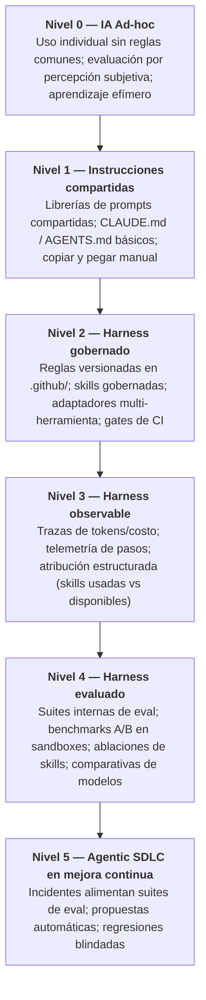

# Modelo de madurez del Agentic SDLC

El **Modelo de madurez del Agentic SDLC** es una propuesta metodológica para comprender y guiar la evolución de una organización de ingeniería desde el uso individual y desarticulado de la IA hacia un ciclo de vida de desarrollo asistido por agentes gobernado, evaluado y en mejora continua.

> [!NOTE]
> **Propuesta metodológica**: Este modelo de madurez es un marco propuesto desarrollado dentro de la metodología de Harness Engineering. Funciona como herramienta de diagnóstico y hoja de ruta, no como un estándar normativo impuesto por la industria.

---

---

## Las 6 etapas de madurez organizacional

### Nivel 0 — IA Ad-hoc
*Experimentación individual sin estándares comunes.*

- **Características**: Cada desarrollador elige sus herramientas de IA (ChatGPT, GitHub Copilot, Claude, Cursor) sin coordinación. Los prompts se introducen de forma manual e improvisada en chats.
- **Evaluación**: Puramente subjetiva y anecdótica ("Claude parece responder más rápido hoy", "Copilot tuvo una alucinación extraña").
- **Modo de fallo**: Aprendizaje efímero. Cuando un agente genera código incorrecto o comete violaciones arquitectónicas, el desarrollador lo corrige a mano; no queda ningún aprendizaje en la organización.
- **Artefactos clave**: Ninguno.

---

### Nivel 1 — Instrucciones compartidas
*Aparición de prompts compartidos y archivos de instrucciones básicos.*

- **Características**: Los equipos empiezan a documentar prompts comunes en Notion o a compartir archivos de instrucciones base (`CLAUDE.md`, `AGENTS.md`, `.github/copilot-instructions.md`) en la raíz de los repositorios.
- **Evaluación**: Discusiones informales entre pares durante standups o revisiones de código.
- **Modo de fallo**: Drift de instrucciones. Los archivos divergen entre distintas herramientas y proyectos; las modificaciones de prompts no se auditan ni se validan.
- **Artefactos clave**: Archivos Markdown estáticos con instrucciones, hojas de trucos (cheatsheets) de prompts.

---

### Nivel 2 — Harness gobernado
*Reglas centralizadas, skills estructuradas y control automatizado de drift.*

- **Características**: Las reglas de arquitectura, los límites de capas y las skills modulares se centralizan en `.github/` como fuente única de verdad. Adaptadores automatizados proyectan las reglas a todas las herramientas compatibles. Gates de CI automatizados (`make check`, `make check-sync`) garantizan la integridad de los lockfiles y bloquean cambios no comprometidos.
- **Evaluación**: Verificación mediante suites de tests unitarios e integrados estándar en los PRs generados por agentes.
- **Modo de fallo**: Ausencia de visibilidad sobre el comportamiento. El equipo sabe si el código compila y pasa CI, pero desconoce qué skills fueron consultadas o por qué el agente tuvo dificultades.
- **Artefactos clave**: Capa centralizada de reglas, `.github/skills/`, adaptadores automatizados de herramientas, scripts de control de drift, pre-commit hooks.
- **Ejemplo de referencia**: [`marcosdh1987/ml-python-base`](https://github.com/marcosdh1987/ml-python-base).

---

### Nivel 3 — Harness observable
*Telemetría, trazas de ejecución y atribución estructurada.*

- **Características**: Toda ejecución del agente queda instrumentada. Se registran logs paso a paso, consumo de tokens, costo económico, latencia, herramientas ejecutadas y tasas de error en plataformas de observabilidad (ej. OpenTelemetry, Langfuse).
- **Atribución**: El sistema mide la **atribución usada vs disponible**, identificando qué reglas, documentación y skills consultó y ejecutó el agente durante su interacción multi-paso.
- **Modo de fallo**: El equipo posee alta observabilidad ("qué ocurrió"), pero carece de validación objetiva sobre si los cambios mejoraron el rendimiento del agente ("si el resultado fue bueno").
- **Artefactos clave**: Parsers de logs de pasos, integraciones de tracing, matrices de atribución, dashboards de consumo y costos.

---

### Nivel 4 — Harness evaluado
*Suites internas de evaluación, benchmarks en sandboxes y pruebas A/B controladas.*

- **Características**: La organización dispone de un repositorio de **casos de evaluación reproducibles** representativos de su código y arquitectura. Las pruebas de agentes se corren en **sandboxes aislados en contenedores Docker** con límites estrictos de recursos.
- **Experimentación**: Se ejecutan evaluaciones A/B controladas y **ablaciones de skills** (ej. *Baseline* vs *Baseline + Skill X*), manteniendo constantes el modelo, el prompt y el entorno para aislar el impacto del harness.
- **Evaluadores**: Caja de herramientas con evaluadores objetivos de código, auditores de comportamiento mediante LLMs y evaluación humana calibrada.
- **Modo de fallo**: La creación de casos de evaluación es manual y no está conectada directamente con los incidentes cotidianos de producción.
- **Artefactos clave**: Suites de evaluación interna, imágenes base para runners en contenedores, rúbricas de scoring multidimensional, harness de ablaciones.
- **Ejemplo de referencia**: [`marcosdh1987/ai-agentic-harness-lab`](https://github.com/marcosdh1987/ai-agentic-harness-lab).

---

### Nivel 5 — Agentic SDLC en mejora continua
*Ciclo de retroalimentación cerrado: los fallos se acumulan como capacidades organizacionales.*

- **Características**: El ciclo está totalmente integrado. Cuando un agente falla en producción o en una revisión de PR:
  1. El fallo se sanitiza en un caso de evaluación reproducible.
  2. Se mide el rendimiento del baseline.
  3. Se genera una propuesta de mejora del harness.
  4. La skill o regla modificada se evalúa bajo condiciones controladas y múltiples ejecuciones.
  5. El cambio se publica mediante un release versionado y el caso pasa a formar parte permanente de la **suite de regresión**.
- **Resultado**: La capacidad de desarrollo con IA de la organización **se acumula de forma compuesta**, constituyendo un activo técnico estratégico y defendible.
- **Artefactos clave**: Generadores automáticos de propuestas, flujos de issues sanitizados, releases inmutables con SemVer, suites de regresión permanentes.

---

## Matriz de evaluación de madurez

| Dimensión | Nivel 0 | Nivel 1 | Nivel 2 | Nivel 3 | Nivel 4 | Nivel 5 |
|---|---|---|---|---|---|---|
| **Capa de instrucciones** | Ad-hoc en chat | Markdown compartido | Centralizado en `.github/` | Centralizado en `.github/` | Catálogo versionado | Staged y ablacionable |
| **Adaptación a herramientas** | Ninguna | Copias manuales | Sincronización automática | Sincronización automática | Overlays controlados | Inyección dinámica |
| **Quality Gates en CI** | Ninguno | Opcional | Obligatorio | Obligatorio | Obligatorio | Obligatorio |
| **Telemetría y costos** | Sin registrar | Sin registrar | Sin registrar | Trazas completas | Trazas completas | Costo por condición eval |
| **Atribución** | Ninguna | Ninguna | Ninguna | Usada vs Disponible | Usada vs Disponible | Diferencial por ablación |
| **Entorno de ejecución** | Host local | Host local | Host local | Host local | Sandboxes Docker | Sandboxes Docker |
| **Método de evaluación** | Percepción/Vibes | Anecdótico | Pruebas unitarias | Revisión de trazas | Evals A/B en sandbox | Regresiones multi-run |
| **Gestión de incidentes** | Corrección local | Consejo en Slack | Edición manual de doc | Edición manual de doc | Nuevo caso de eval | Ciclo cerrado integral |

---

### Próximos pasos
- Aprende a **[Construir una suite de evaluación interna](internal-evaluation-suite.md)**.
- Comprende la analogía **[De fallos de agentes a casos de regresión](failures-to-regression-cases.md)**.
- Explora el ciclo de **[Mejora continua del harness](continuous-harness-improvement.md)**.
