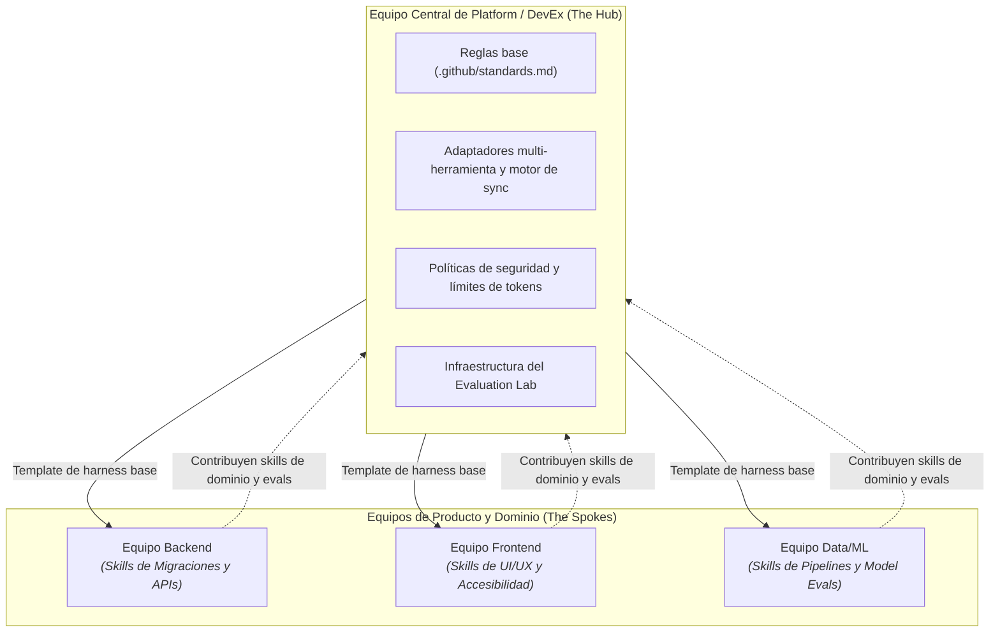
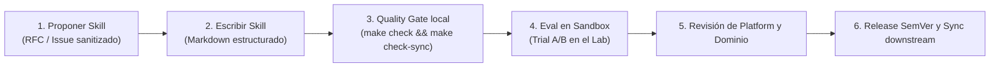
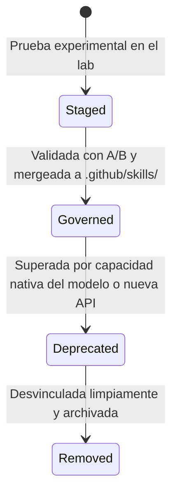

# Gobernanza y ownership del equipo

A medida que una organización adopta Harness Engineering, surge una pregunta organizativa clave: **¿Quién es el dueño del harness y cómo colaboran los equipos en las reglas, skills y suites de evaluación?**

Sin una estructura de ownership y políticas de gobernanza claras, los harnesses sufren de **divergencia anárquica** (cada equipo reinventa sus propias skills incompatibles) o de **estancamiento burocrático** (nadie actualiza las skills cuando las herramientas evolucionan).

---

## Modelos de gobernanza: Plataforma centralizada vs Ownership federado

Las organizaciones de ingeniería exitosas equilibran la estandarización de plataforma con la flexibilidad de dominio mediante un **modelo federado hub-and-spoke**:

### 1. Responsabilidades del equipo central de plataforma (El Core Harness)
- Mantiene los repositorios template base (`ml-python-base`).
- Mantiene el motor de sincronización para adaptadores multi-herramienta (`CLAUDE.md`, `AGENTS.md`, `OPENCODE.md`).
- Opera la infraestructura compartida de evaluación (`ai-agentic-harness-lab`) y las imágenes base de Docker.
- Establece restricciones de seguridad globales, protección de credenciales y límites de gasto de tokens.

### 2. Responsabilidades de los equipos de dominio (Extensiones de dominio)
- Crean skills especializadas acordes a su dominio (ej. generación de esquemas GraphQL, pipelines de entrenamiento en PyTorch).
- Convierten incidentes de producción y revisiones de PR en casos de evaluación específicos de su dominio.
- Gestionan las reglas locales y los contratos de contexto de sus repositorios.

---

## Flujo de contribución y revisión de skills

Para evitar la saturación de skills y la proliferación de prompts de baja calidad, las nuevas skills siguen un proceso de revisión estructurado:

### Checklist de calidad para revisores de skills
Toda skill nueva o modificada debe superar 5 criterios de revisión antes de ser aprobada:

1. **Determinismo**: ¿La skill prescribe pasos estructurados y secuenciales con puntos explícitos de verificación en lugar de sugerencias ambiguas?
2. **Presupuesto de contexto**: ¿La skill es concisa y enfocada? (Evita incluir documentación enciclopédica que consuma tokens innecesarios de la ventana de contexto).
3. **Seguridad en herramientas**: ¿La skill restringe la ejecución en terminal a comandos seguros e idempotentes?
4. **Atribución verificable**: ¿Puede el harness de evaluación detectar si el agente efectivamente consultó y siguió la skill?
5. **Verificación de regresiones**: ¿La contribución incluye al menos un caso de evaluación que demuestre una mejora medible frente al baseline no asistido?

---

## Ciclo de vida y depreciación de skills

Las skills son piezas de software vivas; deben versionarse, mantenerse y eventualmente retirarse cuando los modelos subyacentes o los frameworks cambian:

1. **Staged**: La skill reside en el área de staging (`data/skills_staging/`), donde puede probarse en experimentos A/B sin tocar repositorios productivos.
2. **Governed**: La skill se promueve a `.github/skills/`, se sincroniza en los adaptadores multi-herramienta y se incluye en los quality gates de CI.
3. **Deprecated**: Cuando los modelos de frontera incorporan la capacidad de forma nativa o las APIs internas cambian, la skill se marca como `@deprecated` con una nota de migración.
4. **Removed**: La skill se retira del catálogo; las verificaciones de drift en CI comprueban que no queden referencias residuales.

---

## Gestión del drift en múltiples repositorios

Cuando una organización mantiene decenas o cientos de microservicios, prevenir el drift de configuración es crucial:

- **Repositorios Template**: Todos los nuevos servicios se inicializan desde el template gobernado (`make init NAME=mi_servicio`), preservando los enlaces de sincronización upstream.
- **PRs automáticos de sincronización**: Las actualizaciones upstream del harness disparan PRs de previsualización en los repositorios downstream (`make template-sync REF=vX.Y.Z`).
- **Quality Gates de solo lectura en CI**: Las pipelines de CI ejecutan `make check` y `make check-sync` para asegurar que los desarrolladores no hayan desincronizado manualmente sus adaptadores locales respecto de la fuente de verdad en `.github/`.

---

### Recursos relacionados
- **[Modelo de madurez del Agentic SDLC](maturity-model.md)**
- **[Mejora continua del harness](continuous-harness-improvement.md)**
- **[Patrón: Control de drift](../patterns/drift-control.md)**
