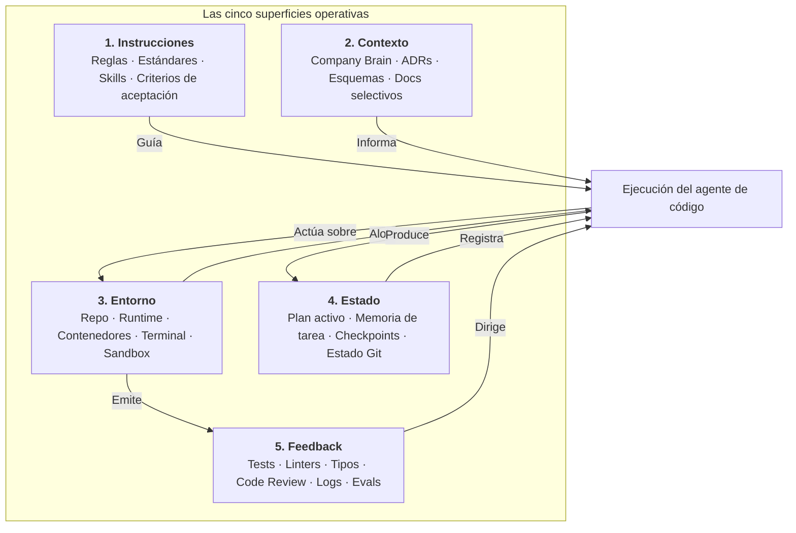

# Las cinco superficies operativas del harness

Harness Engineering opera a través de cinco superficies de interacción concretas entre desarrolladores humanos, entornos de ejecución y agentes autónomos de programación:

1. **Instrucciones**
2. **Contexto**
3. **Entorno**
4. **Estado**
5. **Feedback**

Mientras que el Harness Stack de cuatro capas (Reglas, Skills, Herramientas y Gates) describe la estructura arquitectónica, las **Cinco Superficies Operativas** describen la topología de ejecución mediante la cual un agente interactúa con los sistemas de software.

---

## 1. Instrucciones: Dirección y políticas

Las instrucciones declaran qué debe, qué puede y qué no debe hacer el agente. Codifican la intención humana, las convenciones del equipo y las restricciones arquitectónicas en políticas legibles por máquinas.

Operan en tres alcances:

- **Reglas y políticas globales**: estándares del repositorio, límites arquitectónicos e invariantes de seguridad (como `.github/standards.md`, `CLAUDE.md` o `AGENTS.md`).
- **Skills gobernadas**: procedimientos operativos parametrizados para acciones complejas de múltiples pasos (como migraciones de bases de datos o scaffolding de APIs).
- **Directivas específicas de la tarea**: descripciones enriquecidas de tickets, prompts de usuario y criterios explícitos de aceptación.

Las instrucciones deben mantenerse concisas y jerárquicas. Como demuestran investigaciones recientes de laboratorios de frontera (OpenAI, 2026), el archivo de instrucciones del agente actúa como un mapa hacia documentación detallada en lugar de una enciclopedia exhaustiva.

---

## 2. Contexto: Conocimiento y dominio del sistema

El contexto proporciona el conocimiento de negocio, la historia arquitectónica y las restricciones técnicas necesarias para ejecutar una tarea correctamente sin alucinaciones.

Los activos principales de contexto incluyen:

- **Conocimiento organizacional**: requerimientos canónicos, decisiones y perfiles de sistemas curados en un Company Brain.
- **Registros de Decisiones Arquitectónicas (ADRs)**: justificación de decisiones técnicas pasadas, lo que impide que los agentes reintroduzcan diseños descartados.
- **Esquemas técnicos**: esquemas de bases de datos, contratos OpenAPI y definiciones de Protocolos.
- **Recuperación selectiva**: entregar únicamente el conjunto mínimo de lectura útil para la tarea, evitando saturar la ventana de contexto.

El contexto no es sinónimo del prompt del modelo. El conocimiento amplio de la organización es filtrado y compilado por el harness en contexto específico para cada tarea.

---

## 3. Entorno: El espacio físico de trabajo

El entorno abarca el sistema operativo, el sistema de archivos, las herramientas de compilación, los servicios en ejecución y el acceso a red disponible para el agente.

Componentes de la superficie de entorno:

- **Estructura del repositorio**: convenciones de carpetas consistentes, dependencias bloqueadas de forma reproducible (`uv.lock`) y scripts de compilación deterministas.
- **Sandboxes de ejecución aislados**: entornos en contenedores (Docker, Podman o sandboxes del sistema operativo) que permiten pruebas destructivas y ejecución de comandos sin poner en riesgo la máquina del desarrollador.
- **Servicios de runtime**: bases de datos locales, mocks de servicios externos y workers en segundo plano.
- **Herramientas legibles por agentes**: comandos de terminal con salidas estructuradas (JSON, códigos de salida estándar) y mensajes de error inequívocos.

Como demostró Anthropic (2026), variaciones en CPU, memoria RAM, latencia de red y configuración de contenedores introducen ruido medible en evaluaciones de programación. El entorno debe tratarse como una condición experimental explícita.

---

## 4. Estado: Progreso y continuidad

El estado captura la condición operativa transitoria de una tarea. Permite a los agentes pausar, reanudar, crear puntos de control y coordinar el trabajo a través de múltiples ventanas de contexto o llamadas al modelo.

La superficie de estado registra:

- **Plan activo y matriz de tareas**: lista de elementos completados, trabajo en curso y pasos pendientes.
- **Supuestos de trabajo**: hipótesis generadas durante la investigación que requieren validación empírica antes del commit.
- **Artefactos de ejecución**: diffs temporales, bitácoras de ejecución, trazas de pasos y resúmenes intermedios de validación.
- **Estado de trabajo en Git**: rama activa, ruta del worktree, stashes y modificaciones sin commitear.

Diferenciar el estado de trabajo transitorio de la memoria permanente del repositorio evita contaminar la documentación canónica con notas de depuración efímeras.

---

## 5. Feedback: Verdad empírica y validación

El feedback proporciona la señal autoritativa que dirige la ejecución del agente. En Harness Engineering, los resultados empíricos siempre tienen prioridad sobre lo que el modelo afirma haber hecho.

Las señales de feedback operan en varios niveles:

- **Gates deterministas**: linters (Ruff, ESLint), verificadores de tipos (Mypy, TypeScript), suites de pruebas unitarias (Pytest, Jest) y análisis de seguridad (Bandit, Gitleaks).
- **Observabilidad en tiempo de ejecución**: logs de aplicación, métricas, trazas de OpenTelemetry y códigos de respuesta HTTP emitidos durante la ejecución.
- **Revisión agente a agente**: subagentes especializados que inspeccionan pull requests contra reglas de arquitectura y estilo.
- **Gate humano de integración**: verificación humana final de la intención del negocio, implicaciones de seguridad y coherencia del diseño.

Sin feedback riguroso, el agente trabaja a ciegas, optimizando para generar respuestas verosímiles en lugar de soluciones verificadas.

---

## Conexión de las cinco superficies con el Harness Stack

Las Cinco Superficies Operativas se alinean de forma directa con las cuatro capas estructurales del Harness Stack:

| Superficie operativa | Rol principal | Capa del Harness Stack | Mecanismo representativo |
|---|---|---|---|
| **Instrucciones** | Dirigir el comportamiento y fijar límites | Capa 1: Reglas y Políticas | `AGENTS.md`, `.github/standards.md`, skills |
| **Contexto** | Anclar la ejecución en la realidad del sistema | Capa 2: Skills y Flujos de trabajo | Company Brain, ADRs, esquemas |
| **Entorno** | Alojar y aislar la ejecución | Capa 3: Herramientas y Entorno | Docker, devcontainers, `uv.lock`, Makefile |
| **Estado** | Preservar el progreso y permitir reanudación | Capa 2 y Capa 3 | Memoria de trabajo, listas de tareas, git worktrees |
| **Feedback** | Verificar resultados y asegurar calidad | Capa 4: Verificación y Feedback | `make check`, suites de tests, auditorías |

Un harness equilibrado requiere inversión en las cinco superficies. Enfocarse únicamente en instrucciones mientras se descuida el feedback o el aislamiento del entorno produce agentes frágiles y resultados no verificables.
