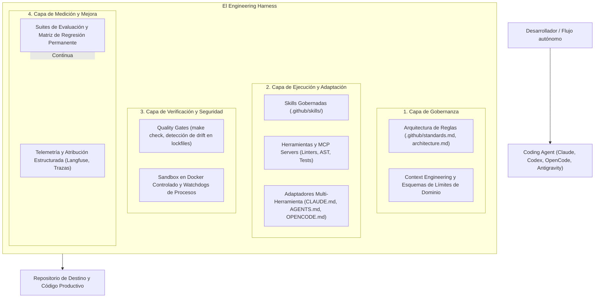

# Harness Engineering

**Harness Engineering** es la práctica de diseñar, gobernar, observar, evaluar y mejorar de forma continua el sistema completo alrededor de los agentes de inteligencia artificial aplicados al desarrollo de software.

En lugar de concebir la asistencia de IA como una simple conversación de chat efímera, Harness Engineering estructura todo el sistema operativo del desarrollo: reglas de arquitectura persistentes, skills modulares, memoria contextual del repositorio, adaptadores multi-herramienta, sandboxes en contenedores, gates de calidad y suites de regresión automatizadas.

---

---

## Los 4 pilares de la arquitectura de un harness

### 1. Gobernanza y restricciones
Establece las reglas de juego para el agente:
- **Límites de capas**: Separación estricta de responsabilidades (ej. Dominio, Aplicación, Infraestructura).
- **Estándares y convenciones**: Tipado, importaciones absolutas, nomenclatura y patrones prohibidos.
- **Límites de contexto**: Gestión del presupuesto de tokens y curación de la memoria del proyecto para maximizar la señal y evitar la dilución de contexto.

### 2. Capacidades y adaptadores de herramientas
Equipa al agente con procedimientos estructurados y repetibles:
- **Skills gobernadas**: Instrucciones ejecutables en Markdown con validación de entradas y pasos lógicos.
- **Servidores MCP y herramientas**: Interfaces controladas para consultar ASTs, esquemas de bases de datos o correr tests.
- **Adaptadores declarativos**: Generación automática de archivos de configuración (`CLAUDE.md`, `AGENTS.md`, `OPENCODE.md`, `GEMINI.md`, `copilot-instructions.md`) a partir de la fuente de verdad en `.github/`.

### 3. Verificación y seguridad en sandboxes
Evita la ejecución descontrolada y las regresiones silenciosas:
- **Quality Gates**: Verificaciones de pre-commit y CI de solo lectura que fallan de inmediato ante desincronizaciones o violaciones de reglas.
- **Sandboxes aislados**: Ejecución de agentes en contenedores Docker dedicados para garantizar reproducibilidad y evitar alteraciones en la máquina host.

### 4. Medición y mejora continua
Reemplaza la intuición por ciencia empírica:
- **Atribución estructurada**: Medición de qué partes del harness consultó efectivamente el agente durante su ejecución multi-paso.
- **Ingeniería de evaluación**: Experimentos A/B multi-corrida, ablaciones de skills y suites de regresión permanentes.
- **Propuestas de ciclo cerrado**: Transformación de errores observados en issues sanitizados que actualizan el harness de forma continua.

---

### Recursos relacionados
- **[¿Qué es Harness Engineering? (Empieza aquí)](../start-here/what-is-harness-engineering.md)**
- **[Estandarizar → Medir → Mejorar](../start-here/standardize-measure-improve.md)**
- **[Modelo de madurez del Agentic SDLC](../adoption/maturity-model.md)**
- **[Observabilidad vs Evaluación](observability-vs-evaluation.md)**
