# Observabilidad vs Evaluación vs Experimentación

Un motivo frecuente de confusión en las organizaciones de ingeniería que adoptan IA es confundir **observabilidad**, **evaluación** y **experimentación**.

Muchos equipos instalan una plataforma de tracing de LLMs (ej. Langfuse, LangSmith u OpenTelemetry) y asumen que ya cuentan con un sistema de evaluación. Si bien la observabilidad es un prerrequisito fundamental, responde a una pregunta completamente distinta a la evaluación o la experimentación.

---

## Las tres disciplinas

```mermaid
flowchart LR
    subgraph OBS["1. Observabilidad"]
        direction TB
        Q1["<b>'¿Qué ocurrió?'</b>"]
        O1["Trazas y Spans"]
        O2["Consumo de Tokens"]
        O3["Logs de Herramientas"]
        O4["Latencia y Códigos de Error"]
    end

    subgraph EVAL["2. Evaluación"]
        direction TB
        Q2["<b>'¿El resultado fue bueno?'</b>"]
        E1["Tests Unitarios Objetivos"]
        E2["Gates de prueba Pass/Fail"]
        E3["Adherencia Arquitectónica"]
        E4["Scoring por LLM y Humano"]
    end

    subgraph EXP["3. Experimentación"]
        direction TB
        Q3["<b>'¿Este cambio causó una mejora?'</b>"]
        X1["Brazos Control vs Tratamiento"]
        X2["Trials de Ablación de Skills"]
        X3["Validez Estadística Multi-Run"]
        X4["Aislamiento de Variable Única"]
    end

    OBS -->|"Aporta la Transcripción"| EVAL
    EVAL -->|"Aporta la Puntuación"| EXP
```

---

## 1. Observabilidad: "¿Qué ocurrió?"

La observabilidad captura la **telemetría en tiempo de ejecución y la transcripción detallada** de la interacción del agente:
- **Trazas y spans**: Cada llamada al modelo, invocación de herramientas y consulta de contexto.
- **Consumo de recursos**: Tokens de entrada, salida, cacheados y costo económico resultante.
- **Latencia**: Tiempo esperando la generación del modelo vs tiempo ejecutando herramientas de terminal.
- **Logs de pasos**: Secuencia exacta de archivos leídos, archivos modificados y comandos ejecutados.
- **Errores**: Códigos de salida distintos de cero, timeouts o errores de rate limiting en APIs.

> **Lo que la observabilidad responde**: *"El agente ejecutó 14 pasos, leyó 4 archivos, corrió pytest dos veces, consumió 42.000 tokens ($0,18) y completó la tarea en 45 segundos."*  
> **Lo que la observabilidad NO puede responder**: *"¿El código solucionó realmente el bug? ¿Violó los límites de arquitectura? ¿Introdujo alguna regresión?"*

---

## 2. Evaluación: "¿El resultado fue bueno?"

La evaluación aplica **criterios objetivos, suites de pruebas y evaluadores calibrados** para determinar si el resultado final generado por el agente es correcto, seguro y de calidad:
- **Verificación objetiva**: ¿Pasó la suite de tests (`pass/fail`)? ¿El linter finalizó con código 0?
- **Restricciones de dominio**: ¿El código mantuvo la arquitectura limpia sin importar librerías prohibidas?
- **Atribución**: ¿El agente consultó la skill gobernada pertinente o intentó adivinar la solución?
- **Calidad de comportamiento**: ¿El agente siguió un flujo ordenado de planificar y luego ejecutar, o entró en bucles de comandos?

> **Lo que la evaluación responde**: *"El patch generado resolvió el problema, aprobó los 8 tests unitarios, cumplió con las pautas de migraciones sin downtime y consultó la skill `safe_db_migration`."*  
> **Lo que la evaluación NO puede responder**: *"¿La nueva skill fue la causa real del éxito, o el modelo base habría tenido éxito de todos modos en esta corrida?"*

---

## 3. Experimentación: "¿Este cambio específico causó una mejora?"

La experimentación utiliza **ensayos comparativos controlados** para establecer causalidad entre un cambio en el harness y la mejora en los resultados:
- **Brazos comparativos**: Ejecutar una tarea idéntica bajo una *Condición de Control* (ej. Modelo Base sin Skill) y una *Condición de Tratamiento* (ej. Modelo Base con Skill en Staging).
- **Aislamiento de variables**: Mantener constantes los pesos del modelo, prompts del sistema, imagen del SO y commit del repo, de modo que solo cambie la regla o skill evaluada.
- **Múltiples repeticiones**: Ejecutar varias corridas (ej. $N=5$ o $N=10$) por condición para medir la distribución estadística y filtrar el ruido estocástico.

> **Lo que la experimentación responde**: *"Añadir la skill `safe_db_migration` elevó la tasa de éxito del 20% (2/10 en Control) al 100% (10/10 en Tratamiento), reduciendo la cantidad de pasos en un 35% bajo entornos idénticos de contenedor."*

---

## Matriz comparativa

| Dimensión | Observabilidad | Evaluación | Experimentación |
|---|---|---|---|
| **Pregunta central** | *"¿Qué ocurrió?"* | *"¿El resultado fue bueno?"* | *"¿Este cambio causó una mejora?"* |
| **Métrica principal** | Tokens, latencia, trazas, pasos | Test pass/fail, puntuación de rúbrica | Delta de tasa de éxito ($\Delta$), tamaño del efecto |
| **Herramienta habitual** | Langfuse, OpenTelemetry, Datadog | Pytest test runners, jueces LLM | `ai-agentic-harness-lab`, suites de ablación A/B |
| **Alcance** | Transcripción de una corrida | Calificación de resultado de una corrida | Distribución comparativa multi-corrida |
| **Indicador de fallo** | Códigos de error, picos de tokens | Tests rotos, violaciones de arquitectura | Ausencia de mejora estadísticamente significativa |

---

### Recursos relacionados
- **[¿Qué es una evaluación de agentes?](../evaluation/what-is-an-eval.md)**
- **[Entornos controlados y Sandboxing](../evaluation/controlled-environments-sandboxing.md)**
- **[Validez experimental y ablaciones](../evaluation/experimental-validity-and-ablations.md)**
