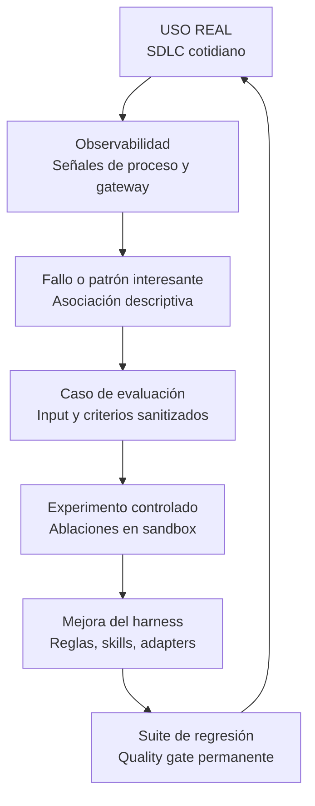

# Observabilidad vs Evaluación

!!! info "Sobre esta página"
    **Qué vas a aprender:** por qué la observabilidad operacional y la evaluación controlada responden preguntas distintas.

    **Para quién:** engineering managers, tech leads, AI champions, Harness Engineers y equipos que adoptan IA.

    **Leela cuando:** necesites conectar evidencia operacional con un experimento defendible.

La observabilidad y la evaluación se complementan. La observabilidad describe la actividad de un sistema real. La evaluación compara alternativas bajo condiciones suficientemente controladas para sostener una conclusión.

| Observabilidad | Evaluación |
| --- | --- |
| Qué ocurrió | Qué alternativa funciona mejor |
| Producción o uso cotidiano | Entorno controlado |
| Gateway, telemetría de procesos y datos de delivery | Harness Lab |
| Detecta patrones y asociaciones | Prueba hipótesis y demuestra causalidad |
| Genera casos candidatos y anomalías | Confirma mejoras o regresiones |

## Del uso al aprendizaje

## Observabilidad: ¿qué está ocurriendo?

La observabilidad captura señales de runtime para entender cómo se usa el sistema: telemetría de procesos, commits, ventanas activas de ingeniería, modelos seleccionados, consumo de tokens, latencias e hitos de delivery. Sigue el principio central:

> "Medir el proceso de ingeniería sin observar el contenido de ingeniería."

La telemetría de procesos revela patrones empíricos: un workflow costoso, un fallo de verificación recurrente, una skill subutilizada o una cohorte de tareas con cycle time elevado.

Sin embargo, la telemetría observacional no demuestra que un modelo, skill o regla haya causado un resultado específico. Concluir que "la IA causó una reducción en el cycle time" a partir de telemetría observacional incurre en una falacia post hoc. La observabilidad entrega asociaciones descriptivas, no pruebas causales.

## Evaluación: ¿funciona mejor?

La evaluación ejecuta casos de prueba reproducibles bajo condiciones controladas, variando un parámetro mientras mantiene constantes el prompt, el entorno y los inputs. El [Harness Lab](../reference-implementation/ai-agentic-harness-lab/index.md) ejecuta:

- **Estudios de ablación:** evaluar el rendimiento con y sin una regla o skill específica.
- **Benchmarks controlados:** ejecutar pruebas de múltiples corridas dentro de contenedores Docker aislados.
- **Scoring multidimensional:** combinar checks determinísticos, rúbricas de comportamiento y eficiencia de tokens.
- **Suites de regresión:** congelar fallos sanitizados de producción como validaciones permanentes para evitar regresiones.

El objeto de evaluación es el sistema alrededor del modelo: contexto, reglas, skills, herramientas, routing, entorno de ejecución, verificación y workflow. El modelo es una variable dentro de ese sistema.

## Un traspaso útil

1. **Observar la actividad real:** identificar un patrón, cuello de botella o anomalía de verificación en el [Patrón Engineering Delivery Observatory](../medir-y-mejorar/engineering-delivery-observatory.md) sin saltar a conclusiones causales.
2. **Sanitizar en un caso de prueba:** remover datos propietarios, aislar el contexto mínimo reproducible y definir criterios claros de éxito.
3. **Ejecutar una comparación controlada:** medir el harness baseline frente al candidato propuesto en el [Harness Lab](../reference-implementation/ai-agentic-harness-lab/index.md).
4. **Desplegar mejoras verificadas:** publicar las reglas, skills o adaptadores mejorados para el equipo una vez que la evidencia causal respalde el cambio.
5. **Proteger con suites de regresión:** incorporar el caso de prueba a la suite permanente de evaluación y monitorear la telemetría operacional futura.

!!! note "Para seguir"
    Consultá el [Patrón Engineering Delivery Observatory](../medir-y-mejorar/engineering-delivery-observatory.md) para el plano operacional y [Harness Lab](../reference-implementation/ai-agentic-harness-lab/index.md) para el plano de evaluación.
