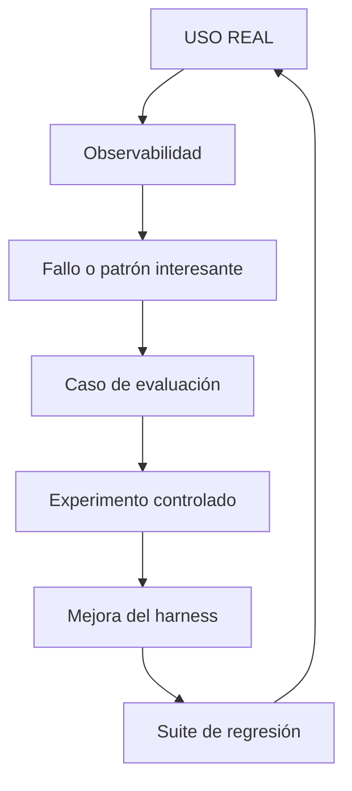

# Observabilidad vs Evaluación

!!! info "Sobre esta página"
    **Qué vas a aprender:** por qué la observabilidad operacional y la evaluación controlada responden preguntas distintas.

    **Para quién:** engineering managers, tech leads, AI champions, Harness Engineers y equipos que adoptan IA.

    **Leela cuando:** necesites conectar evidencia operacional con un experimento defendible.

La observabilidad y la evaluación se complementan. La observabilidad describe la actividad de un sistema real. La evaluación compara alternativas bajo condiciones suficientemente controladas para sostener una conclusión.

| Observabilidad | Evaluación |
| --- | --- |
| Qué ocurrió | Qué alternativa funciona mejor |
| Producción o uso cotidiano | Entorno controlado |
| Gateway, traces y datos de delivery | Harness Lab |
| Detecta patrones | Prueba hipótesis |
| Genera casos candidatos | Confirma mejoras o regresiones |

## Del uso al aprendizaje

## Observabilidad: ¿qué está ocurriendo?

La observabilidad captura señales de runtime para entender cómo se usa el sistema: requests, modelos, tokens, latencia, fallos, tags, traces y, cuando existe integración, eventos de delivery. Puede revelar un fallo repetido, un workflow costoso, una fuente ruidosa o una skill que casi nunca se selecciona.

No demuestra que un modelo, skill o regla haya causado un resultado. Tampoco puede inferir delivery o performance individual solamente a partir del tráfico del gateway.

## Evaluación: ¿funciona mejor?

La evaluación ejecuta un caso con entradas explícitas, un sistema candidato y criterios objetivos o calibrados. Harness Lab puede comparar un harness baseline con uno candidato, variar un factor, registrar atribución y conservar un caso de regresión después de corregir un fallo.

El objeto de evaluación es el sistema alrededor del modelo: contexto, reglas, skills, herramientas, routing, entorno de ejecución, verificación y workflow. El modelo es una variable dentro de ese sistema.

## Un traspaso útil

1. Observá un patrón real sin tratarlo como una conclusión.
2. Sanitizá la situación y definí un caso de evaluación reproducible.
3. Ejecutá una comparación controlada con un baseline claro.
4. Mejorá el harness o la fuente de conocimiento si el resultado lo respalda.
5. Agregá el caso a una suite de regresión y observá el uso real futuro.

!!! note "Para seguir"
    Consultá [Engineering Delivery Observatory](../medir-y-mejorar/engineering-delivery-observatory.md) para el plano operacional y [Harness Lab](../reference-implementation/ai-agentic-harness-lab/index.md) para el plano de evaluación.
