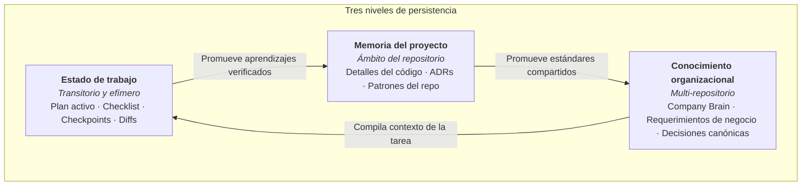

# Estado y continuidad en sistemas de agentes

El desarrollo de software autónomo rara vez cabe en un único prompt o ventana de contexto. Las tareas complejas exigen múltiples turnos iterativos, llamadas a herramientas externas y traspasos de control entre sesiones.

Para garantizar una ejecución fiable en tareas de larga duración, el harness debe diferenciar explícitamente tres niveles de información:

$$\mathbf{Estado\ de\ trabajo} \neq \mathbf{Memoria\ del\ proyecto} \neq \mathbf{Conocimiento\ organizacional\ duradero}$$

---

## 1. Definición de los tres niveles

### Estado de trabajo (Transitorio)

El estado de trabajo contiene el contexto inmediato y mutable necesario para completar una unidad de trabajo activa. Es efímero y debe archivarse o limpiarse una vez que el pull request es integrado.

Ejemplos de estado de trabajo:

- El plan técnico activo y la lista de tareas pendientes.
- Pasos completados e hitos restantes.
- Fallos de tests conocidos o logs transitorios de reproducción.
- Nombre de la rama activa o ruta del worktree de Git.
- Supuestos de trabajo que aún no han sido validados empíricamente.
- Datos de punto de control e instrucciones de reanudación para el siguiente turno del agente.

### Memoria del proyecto (Ámbito del repositorio)

La memoria del proyecto captura el contexto técnico persistente que pertenece a un repositorio específico. Sobrevive a tareas individuales, pero permanece interna a la base de código.

Ejemplos de memoria del proyecto:

- Convenciones del código y manuales operativos (`CLAUDE.md`, `.github/standards.md`).
- Registros de Decisiones Arquitectónicas (`docs/adr/`).
- Aprendizajes específicos del repositorio y casos límite documentados en `memory/`.
- Skills operacionales gobernadas (`.github/skills/`).

### Conocimiento organizacional duradero (Company Brain)

El conocimiento organizacional captura reglas de negocio transversales, arquitectura multi-repositorio y gobernanza canónica que abarca a toda la empresa o relación de consultoría.

Ejemplos de conocimiento organizacional:

- Registros del Company Brain (`00-context/`, `05-requirements/`, `06-decisions/`).
- Contratos estratégicos de proveedores y límites de sistemas cliente.
- Bibliotecas de capacidades compartidas entre múltiples proyectos.

---

## 2. Las cinco preguntas de continuidad

Cuando un agente inicia un nuevo turno o se reanuda tras reiniciar la sesión, debe orientarse rápidamente sin gastar miles de tokens releyendo el historial completo de Git.

Un harness robusto estructura el estado de trabajo para que el agente responda de inmediato a cinco preguntas:

1. **¿Dónde estoy?** ¿En qué repositorio, rama, worktree y directorio estoy operando?
2. **¿Qué se ha hecho ya?** ¿Qué pasos del plan técnico se completaron con tests exitosos?
3. **¿Qué queda pendiente?** ¿Cuál es la siguiente unidad concreta de trabajo a abordar?
4. **¿Qué supuestos están activos?** ¿Bajo qué hipótesis de arquitectura o negocio estoy operando que aún carecen de verificación empírica?
5. **¿Qué debe verificarse antes de continuar?** ¿Qué gates, linters o suites de pruebas deben pasar antes de avanzar al siguiente paso?

---

## 3. Patrones de continuidad para múltiples sesiones

Investigaciones de frontera sobre agentes autónomos de larga duración (Anthropic, 2026) demuestran que los agentes rinden mucho mejor cuando mantienen artefactos de progreso explícitos en lugar de depender del historial desestructurado de la conversación.

Los harnesses efectivos implementan varios patrones de continuidad:

### Patrón A: El artefacto de seguimiento de progreso

Para tareas complejas que toman varias horas o sesiones, el harness mantiene un documento estructurado de progreso (como `task_progress.md` o un JSON de estado). Al finalizar cada sesión, el agente anota:

- Tareas completadas con referencias a los archivos modificados.
- El commit o stash exacto de Git que representa el punto de control limpio.
- Bloqueos activos o preguntas abiertas.
- El primer comando recomendado para el agente que reanude la tarea.

### Patrón B: Traspaso limpio al final de la sesión

Un agente nunca debe salir abruptamente en mitad de un refactor dejando errores de sintaxis en cinco archivos. Cuando un agente alcanza su límite de turnos o el umbral de compactación de contexto, el harness le instruye a:

1. Revertir o guardar en stash cambios experimentales que no compilen, o registrarlos explícitamente como trabajo en curso.
2. Ejecutar los checks básicos de calidad para confirmar que el árbol de trabajo está en un estado predecible.
3. Hacer commit del progreso en una rama de trabajo específica.
4. Emitir un resumen conciso de traspaso.

### Patrón C: Reanudación a partir de artefactos duraderos

Cuando se inicia una sesión limpia de agente, no relee cientos de turnos de chat anteriores. En su lugar, lee:

1. La intención inicial (ticket o especificación enriquecida).
2. El artefacto de seguimiento de progreso.
3. El estado y diff actual de Git.

Esto reduce la sobrecarga de la ventana de contexto y elimina alucinaciones basadas en conversaciones pasadas.

---

## Qué no es el estado

- **El estado de trabajo no es documentación definitiva**: Las notas de tareas, hipótesis de depuración y borradores temporales no pertenecen a los READMEs canónicos ni a los ADRs.
- **La memoria del proyecto no es una transcripción de chat**: La memoria persistente consiste en reglas y decisiones curadas de alta señal, no en logs crudos de conversación.
- **El conocimiento organizacional no es un prompt gigante**: El Company Brain contiene evidencia empresarial amplia; el harness compila únicamente la porción relevante para el contexto inmediato del agente.
