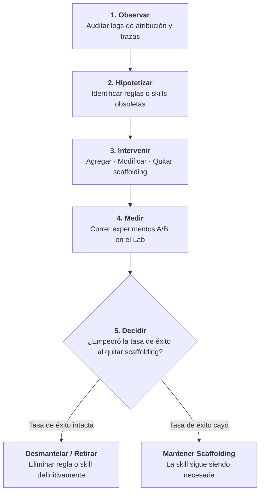

# Harnesses adaptativos y desmantelamiento de scaffolding

Un fallo habitual en equipos que adoptan agentes de IA es la acumulación descontrolada de reglas, restricciones y skills complejas. Con el tiempo, el harness se vuelve pesado, lento y costoso, consumiendo una porción significativa de la ventana de contexto en instrucciones que el modelo ya no necesita.

El principio fundacional de la ingeniería madura de harnesses es:

$$\mathbf{El\ mejor\ harness\ no\ es\ el\ más\ grande.}$$

---

## 1. Degradación de scaffolding y drift de capacidades

Los harnesses codifican supuestos humanos sobre las limitaciones del modelo. Por ejemplo:

- Un modelo inicial fallaba en refactors de múltiples archivos, por lo que el equipo escribió una skill de 500 líneas detallando el orden de edición.
- Un modelo anterior alucinaba flags de línea de comandos, por lo que el equipo añadió decenas de reglas negativas a `AGENTS.md`.

A medida que los modelos de frontera mejoran, sus capacidades nativas se expanden. Esto genera **Drift de Capacidades**: los supuestos codificados en el harness quedan obsoletos. Mantener scaffolding innecesario provoca perjuicios reales:

1. **Saturación de la ventana de contexto**: archivos de instrucciones enormes consumen miles de tokens en cada turno.
2. **Dilución de la atención**: los modelos prestan menos atención a los requerimientos de la tarea si están rodeados de reglas históricas irrelevantes.
3. **Carga de mantenimiento**: los desarrolladores pierden tiempo manteniendo skills complejas para tareas que los nuevos modelos resuelven sin ayuda.

Un harness maduro debe estar diseñado para **desmantelar scaffolding**, no solo para sumar reglas indefinidamente.

---

## 2. El ciclo adaptativo

Para mantener el harness ágil, los equipos siguen un ciclo de mantenimiento en cinco pasos:

### 1. Observar
Revisar las trazas de ejecución y los reportes de atribución en el Harness Lab. Detectar skills que nunca se consultan, reglas que se ignoran sin causar errores o flujos que corren sin fricción.

### 2. Hipotetizar
Formular una hipótesis explícita de ablación:
> *"Con los modelos actuales de frontera, eliminar la skill detallada de migraciones y depender de los targets estándar del Makefile no degradará la tasa de éxito."*

### 3. Intervenir (Brazo de ablación)
Crear una rama de ablación que comente o elimine la skill o regla candidata.

### 4. Medir
Ejecutar un experimento A/B de ablación en el Harness Lab sobre una suite representativa:
- **Brazo A (Control)**: Repositorio candidato con el scaffolding existente.
- **Brazo B (Tratamiento)**: Repositorio candidato sin el scaffolding.

Mantener modelo, prompt y entorno de ejecución estrictamente constantes.

### 5. Decidir (Retirar o mantener)
Comparar los resultados entre ambos brazos:
- Si el Brazo B logra la misma o mejor tasa de éxito con menor consumo de tokens y mayor velocidad, **retirar definitivamente** el componente.
- Si el Brazo B produce regresiones, **mantener** el scaffolding.

---

## 3. Desmantelamiento en la práctica

El desmantelamiento de scaffolding debe programarse como higiene habitual de ingeniería:

| Candidato a retiro | Indicador en el Lab | Acción |
|---|---|---|
| **Skills con cero atribución** | La skill está en `.github/skills/` pero ningún agente la leyó en 50 corridas | Archivar la skill o retirarla del índice activo |
| **Reglas de formato obsoletas** | Reglas que enseñan al modelo cómo formatear diffs o bloques de código | Eliminar la regla; los modelos actuales ya lo dominan |
| **Flujos de trabajo redundantes** | Flujos multi-agente complejos cuando un solo bucle de herramientas resuelve la tarea | Simplificar la arquitectura hacia un tool loop mínimo |
| **Documentos de contexto viejos** | Páginas que describen APIs heredadas o esquemas en desuso | Eliminar del contexto para prevenir alucinaciones |

Combinar evaluación continua con desmantelamiento periódico de scaffolding garantiza un harness rápido, económico y de alta señal.
