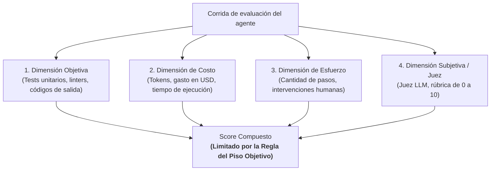
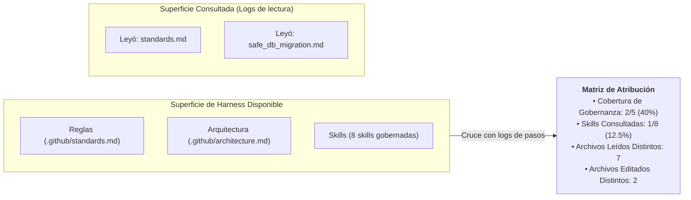
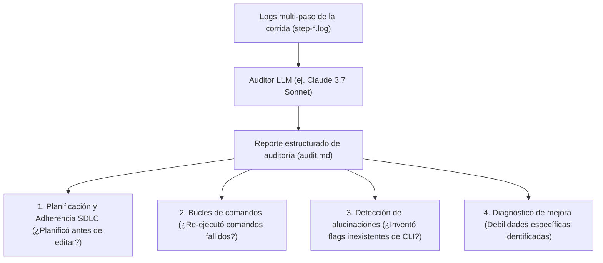

# Auditorías de comportamiento y Scoring

Evaluar a un agente de código autónomo requiere ir más allá de una simple calificación numérica. Reducir la corrección funcional, la cantidad de pasos, el costo en tokens y el cumplimiento del SDLC a un único puntaje oculta la señal exacta necesaria para diagnosticar y mejorar el harness.

Harness Engineering emplea un **marco de scoring multidimensional** combinado con **atribución estructurada** y **auditorías de comportamiento mediante LLMs**.

---

## La arquitectura de scoring multidimensional

Cada corrida de evaluación genera un registro multidimensional de `Validación` en cuatro dimensiones independientes:

### Las 4 dimensiones de evaluación

| Dimensión | Métricas evaluadas | Propósito |
|---|---|---|
| **1. Objetiva** | `pass / fail` en suites de prueba, código de salida de validadores | Determina la corrección funcional binaria. |
| **2. Costo** | Tokens de entrada, salida, caché, costo en USD y latencia | Mide la eficiencia computacional y la viabilidad económica. |
| **3. Esfuerzo** | Cantidad de pasos, llamadas a herramientas, intervenciones humanas | Mide la autonomía del agente y la directitud de su camino. |
| **4. Subjetiva / Juez** | Puntuación de rúbrica (0.0 a 10.0), claridad de código, adherencia SDLC | Mide la calidad cualitativa de la arquitectura y el manejo de casos borde. |

---

## La regla del piso objetivo (Objective Floor Rule)

> [!IMPORTANT]
> **El principio del piso objetivo**:  
> Una puntuación cualitativa o subjetiva alta **no es creíble si el código no funciona**.  
> 
> Si la validación objetiva de tests falla, el puntaje compuesto de la corrida queda automáticamente **limitado a un máximo de 1.0 / 10.0**, sin importar cuán elocuente o bien estructurado le parezca el patch al juez LLM.

Esta regla elimina los falsos positivos en los que un juez LLM califica con nota alta código de apariencia correcta que falla en sintaxis o rompe pruebas unitarias básicas.

---

## Atribución estructurada del harness

La **Atribución** mide qué partes del harness utilizó *realmente* el agente en comparación con lo que estaba *disponible* en el repositorio:

### Métricas de atribución analizadas:
- **Herramientas ejecutadas**: Desglose de `read_file`, `edit_file`, `bash_command` y `grep_search`.
- **Archivos editados**: Archivos distintos modificados (filtrados estrictamente por eventos de `permission=edit/write`, ignorando lecturas pasivas).
- **Cobertura de gobernanza**: Porcentaje de documentos de reglas y arquitectura consultados por el agente.
- **Skills consultadas**: Verificación explícita de si el agente leyó el archivo `.github/skills/` pertinente antes de modificar código.

---

## Auditorías de comportamiento mediante LLMs

Mientras los evaluadores de código verifican el resultado de las pruebas y la atribución mide el acceso a archivos, una **Auditoría de comportamiento con LLM** analiza la transcripción completa de pasos para evaluar la disciplina ingenieril:

### Ejemplos de hallazgos de auditoría
- **Adherencia positiva al SDLC**: *"El agente redactó un plan de implementación en `PLAN.md`, probó los comandos de prueba en modo dry-run y ejecutó `make check` antes de finalizar."*
- **Bucle de comandos detectado**: *"El agente encontró un `ModuleNotFoundError` y ejecutó el mismo comando `pytest` 6 veces seguidas sin modificar importaciones ni instalar dependencias (`repeated_equivalent_commands: 6`)."*
- **Propuesta dirigida**: *"La skill `systematic_debugging` debe actualizarse con una regla: si un test falla dos veces con el mismo traceback, obligar a reevaluar la hipótesis antes de volver a correr pytest."*

---

### Recursos relacionados
- **[¿Qué es una evaluación de agentes?](what-is-an-eval.md)**
- **[Mejora continua del harness](../adoption/continuous-harness-improvement.md)**
- **[Implementación de referencia: ai-agentic-harness-lab](../reference-implementation/ai-agentic-harness-lab/index.md)**
