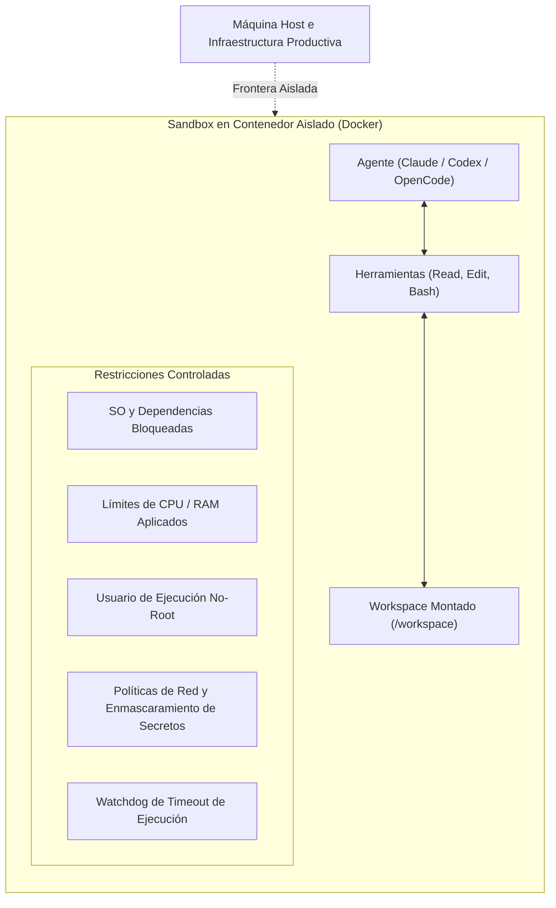
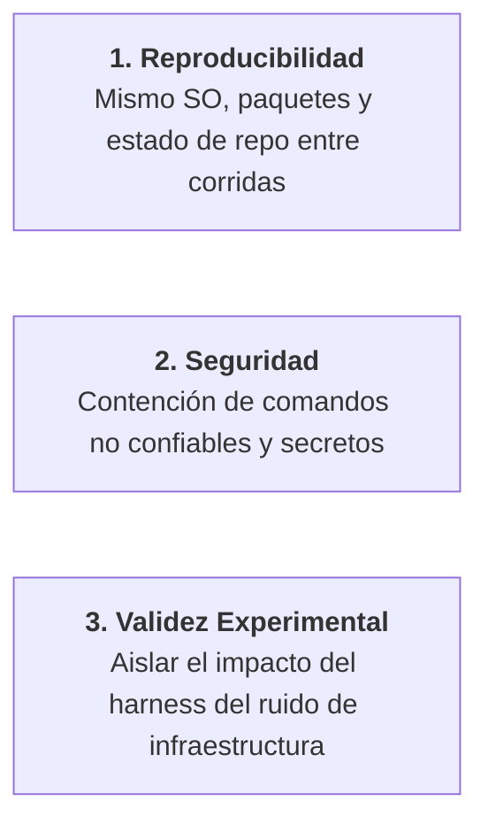

# Entornos controlados y Sandboxing

**¿Por qué es indispensable evaluar a los agentes de programación dentro de entornos controlados y aislados (sandboxes)?**

Un agente de programación no es un generador pasivo de texto. Es un actor autónomo que:
- Lee y reescribe archivos en el árbol del repositorio.
- Ejecuta comandos de terminal y herramientas de compilación.
- Instala librerías externas y paquetes del sistema operativo.
- Ejecuta suites de pruebas y linters.
- Manipula variables de entorno y permisos de archivos.
- Puede intentar realizar conexiones salientes de red.
- Opera de manera iterativa a lo largo de docenas de pasos secuenciales.

Evaluar a un agente requiere **controlar estrictamente su entorno de ejecución**.

---

---

## Los tres pilares de la ejecución controlada

Controlar el entorno de ejecución del agente es indispensable por tres razones ingenieriles diferenciadas:

### 1. Reproducibilidad
Si dos evaluaciones se ejecutan en sistemas operativos diferentes, con versiones divergentes de dependencias o con asignaciones distintas de CPU, el resultado del benchmark puede cambiar drásticamente incluso cuando los pesos del modelo y los prompts sean exactamente los mismos.

Para lograr reproducibilidad científica, el entorno debe fijar estrictamente:
- El sistema operativo base y las librerías del sistema.
- El SHA del commit base de Git.
- La versión bloqueada del runtime y las dependencias (`uv.lock`).
- Las herramientas de CLI, linters y compiladores disponibles.
- Los recursos de hardware asignados (núcleos de CPU, límites de RAM y timeouts de ejecución).

---

### 2. Seguridad y contención
Dado que los coding agents ejecutan comandos arbitrarios en la terminal generados por modelos estocásticos, correr evaluaciones directamente en la máquina host de un desarrollador introduce riesgos operativos y de seguridad significativos:
- **Integridad del sistema de archivos**: El sandbox restringe el acceso de escritura exclusivamente al directorio del workspace de destino, impidiendo modificaciones en directorios de usuario (`~`) o archivos del sistema host.
- **Protección de credenciales**: Las API keys y credenciales sensibles no se exponen en texto plano dentro del contenedor.
- **Separación de privilegios**: Los agentes se ejecutan bajo un usuario sin privilegios y no-root (`runner` / `developer`), con permisos de `sudo` restringidos.
- **Políticas de red**: Las conexiones de red salientes se limitan para evitar la filtración involuntaria de datos o interacciones con servicios productivos externos.

---

### 3. Validez experimental y atribución
En la ciencia empírica, para poder afirmar que *"la Skill X mejoró la tasa de éxito en un 30%"*, **todas las demás variables del sistema deben permanecer constantes**.

Si la corrida $A$ se ejecuta en una estación de trabajo de 16 núcleos sin límites y la corrida $B$ se ejecuta en una máquina virtual en la nube estrangulada a 2 núcleos, cualquier diferencia en el rendimiento podría ser un simple artefacto del throttling de CPU, timeouts en pruebas o presión de memoria. El entorno de ejecución es una condición experimental activa.

---

## Respaldado en evidencia pública de la industria

Harness Engineering fundamenta su metodología de sandboxing en investigaciones públicas y arquitecturas documentadas por laboratorios líderes y benchmarks académicos:

### 1. SWE-bench (Universidad de Princeton)
El benchmark estándar de la industria [SWE-bench](https://www.swebench.com/) evalúa patches generados por agentes levantando un contenedor Docker dedicado y aislado para cada issue del repositorio. Este aislamiento garantiza que los efectos secundarios de los tests de un issue no contaminen evaluaciones posteriores y que las dependencias coincidan exactamente con el entorno histórico del bug.

### 2. OpenAI: Ejecución segura de Codex
En [Running Codex safely at OpenAI (2026)](https://openai.com/index/running-codex-safely/), OpenAI detalla los controles arquitectónicos multicapa requeridos para operar agentes de código:
- **Sandboxing a nivel de SO**: Uso de primitivas nativas del kernel (Seatbelt en macOS, Landlock en Linux y tokens ACL restringidos en Windows) para contener las acciones del agente.
- **Políticas de aprobación**: Clasificación de acciones en niveles *Permitidas*, *Requieren Aprobación* y *Bloqueadas*.
- **Políticas de red y OpenTelemetry**: Aplicación de límites estrictos de salida a internet y registro completo de auditoría mediante OpenTelemetry.

### 3. Anthropic: Desmitificando evals y ruido de infraestructura
En [Demystifying evals for AI agents (2026)](https://www.anthropic.com/engineering/demystifying-evals-for-ai-agents), Anthropic resalta que las evaluaciones de agentes ponen a prueba el sistema completo (modelo + harness + entorno) y que las trazas de pasos deben capturarse junto con el estado final.

Asimismo, en [Quantifying infrastructure noise in agentic coding evals (2026)](https://www.anthropic.com/engineering/infrastructure-noise), Anthropic publicó evidencia empírica que demuestra que variar los recursos de infraestructura (CPU, RAM, timeouts) provocó una oscilación de hasta **6 puntos porcentuales** en benchmarks de código (como Terminal-Bench 2.0) , un margen superior a la diferencia en leaderboards entre modelos de frontera líderes. Esta investigación confirma que la infraestructura debe configurarse con el mismo rigor que el formateo de prompts o la temperatura del modelo.

---

## Escala accesible para equipos de ingeniería

> [!IMPORTANT]
> **Aclaración sobre el alcance ingenieril**:  
> Nuestra plataforma de referencia abierta ([`ai-agentic-harness-lab`](https://github.com/marcosdh1987/ai-agentic-harness-lab)) no pretende replicar la infraestructura millonaria de los laboratorios de frontera.  
> 
> En su lugar, adopta los **mismos principios fundamentales** a una escala práctica y accesible para cualquier equipo de ingeniería:
> - Un contenedor Docker por corrida de evaluación.
> - Hash de condición (`condition_hash`) que captura todas las variables del entorno.
> - Atribución estructurada que diferencia skills disponibles de consultadas.
> - Workers automatizados con Celery/Redis y watchdogs de timeout.
> - Montajes de solo lectura desde el host con copias aisladas del workspace.

---

### Recursos relacionados
- **[Validez experimental y ablaciones](experimental-validity-and-ablations.md)**
- **[Auditorías de comportamiento y Scoring](behavioral-audits-and-scoring.md)**
- **[Fuentes de investigación y evidencia](../evidence/research.md)**
