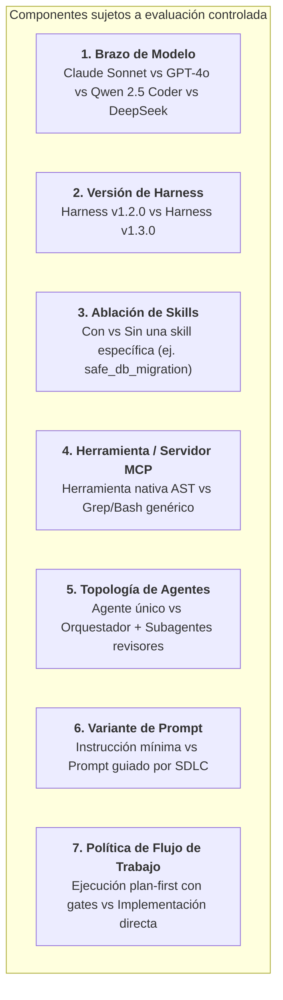
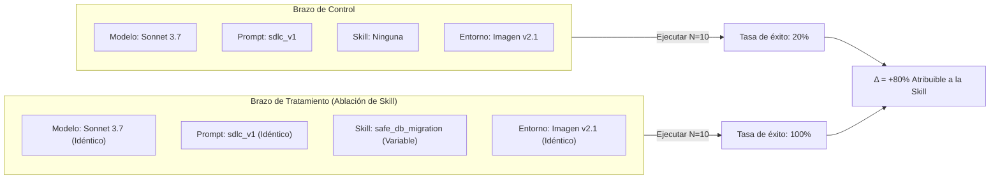

# Validez experimental y ablaciones

En el machine learning tradicional, evaluar un sistema suele consistir en mantener fijo el dataset mientras se intercambian los checkpoints del modelo.

En **Harness Engineering**, el modelo es solo un componente del sistema. Un equipo de ingeniería debe ser capaz de aislar, medir y evaluar **cualquier componente del harness stack**.

---

## Evaluación a lo largo de todo el stack

El objeto de evaluación no tiene por qué limitarse al modelo base. Es posible diseñar experimentos controlados orientados a siete dimensiones distintas:



---

## El principio de oro: Modificar una sola variable a la vez

Para establecer causalidad real —demostrar que una modificación específica fue la causa directa de una mejora observada—, los experimentos deben mantener un aislamiento estricto de variables:

$$\text{Resultado Tratamiento} - \text{Resultado Control} = \Delta_{\text{Variable Aislada}}$$

Si un experimento actualiza simultáneamente el modelo (ej. Sonnet 3.5 $\to$ Sonnet 4), modifica el prompt del sistema, agrega dos skills nuevas y altera la imagen base de Docker, **resulta imposible atribuir cualquier cambio en la tasa de éxito o costo a una intervención concreta.**



---

## ¿Qué es la ablación de skills?

La **Ablación de skills** es una técnica experimental donde una skill específica se desactiva o inyecta temporalmente para medir su contribución marginal exacta:

- **Brazo de Baseline (Control)**: El agente se ejecuta frente al caso de evaluación con todas las reglas estándar del repositorio, pero sin la skill evaluada.
- **Brazo Ablacionado (Tratamiento)**: El agente se ejecuta frente al mismo caso con la skill evaluada habilitada.
- **Comparación**: Se comparan las tasas de éxito objetivo, cantidad de pasos, consumo de tokens y matrices de atribución.

Si el grupo de tratamiento alcanza una mayor tasa de éxito con menos pasos y alta atribución de la skill, la skill ha demostrado empíricamente su utilidad. Si la tasa de éxito no varía, la skill puede ser redundante o estar mal estructurada.

---

## Gestión del no-determinismo y la varianza estocástica

Los agentes basados en LLMs son sistemas estocásticos. El mismo prompt ejecutado dos veces sobre el mismo repositorio puede generar pasos intermedios diferentes.

### Reglas experimentales para sistemas estocásticos:
1. **Nunca evaluar a partir de una sola corrida**: Una única corrida exitosa puede ser simple azar; una única corrida fallida puede ser una anomalía aislada.
2. **Ejecutar lotes multi-corrida**: Ejecutar al menos $N=5$ (para iteración rápida) o $N=10$ (para gates formales de promoción) repeticiones por condición evaluada.
3. **Calcular distribuciones estadísticas**: Reportar tasas de éxito con intervalos de confianza y calcular el costo promedio de tokens con su desviación estándar.

---

## Hash de condición y procedencia experimental

Para garantizar que los resultados de benchmarks pasados sigan siendo interpretables y comparables con el tiempo, cada trial de evaluación debe registrar un **hash de condición determinista**:

```json
{
  "condition_hash": "c8f2a91b4e073d82",
  "harness_fingerprint": "a1f62c29d9814d59",
  "model": "claude-3-7-sonnet-20250219",
  "prompt_variant": "swe_harness",
  "skills_enabled": ["safe_db_migration", "systematic_debugging"],
  "skills_disabled": ["generate_e2e_tests"],
  "environment_image": "harness-runner:v2.4.0",
  "temperature": 0.0
}
```

Si cualquier parámetro (una línea del prompt, un archivo de skill o una dependencia del contenedor) cambia, el `condition_hash` cambia automáticamente, asegurando que corridas de condiciones experimentales distintas nunca se agrupen erróneamente.

---

## Qué tiene permitido afirmar un diseño

El aislamiento de variables responde *cómo* comparar; el **modo de evaluación** responde *qué puede concluir la comparación*. Un diseño de evaluación de harness licencia una afirmación causal solo cuando el repositorio, los casos y el modelo están fijados; un diseño cross-repo licencia una lectura de robustez por repositorio y nada agrupado; un diseño de discovery licencia observaciones, nunca veredictos. Un sistema de evaluación debería rechazar — en el momento del diseño, antes de gastar tokens — cualquier experimento que contradiga su modo declarado. Ver **[Las tres preguntas (Modos de evaluación)](the-three-questions.md)**.

Dos reglas complementarias mantienen honestos los resultados multi-corrida a lo largo del tiempo:

- **Lenguaje prudente en los veredictos.** Con 2 repeticiones decí *exploratorio*; con 5, *una comparación útil*; con 10, *evidencia más fuerte*. Nunca *significativo* — no corrió ningún test de hipótesis. Un delta dentro de la varianza entre corridas se reporta exactamente como eso.
- **Un experimento, una medición.** Una vez que un experimento tiene corridas reales, relanzarlo con otro modelo, prompt o presupuesto debe rechazarse: archivaría dos mediciones bajo un nombre y cada resumen las promediaría como una sola condición. Relanzar con la misma configuración es cómo crecen las repeticiones; una configuración distinta es un experimento nuevo.

---

### Recursos relacionados
- **[Entornos controlados y Sandboxing](controlled-environments-sandboxing.md)**
- **[Auditorías de comportamiento y Scoring](behavioral-audits-and-scoring.md)**
- **[Construir una suite interna de evaluación](../adoption/internal-evaluation-suite.md)**
