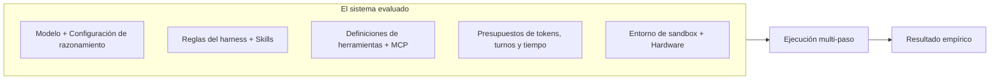
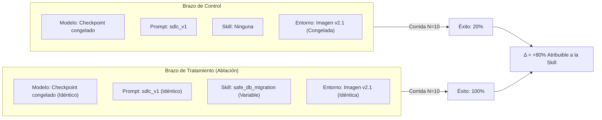

# Validez experimental y ablaciones

En el machine learning tradicional, evaluar un sistema solía significar mantener fijo un conjunto de datos mientras se intercambiaban checkpoints del modelo.

En **Harness Engineering**, el modelo base es solo un componente del sistema evaluado:

$$\mathbf{Modelo\ Aislado} \neq \mathbf{Sistema\ Evaluado}$$

Una evaluación fiable mide el sistema completo a lo largo de todo su envoltorio operacional:



---

## 1. Componentes del sistema evaluado

Como establece la metodología de evaluación de frontera (OpenAI, 2026), una evaluación mide el comportamiento combinado de:

1. **Modelo y configuración de razonamiento**: checkpoint del modelo, esfuerzo de razonamiento y temperatura.
2. **Reglas y skills del harness**: la capa activa de reglas (`AGENTS.md`, `.github/standards.md`) y skills operacionales.
3. **Herramientas y esquemas**: herramientas provistas, descripciones de parámetros y formatos de respuesta.
4. **Salvaguardas del agente**: políticas de seguridad, permisos y condiciones de parada de bucles.
5. **Presupuestos operacionales**: tokens máximos, límite de turnos, intentos permitidos y timeouts.
6. **Entorno de ejecución**: sistema operativo, runtime de contenedores, dependencias, CPU y límites de memoria.

Modificar cualquier componente altera la condición experimental.

---

## 2. Ruido de infraestructura en evaluaciones de código

Investigaciones empíricas de Anthropic (2026) demuestran que la infraestructura de ejecución es una variable experimental activa:

- Variaciones en asignación de CPU, límites de memoria y latencia de red pueden alterar la tasa de éxito hasta en 6 puntos porcentuales en benchmarks como Terminal-Bench.
- Descargas de paquetes con fallos intermitentes de red generan errores artificiales ajenos al razonamiento del modelo.
- Diferencias en las imágenes base de contenedores (como versiones de glibc o utilidades instaladas) modifican el resultado de los comandos ejecutados por el agente.

**Regla de oro**: Dos ejecuciones realizadas en infraestructuras diferentes no pueden interpretarse como una comparación limpia entre modelos o harnesses. El entorno debe estar contenerizado, congelado y registrado como parte explícita de la condición experimental.

---

## 3. La regla fundamental: Cambiar una sola variable a la vez

Para establecer causalidad real, demostrando que una modificación específica causó la mejora observada, los experimentos deben aislar variables con rigor:

$$\text{Resultado del Tratamiento} - \text{Resultado del Control} = \Delta_{\text{Variable Aislada}}$$

Si un experimento actualiza simultáneamente el modelo (de Sonnet 3.5 a Sonnet 4), modifica el system prompt, añade dos skills nuevas y cambia la imagen de Docker, es imposible atribuir el cambio en la tasa de éxito a una intervención concreta.



---

## 4. ¿Qué es la ablación de skills?

La **Ablación de Skills** es una técnica experimental donde una skill específica se desactiva o inyecta temporalmente para medir su contribución marginal exacta:

- **Brazo de línea base (Control)**: El agente ejecuta el caso con las reglas estándar del repositorio, pero sin la skill evaluada.
- **Brazo de ablación (Tratamiento)**: El agente ejecuta exactamente el mismo caso con la skill evaluada activa.
- **Comparación**: Se comparan tasas objetivas de éxito, conteo de pasos, consumo de tokens y matrices de atribución.

Si el tratamiento logra mayor tasa de éxito con menos pasos y atribución positiva, la skill demuestra utilidad empírica. Si la tasa de éxito no varía, la skill es una candidata directa para desmantelamiento y retiro.

---

## 5. Hashes de condición y procedencia experimental

Para asegurar que los resultados históricos sigan siendo interpretables y comparables a lo largo del tiempo, cada corrida captura un **hash de condición** determinista:

```json
{
  "condition_hash": "c8f2a91b4e073d82",
  "harness_fingerprint": "a1f62c29d9814d59",
  "model": "claude-3-7-sonnet-20250219",
  "prompt_variant": "swe_harness",
  "skills_enabled": ["safe_db_migration", "systematic_debugging"],
  "skills_disabled": ["generate_e2e_tests"],
  "environment_image": "harness-runner:v2.4.0",
  "temperature": 0.0
}
```

Si cualquier parámetro (una línea de prompt, una skill o una dependencia del contenedor) cambia, el `condition_hash` cambia de inmediato, impidiendo agregar corridas de condiciones experimentales distintas.

---

## 6. Lenguaje prudente en los veredictos

Dado que los LLMs son estocásticos, los reportes deben mantener rigor conceptual:

- Con $N=2$ repeticiones, califica los resultados como **exploratorios**.
- Con $N=5$ repeticiones, califica los resultados como **una comparación direccional útil**.
- Con $N=10$ repeticiones, califica los resultados como **evidencia sólida**.
- Nunca afirmes que un cambio es **estadísticamente significativo** sin un test de hipótesis explícito.
- Toda diferencia que caiga dentro de la varianza natural entre corridas debe reportarse como margen de ruido.
