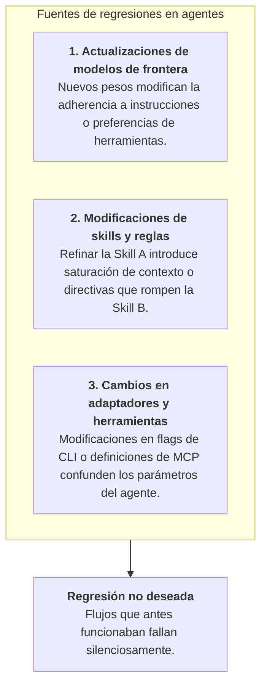
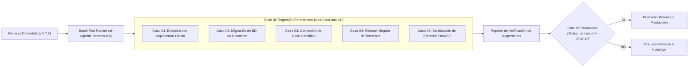
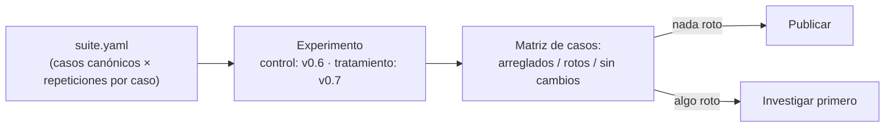

# Suites de regresión para harnesses de IA

Así como el software tradicional requiere suites de pruebas automatizadas para evitar bugs de regresión cuando el código de la aplicación cambia, **un harness de programación asistido por IA requiere una suite de regresión permanente para asegurar que las actualizaciones de modelos, prompts, skills o reglas no degraden capacidades existentes.**

---

## Por qué ocurren regresiones en sistemas agentic

En un SDLC con agentes, las regresiones pueden originarse por tres tipos de cambios:



### Escenarios frecuentes de regresión
- **Regresión por saturación de contexto (Context Bloat)**: El equipo agrega 5 guías de arquitectura detalladas en `.github/`. Si bien el conocimiento de dominio aumenta, el prompt más extenso diluye la atención del agente, haciendo que pase por alto reglas básicas de testing.
- **Cambio en heurísticas del modelo**: El proveedor de IA actualiza su endpoint de Sonnet o GPT; el nuevo modelo prefiere ejecutar código directamente en vez de redactar un `PLAN.md`, violando las políticas de SDLC del equipo.
- **Conflicto en formato de herramientas**: La actualización de una skill cambia un comando de terminal directo por un script auxiliar que falla en Windows o en contenedores con permisos reducidos.

---

## Arquitectura de una suite de regresión del harness

Una suite de regresión del harness consta de casos de evaluación curados y deterministas que representan bugs históricos, casos borde y flujos arquitectónicos clave:



---

## Criterios del Gate de Publicación (Promotion Gate)

Antes de que una nueva versión del harness (o una migración de modelo) se despliegue a los equipos de desarrollo, debe superar cuatro criterios automatizados:

```yaml
# Ejemplo de política de Release Gate
release_gate_policy:
  min_pass_rate_critical: 1.00    # 100% de éxito en seguridad crítica (BD, Auth)
  min_pass_rate_standard: 0.90    # 90% de éxito en features y refactoring general
  max_repeated_command_loops: 2   # Cero bucles de comandos erráticos
  max_token_cost_increase: 0.15   # Máximo 15% de incremento de costo vs baseline
  required_clean_proposals: true  # El outcome gate del lab debe generar 0 propuestas
```

1. **Tolerancia Cero en Seguridad**: Todos los casos críticos (migraciones sin downtime, manejo de secretos, reglas de autenticación) deben alcanzar un 100% de éxito a lo largo de $N=10$ corridas.
2. **Piso Funcional Estándar**: Las tareas generales de código y refactorización deben mantener al menos un 90% de tasa de éxito.
3. **Límites de Eficiencia**: El promedio de pasos y costo en tokens no debe superar los presupuestos definidos.
4. **Integridad de Atribución**: El agente debe demostrar haber consultado las skills gobernadas requeridas.

---

## Ejecución por lotes y automatización

Ejecutar suites de regresión en docenas de casos y múltiples tiers de modelos se automatiza mediante corridas en lote (batch runs):

- **Matriz de producto cruzado**: IDs de Casos $\times$ Tiers de Modelos (Haiku, Sonnet, GPT-4o) $\times$ Variantes de Prompt $\times$ Repeticiones.
- **Colas de workers**: Workers aislados en Celery toman las ejecuciones y las corren en paralelo dentro de contenedores Docker con watchdogs de timeout.
- **Diferencial de regresión**: La interfaz web del lab genera un reporte automatizado que resalta cualquier caso donde la tasa de éxito haya disminuido en comparación con el release anterior.

---

## La suite como productora de experimentos

Una suite de regresión no debería necesitar su propio ejecutor, su propia agregación ni su propia definición de "regresión". La suite declara el **diseño** — qué casos son canónicos y cuántas repeticiones merece cada uno — y la validación de un release es un experimento controlado común: el release anterior como brazo de control, el candidato como tratamiento.



Dos consecuencias que vale internalizar:

- **Un release se lee por caso, nunca como un único compuesto.** "Arregló cuatro, no rompió ninguno, treinta sin cambios" es una frase publicable; "+3 puntos en total" es un lugar donde esconder regresiones.
- **La suite puede rechazar una comparación.** Si los dos brazos varían un campo que la suite mantiene constante (el modelo, el presupuesto), el diseño se rechaza en lugar de aceptarse en silencio — las mismas reglas de validez que cualquier otro experimento, porque *es* cualquier otro experimento.

---

### Recursos relacionados
- **[Construir una suite interna de evaluación](../adoption/internal-evaluation-suite.md)**
- **[Mejora continua del harness](../adoption/continuous-harness-improvement.md)**
- **[¿Qué es una evaluación de agentes?](what-is-an-eval.md)**
