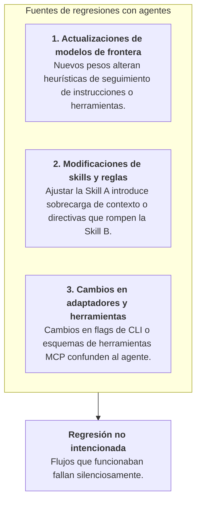
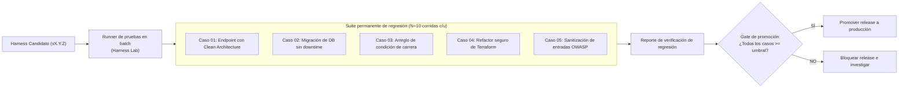
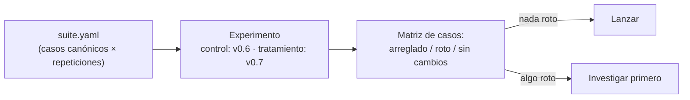

# Suites de regresión para harnesses de IA

Del mismo modo que el software tradicional requiere pruebas automatizadas para prevenir regresiones cuando cambia el código de la aplicación, **un harness de programación con IA exige una suite de regresión permanente para asegurar que las actualizaciones de modelos, prompts, skills o reglas no degraden capacidades existentes.**

---

## 1. Por qué ocurren regresiones en sistemas con agentes

En un SDLC con agentes, las regresiones provienen de tres tipos de cambios:



### Escenarios habituales de regresión
- **Regresión por sobrecarga de contexto**: El equipo agrega cinco guías de arquitectura a `.github/`. Aunque el conocimiento aumenta, el prompt gigante diluye la atención del agente, provocando que ignore reglas básicas de testing.
- **Cambio de heurística**: El proveedor actualiza su endpoint de Sonnet o GPT; el nuevo modelo prefiere editar directo en lugar de crear un plan, violando las políticas del equipo.
- **Conflicto en formato de herramientas**: Una actualización de skill cambia una plantilla bash por un script helper que falla en Windows o entornos restringidos.

---

## 2. Arquitectura de una suite de regresión

Una suite de regresión consta de casos de evaluación curados y deterministas que representan bugs pasados, casos límite y flujos de arquitectura centrales:



---

## 3. Criterios del gate de release

Antes de desplegar una nueva versión del harness a los equipos de desarrollo, debe cumplir cuatro criterios automatizados:

```yaml
# Política de gate de release
release_gate_policy:
  min_pass_rate_critical: 1.00    # 100% de éxito en seguridad crítica (DB, auth)
  min_pass_rate_standard: 0.90    # 90% de éxito en tareas generales
  max_repeated_command_loops: 2   # Cero bucles infinitos de comandos
  max_token_cost_increase: 0.15   # Máximo 15% de aumento de costo vs base
  required_clean_proposals: true  # El gate del lab debe arrojar 0 propuestas nuevas
```

1. **Cero tolerancia en seguridad crítica**: Todo caso crítico (migraciones de bases de datos, manejo de secretos, reglas de autenticación) debe lograr 100% de éxito en $N=10$ pruebas.
2. **Piso funcional estándar**: Tareas generales de programación y refactorización deben mantener al menos un 90% de éxito.
3. **Límites de eficiencia**: El conteo promedio de pasos y costos en tokens no debe superar presupuestos predefinidos.
4. **Integridad de atribución**: El agente debe consultar de forma comprobable las skills gobernadas requeridas.

---

## 4. Ejecución en batch y automatización

Ejecutar suites de regresión sobre decenas de casos y múltiples modelos se automatiza mediante corridas en batch:

- **Matriz de producto cruzado**: IDs de casos $\times$ Modelos $\times$ Variantes de prompt $\times$ Repeticiones.
- **Colas de workers**: Workers aislados de Celery toman tareas y las ejecutan en contenedores Docker paralelos con timeouts de seguridad.
- **Diff de regresión**: La interfaz del lab genera un reporte que resalta cualquier caso donde la tasa de éxito haya caído respecto a la versión anterior.

---

## 5. La suite como productora de experimentos

Una suite de regresión no necesita un runner propio ni una definición aislada de regresión. La suite declara el **diseño** (qué casos son canónicos y cuántas repeticiones merece cada uno) y la validación de release es un experimento controlado habitual: la versión previa como control y la candidata como tratamiento.



Dos lecciones clave:

- **Un release se evalúa por caso, nunca como un único promedio compuesto**: "Se arreglaron cuatro, no se rompió ninguno, treinta sin cambios" es una conclusión lista para producción; "+3 puntos en promedio" es un escondite para regresiones silenciosas.
- **La suite puede rechazar una comparación**: Si los dos brazos varían un campo que la suite exige constante (como el modelo o el presupuesto), el diseño es rechazado de inmediato, aplicando las mismas reglas de validez que cualquier otro experimento.

---

### Recursos relacionados

- **[Construir una suite interna de evaluación](../adoption/internal-evaluation-suite.md)**
- **[Mejora continua del harness](../adoption/continuous-harness-improvement.md)**
- **[¿Qué es una evaluación de agentes?](what-is-an-eval.md)**
