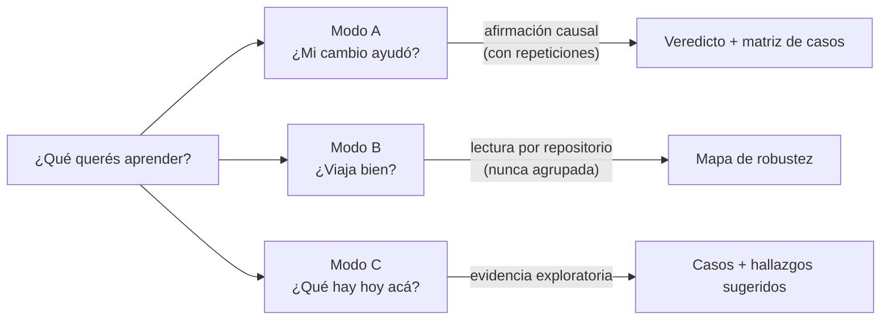
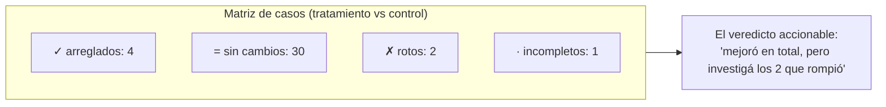

# Las tres preguntas (Modos de evaluación)

Todo equipo de ingeniería que adopta agentes de código termina haciéndose las mismas tres preguntas, casi siempre en un pasillo, casi nunca con evidencia:

1. *"¿Este cambio a nuestro harness realmente mejora algo?"*
2. *"¿Nuestro setup funciona fuera del repositorio donde nació?"*
3. *"¿Qué podemos aprender de cómo este equipo trabaja hoy con IA?"*

Son tres preguntas **distintas**. Requieren diseños experimentales distintos y (esta es la parte que los equipos se saltean) cada una licencia un tipo de conclusión diferente. Tratarlas como intercambiables es la manera en que una corrida con suerte se convierte en política de equipo.

---

## Una pregunta, un modo, un tipo de afirmación

| | **Modo A (Evaluación de harness** | **Modo B) Cross-repo** | **Modo C, Discovery** |
|---|---|---|---|
| **La pregunta** | ¿*Este cambio* causó un mejor resultado? | ¿El harness se sostiene fuera de su repo de origen? | ¿Cómo se comporta hoy este repo/equipo bajo un agente? |
| **Se mantiene fijo** | Repositorio, casos, modelo | Harness, modelo, familia de tareas |, |
| **Varía** | Exactamente un factor del harness | El repositorio | Nada, solo observa |
| **Licencia** | Una afirmación causal, con suficientes repeticiones | Dónde se sostiene y dónde se degrada | Casos, observaciones, hallazgos sugeridos |
| **Nunca** | Variar también el repo o el modelo | Agrupar scores entre repos | Presentar algo como veredicto causal |

La disciplina crítica: **un sistema de evaluación debe rechazar un diseño que no puede responder la pregunta que declara.** Una comparación que varía a la vez el harness y el repositorio produce un número que no es atribuible a ninguno de los dos, es una *petición* perfectamente válida y un *experimento* inválido. Atraparlo en el momento del diseño, antes de gastar un token, es la diferencia entre un instrumento de evaluación y un ejecutor de trabajos que dibuja promedios.

!!! note "Implementación de referencia"
    En [`ai-agentic-harness-lab`](../reference-implementation/ai-agentic-harness-lab/index.md), el modo es un campo de cada experimento y el validador de diseño rechaza contradicciones: el Modo A rechaza que varíe el repositorio o el modelo; el Modo B rechaza cualquier confusor más allá del repositorio y *siempre* advierte que los scores se leen por repositorio; el Modo C no acepta brazo de control y su veredicto queda etiquetado permanentemente como "Exploratorio, sin comparación".

---

## La doctrina de las repeticiones

Los agentes son estocásticos. El mismo prompt contra el mismo repositorio puede tomar otro camino, tocar otros archivos y aterrizar en otro resultado. Eso obliga a una regla de vocabulario fácil de enunciar y difícil de sostener:

| Repeticiones por brazo | Cómo tenés permitido llamarlo |
|---|---|
| **2** | *Solo exploratorio.* Una dirección a investigar, nunca un hallazgo. |
| **5** | *Una comparación útil.* Suficiente para actuar con los ojos abiertos. |
| **10** | *Evidencia más fuerte.* Suficiente para condicionar un release. |

Y una palabra que no aparece nunca: **"significativo"**. Un harness de evaluación a escala de equipo no corre tests de hipótesis, así que no debe tomar prestado el vocabulario de uno. Las frases honestas son: *exploratorio*, *comparación útil*, *evidencia más fuerte*, *dentro de la varianza observada*, *mejora observada*. Si un delta cae dentro del ruido entre corridas, el veredicto lo dice en lugar de redondearlo hacia una victoria.

---

## La matriz de casos le gana al promedio

El promedio es donde se esconden las regresiones. "+8 puntos en total" puede ser *"arregló cuatro casos, rompió dos"*, y los dos que rompió pueden ser justo los que tu equipo entrega todos los días.

Toda comparación debería poder leerse por caso como **arreglado / roto / sin cambios / incompleto** antes de leerse como un número compuesto. El compuesto responde "¿mejoró en promedio?"; la matriz responde "¿qué tengo que mirar exactamente antes de confiar en esto?".

---

## El instrumento honesto: cinco principios de diseño

Lo que hace *defendible* la evidencia de evaluación (ante tu propio equipo o ante un cliente) es un puñado de reglas sobre lo que el instrumento tiene permitido decir. Implementarlas cuesta poco; saltearlas cuesta todo.

### 1. Hechos, observaciones y juicios se etiquetan por separado

`test_pass_rate = 1.0` es el exit code de un comando. `files_changed = 2` se parsea de los artefactos de la corrida. `task_completion = 0.4` es la opinión de un modelo. Cuando los tres son números en la misma tabla se ven idénticos, y la opinión toma prestada, en silencio, la autoridad de la medición. Etiquetá cada métrica con su procedencia (**hecho** / **observación** / **juicio**) en todos los lugares donde se muestre.

### 2. "No medido" nunca es cero

Una métrica que no pudo computarse (sin trayectoria registrada, sin juez configurado, sin expectativa declarada contra la cual calificar) devuelve **ningún score**, con la razón declarada. Escribir un cero en su lugar permite que un agregado lea *"no pudimos medir esto"* como *"a esto le fue mal"*, lo que envenena silenciosamente cada línea de tendencia construida encima.

### 3. Juzgá cada corrida contra lo que realmente tuvo

Cuando comparás *"el setup propio del repositorio"* contra *"nuestro harness inyectado"*, el evaluador debe juzgar cada brazo contra la superficie de gobernanza **que ese brazo realmente recibió**. Auditar un control nativo contra reglas que nunca le dieron lo hace ver peor por construcción, el propio instrumento de medición fabrica la ventaja del tratamiento. Persistí qué archivos pudo ver cada corrida, y calculá su huella.

### 4. Un experimento es una medición

Una vez que un experimento tiene corridas reales, relanzarlo con otro modelo u otro presupuesto debe rechazarse: archivaría dos mediciones distintas bajo un mismo nombre, y cada resumen las promediaría como si fueran una sola condición. Agregar repeticiones con la *misma* configuración es cómo crece la evidencia; cambiar la configuración es un **experimento nuevo**.

### 5. Las máquinas sugieren; las personas firman

El análisis automático es excelente para *notar*, un caso que regresionó, una skill que nadie consulta, una falla repetida. Nunca debe tener permitido *concluir*. Los patrones autogenerados llegan etiquetados como **sugeridos**, y se convierten en hallazgos solo cuando una persona los revisa, opcionalmente los edita, y les pone su nombre. Los rechazos también se registran, para que el mismo patrón no se vuelva a proponer cada semana. Un hallazgo sin dueño es una afirmación que nadie tiene que defender.

---

## Por qué esto funciona para cualquier equipo

Nada de lo anterior requiere un laboratorio de investigación. Requiere:

- Escribir la pregunta **antes** de correr nada (un batch sin pregunta no es un experimento).
- Variar una cosa a la vez, y dejar que el tooling rechace los diseños que varían dos.
- Repetir lo suficiente para respetar la estocasticidad de los agentes, y decir "exploratorio" cuando no lo hiciste.
- Leer la matriz de casos antes que el promedio.
- Mantener al instrumento honesto sobre qué tipo de afirmación es cada número.

Los equipos que adoptan esto dejan de discutir desde anécdotas. El hilo de Slack *"el prompt nuevo se siente mejor"* se convierte en *"éxito 60% → 85% con 5 repeticiones por brazo, nada roto, acá está la matriz."* La segunda frase termina la reunión.

---

### Recursos relacionados

- **[Validez experimental y ablaciones](experimental-validity-and-ablations.md)**: aislamiento de variables y hashing de condiciones.
- **[Suites de regresión](regression-suites.md)**: convertir la validación de releases en un experimento.
- **[Auditorías de comportamiento y scoring](behavioral-audits-and-scoring.md)**: la caja de graders detrás de los números.
- **[Agentic Harness Lab](../reference-implementation/ai-agentic-harness-lab/index.md)**: la implementación de referencia de todo lo anterior.
