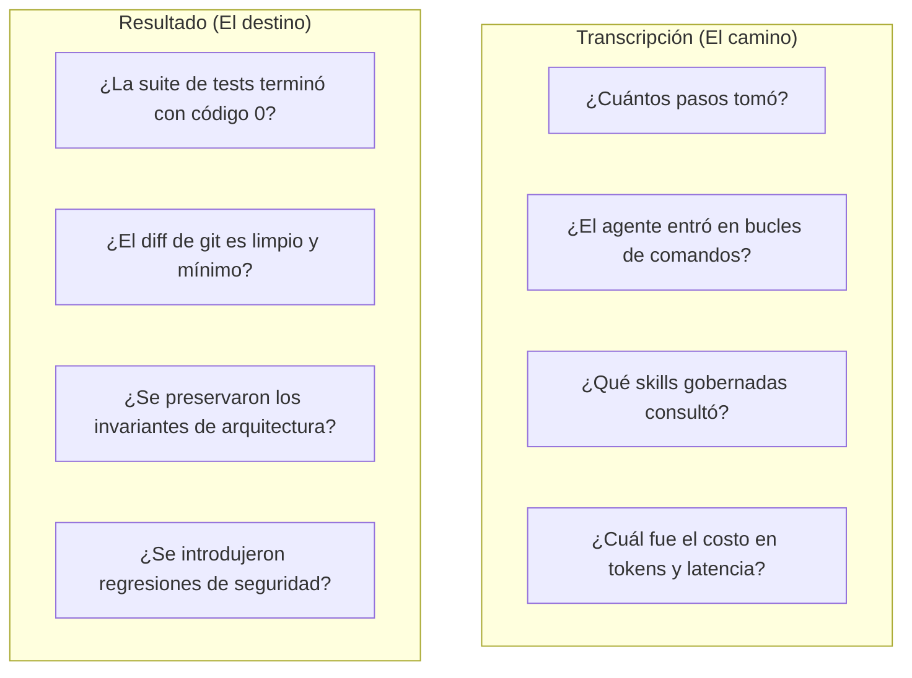
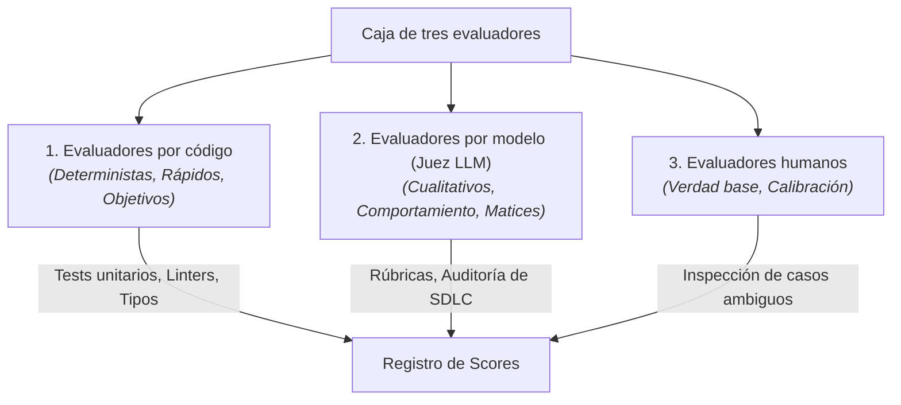
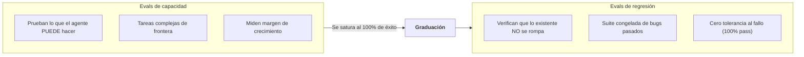

# ¿Qué es una evaluación de agentes?

Una **Evaluación de Agentes** (o *eval*) es un procedimiento riguroso y automatizado que mide con qué eficacia un agente de IA resuelve una tarea concreta dentro de un entorno.

A diferencia de las evaluaciones tradicionales de modelos que miden la generación de texto en un solo turno (como MMLU o HumanEval), las evaluaciones de agentes ponen a prueba el **sistema completo: modelo + harness + herramientas + entorno** a lo largo de interacciones de múltiples turnos.

> [!NOTE]
> **Referencia de la industria**: Los marcos de esta sección sintetizan principios publicados por organizaciones líderes en investigación de IA, en particular *Demystifying Evals for AI Agents* de Anthropic (2026), la investigación de *SWE-bench* de Princeton y las directrices de evaluación de OpenAI (2026).

---

## 1. Vocabulario formal de evaluación

Para evitar confusiones entre corridas de benchmark, experimentos y puntuaciones, Harness Engineering define una taxonomía estricta:

| Término | Definición | Principio clave |
|---|---|---|
| **Tarea (Task)** | Especificación concreta de un problema y estado inicial pineado del repositorio. | Commit congelado, prompt inequívoco, verificación definida. |
| **Prueba (Trial)** | Una única ejecución de una tarea bajo una condición específica. | No determinista; un solo trial nunca es un veredicto. |
| **Experimento (Experiment)** | Comparación declarada de condiciones a lo largo de múltiples pruebas para responder una pregunta. | **Experimento > Pruebas**: El experimento gobierna el diseño. |
| **Evaluador (Grader)** | Instrumento de evaluación que califica la ejecución (Código, Juez LLM o Humano). | Separa hechos, observaciones y juicios. |
| **Trayectoria (Trajectory)** | Secuencia registrada de razonamientos, llamadas a herramientas, comandos y salidas. | Mide eficiencia, bucles y cumplimiento de protocolos. |
| **Resultado (Outcome)** | El estado ambiental final producido por el agente. | **Resultado > Afirmación del agente**: Verifica códigos de salida. |
| **Condición (Condition)** | La tupla completa: modelo, configuración del harness, herramientas, presupuestos y sandbox. | Modificar cualquier elemento cambia la condición. |
| **Harness** | El sistema de reglas, skills, adaptadores y herramientas que envuelve al modelo. | La variable independiente principal bajo prueba. |
| **Suite de evaluación** | Colección curada de tareas categorizadas como benchmarks de capacidad o de regresión. | Las evals de capacidad miden margen; las regresiones protegen la calidad. |

---

## 2. Axiomas centrales de la evaluación de agentes

### Axioma 1: El Experimento sobre la Prueba

Una corrida aislada es solo un dato. Las afirmaciones válidas de ingeniería exigen un **Experimento**:

$$\mathbf{Experimento} > \mathbf{Pruebas}$$

Un experimento declara la pregunta *antes* de que comience la ejecución, declara sus brazos de control y tratamiento, mantiene constantes todas las demás variables y corre suficientes repeticiones para controlar la estocasticidad de los LLMs.

### Axioma 2: El Resultado sobre la Afirmación del Agente

El éxito afirmado por el propio agente es solo una declaración no verificada en la transcripción:

$$\mathbf{Resultado} > \mathbf{Afirmación\ del\ Agente}$$

Si un agente afirma en el chat "He corregido el error y todos los tests pasan", pero el runner de pruebas en el sandbox termina con código de salida 1, el resultado es un fallo. Las evaluaciones deben inspeccionar siempre el estado del entorno real en lugar de confiar en el texto de la conversación.

---

## 3. Transcripción vs Resultado: Dos lentes de evaluación

- **El Resultado**: Valida la corrección funcional. Si el parche no pasa las pruebas unitarias, la corrida es un fallo funcional sin importar cuán elocuente haya sido la explicación del agente.
- **La Transcripción**: Valida la disciplina de ingeniería. Un agente podría lograr que un test pase mediante fuerza bruta (por ejemplo, probando 40 cambios al azar en 100 pasos), pero ese comportamiento representa un fallo costoso y frágil de metodología.

---

## 4. La caja de herramientas de tres evaluadores

Ningún método de calificación individual es suficiente para tareas complejas de ingeniería:

| Tipo de evaluador | Fortalezas | Limitaciones | Uso principal |
|---|---|---|---|
| **Evaluadores por código** | Deterministas, instantáneos, costo cero en tokens. | No evalúan elegancia de estilo ni sutilezas de arquitectura. | Tests pasados, códigos de salida de linters, drift de lockfiles. |
| **Evaluadores por modelo (Juez LLM)** | Evalúan matices, leen diffs, puntúan rúbricas. | Ligero no determinismo; exigen calibración cuidadosa de prompts. | Auditorías de comportamiento, calidad del plan, documentación. |
| **Evaluadores humanos** | Fuente definitiva de calibración y verdad base. | Costosos, lentos, no escalan para integración continua en CI. | Calibrar benchmarks nuevos, revisar regresiones complejas. |

---

## 5. Evals de capacidad vs Evals de regresión

- **Evaluaciones de capacidad**: Miden nuevos modelos o skills ambiciosas en desafíos difíciles. Ofrecen espacio para mejorar.
- **Evaluaciones de regresión**: Una suite congelada y estable de problemas resueltos previamente que todo harness candidato debe aprobar antes del release.
- **Graduación**: Cuando una tarea de capacidad se resuelve de forma consistente (alcanzando 100% de éxito en corridas repetidas), se gradúa a la suite de regresión para proteger contra regresiones futuras.

---

## 6. Desarrollo guiado por evaluaciones (EDD)

En la ingeniería de software clásica, Test-Driven Development (TDD) dicta escribir pruebas antes de implementar el código.

En Harness Engineering, practicamos **Evaluation-Driven Development (EDD)**:
1. Al diseñar o mejorar una skill, primero define el caso de evaluación en el Harness Lab.
2. Ejecuta pruebas de línea base para medir la tasa de fallos y observar los modos de error.
3. Escribe la skill gobernada, regla o adaptador.
4. Itera hasta que el agente alcance la tasa de éxito objetivo en los modelos soportados.
5. Desmantela scaffolding redundante cuando las mediciones de ablación confirmen que ya no es necesario.
