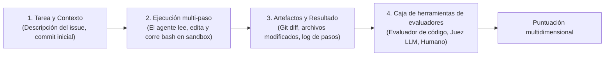
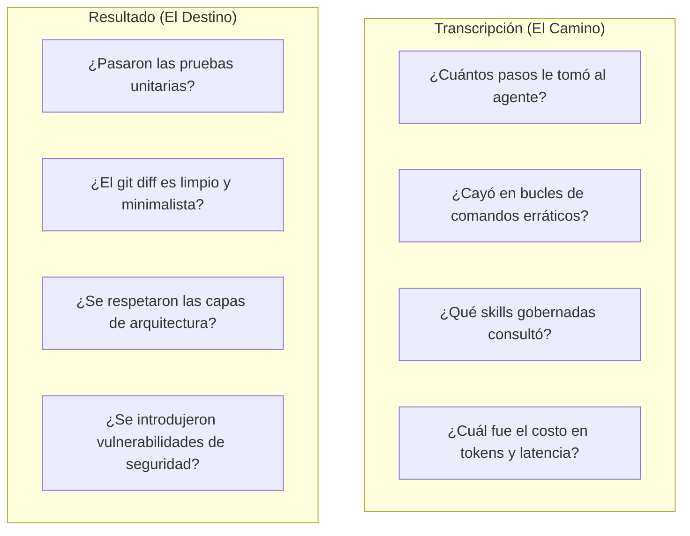
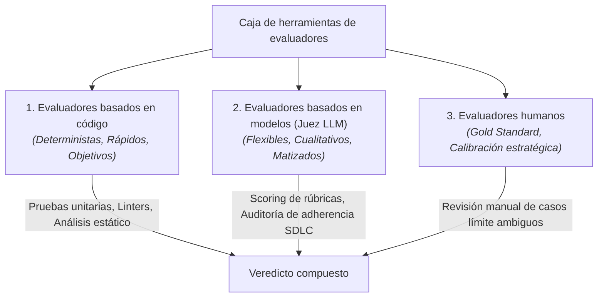
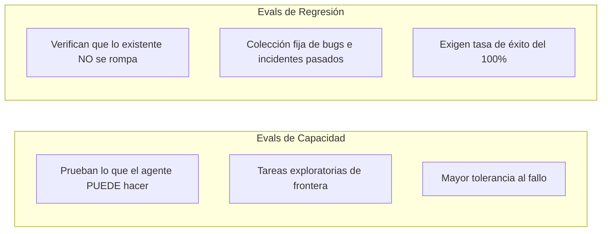

# ¿Qué es una evaluación de agentes?

Una **Evaluación de Agentes** (o *eval*) es un procedimiento riguroso, automatizado o semi-automatizado, que mide con qué eficacia un agente de IA resuelve una tarea específica dentro de un entorno determinado.

A diferencia de las evaluaciones tradicionales de LLMs que miden la compleción de texto en un único paso (como MMLU o HumanEval), las evaluaciones de agentes evalúan el **sistema completo: modelo + harness + herramientas + entorno** a lo largo de interacciones multi-paso.

> [!NOTE]
> **Referencia de la industria**: Los marcos conceptuales de esta sección sintetizan principios publicados por organizaciones líderes de investigación en IA, en particular la guía *Demystifying Evals for AI Agents* de Anthropic (2026), las investigaciones de *SWE-bench* (Princeton) y los manuales de evaluación de OpenAI.

---

## Anatomía de una evaluación de agentes

Una evaluación de agentes consta de cuatro componentes coordinados:

1. **Tarea y estado inicial**: Un prompt con el problema claramente especificado y un commit inicial determinista del repositorio.
2. **Entorno de ejecución controlado**: Un sandbox aislado donde el agente puede inspeccionar código, ejecutar comandos en terminal y editar archivos.
3. **Interacción multi-paso**: El agente observa las salidas de las herramientas, formula hipótesis e itera hacia la solución.
4. **Grading y puntuación**: Evaluación cuantitativa y cualitativa de si el estado final del entorno resuelve la tarea sin efectos colaterales indeseados.

---

## Transcripción vs Resultado: Las dos lentes de evaluación

Al evaluar coding agents, los equipos de ingeniería deben examinar tanto el **camino recorrido** como el **destino final**:

- **El Resultado (Outcome)**: Valida la corrección funcional. Si el patch no pasa las pruebas unitarias, la corrida es un fallo funcional, sin importar lo elocuente que haya sido la explicación del agente.
- **La Transcripción (Transcript)**: Valida la eficiencia y la adherencia al SDLC. Un agente podría lograr pasar un test por fuerza bruta (ej. probando 40 modificaciones aleatorias en 100 pasos), pero ese comportamiento representa un fallo costoso e inaceptable de disciplina ingenieril.

---

## La caja de herramientas de los tres evaluadores (Three-Grader Toolbox)

Ningún método de evaluación individual es suficiente para tareas complejas de agentes. Los equipos combinan tres tipos de evaluadores:

| Tipo de evaluador | Fortalezas | Limitaciones | Uso recomendado |
|---|---|---|---|
| **Evaluadores de código** | 100% deterministas, instantáneos, costo cero en tokens. | No pueden evaluar elegancia estilística ni matices de arquitectura. | Aprobación de tests, linters, compilación, control de drift de lockfiles. |
| **Evaluadores de modelo (LLM Judge)** | Manejan matices cualitativos, leen diffs, puntúan rúbricas. | Ligero no-determinismo; requiere calibrar prompts cuidadosamente. | Auditorías de comportamiento, calidad del plan, completitud de documentación. |
| **Evaluadores humanos** | Fuente suprema de verdad y calibración. | Costosos, lentos, no escalables para ejecución continua en CI. | Calibración inicial de benchmarks, revisión de fallos ambiguos. |

---

## Gestión de la estocasticidad: Métricas de fiabilidad

Dado que los agentes basados en LLMs son no deterministas, evaluar a un agente a partir de una única corrida es un antipatrón de ingeniería. Los equipos emplean métricas estandarizadas multi-corrida:

### 1. `pass@k` (Flujos con humano en el loop)
Mide la probabilidad de que el agente tenga éxito **al menos una vez** en $k$ intentos independientes:
$$\text{pass}@k = 1 - \frac{\binom{n - c}{k}}{\binom{n}{k}}$$
*(Donde $n$ es el total de corridas y $c$ son las corridas correctas).*  
- **Caso de uso**: Flujos de trabajo donde un desarrollador interactúa con el agente y puede descartar 2 intentos fallidos siempre que 1 tenga éxito rápido.

### 2. `pass^k` (Automatización autónoma)
Mide la probabilidad de que el agente tenga éxito **consistentemente en todos los $k$ intentos**:
$$\text{pass}^k = \left(\frac{c}{n}\right)^k$$
- **Caso de uso**: Pipelines automatizados de alta fiabilidad (ej. actualizaciones desatendidas de dependencias, corrección autónoma de bugs en background) donde cualquier fallo genera alarmas.

---

## Evals de capacidad vs Evals de regresión

- **Evaluaciones de capacidad**: Miden el desempeño de nuevos modelos o skills ambiciosas en desafíos complejos.
- **Evaluaciones de regresión**: Suite fija de problemas resueltos en el pasado que todo nuevo harness debe superar antes de publicarse.

---

## Evaluation-Driven Development (EDD) para agentes

En el desarrollo de software tradicional, **Test-Driven Development (TDD)** establece escribir las pruebas antes de implementar el código.

En Harness Engineering practicamos **Evaluation-Driven Development (EDD)**:
1. Al crear o mejorar una skill, primero defines el caso de evaluación en el lab.
2. Ejecutas corridas de baseline para medir la tasa de fallos e identificar los modos de fallo exactos.
3. Escribes la skill o regla gobernada.
4. Iteras hasta que el agente alcance la tasa de éxito objetivo en todos tus tiers de modelos.

---

### Recursos relacionados
- **[Entornos controlados y Sandboxing](controlled-environments-sandboxing.md)**
- **[Validez experimental y ablaciones](experimental-validity-and-ablations.md)**
- **[Auditorías de comportamiento y Scoring](behavioral-audits-and-scoring.md)**
