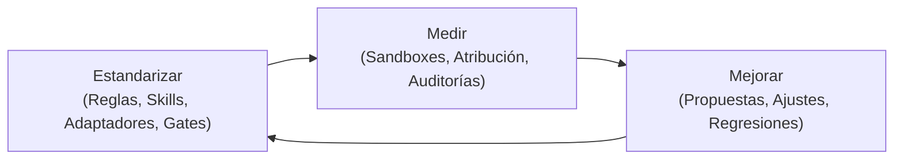
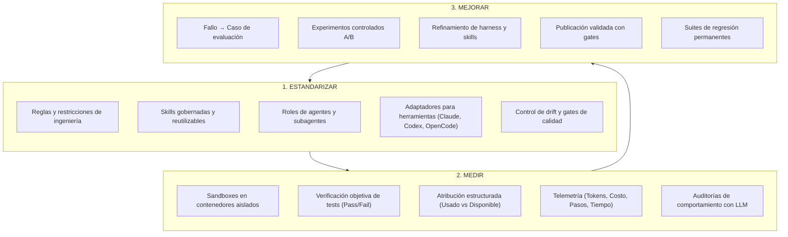
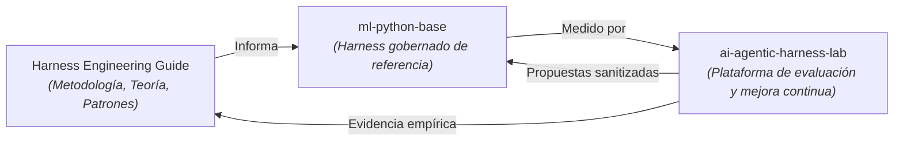

# Guía de Harness Engineering

**La disciplina de ingeniería para diseñar, evaluar y mejorar de forma continua el Agentic SDLC.**

[Harness Engineering Guide](https://marcosdh1987.github.io/harness-engineering-guide/es/) es una guía metodológica y técnica, pública y neutral frente a proveedores, para organizaciones de ingeniería que buscan pasar del *uso ad-hoc de herramientas de IA* a un *ciclo de vida de desarrollo de software asistido por agentes sistemático, medible y mejorable*.

---

---

## La pregunta central

> **¿Cómo pasa una organización de ingeniería de que cada desarrollador use herramientas de IA por su cuenta a gestionar, medir y mejorar de forma sistemática un sistema de desarrollo asistido por agentes?**

A medida que los asistentes de programación con IA evolucionan de la simple autocompleción de código a agentes autónomos de múltiples pasos (capaces de ejecutar comandos en la terminal, editar repositorios, correr suites de pruebas e interactuar con herramientas externas), la ingeniería de prompts resulta insuficiente.

Las organizaciones enfrentan retos críticos:
- **Regresiones silenciosas y drift**: Los agentes generan código que supera revisiones superficiales pero vulnera límites de arquitectura, políticas de seguridad o pautas de migración de bases de datos.
- **Evaluación basada en percepción**: Los equipos juzgan a los agentes por impresiones anecdóticas individuales en lugar de contar con evidencia reproducible y cuantitativa.
- **Aprendizaje efímero**: Las lecciones aprendidas de los errores de los agentes se pierden en conversaciones de chat o hilos de Slack en lugar de acumularse como capacidades de la organización.

**Harness Engineering** resuelve esto tratando al sistema alrededor del modelo —reglas, contexto, skills, herramientas, entornos de ejecución, gates de calidad, observabilidad y evaluaciones— como un producto de software ingenieril y versionado.

---

## Metodología rectora: Estandarizar → Medir → Mejorar

Todo el marco conceptual se articula en tres pilares fundamentales:

1. **Estandarizar**: Definir y versionar cómo esperamos que trabajen los agentes: límites arquitectónicos, herramientas aprobadas, skills reutilizables y gates de validación.
2. **Medir**: Dejar de evaluar agentes por percepción. Ejecutar casos reproducibles dentro de entornos sandbox controlados, midiendo atribución exacta, consumo de tokens, trazas de pasos y auditorías de comportamiento.
3. **Mejorar**: Cerrar el ciclo de retroalimentación. Convertir los fallos de los agentes en casos de evaluación reproducibles, evaluar las mejoras bajo condiciones controladas y conservarlas como tests de regresión permanentes.

---

## Por dónde empezar

-   :material-presentation: **[Agentic SDLC para equipos](start-here/agentic-sdlc-for-teams.md)**

    ---

    Un resumen ejecutivo y técnico de 10 minutos. Explica el problema, el modelo de madurez, el caso de estudio de migraciones de bases de datos y los próximos pasos.

-   :material-school: **[¿Qué es Harness Engineering?](start-here/what-is-harness-engineering.md)**

    ---

    Descubre el Harness Stack completo: context engineering, arquitectura de reglas, skills gobernadas, gates de calidad y adaptadores para herramientas.

-   :material-chart-line: **[Modelo de madurez del Agentic SDLC](adoption/maturity-model.md)**

    ---

    Evalúa la posición de tu organización a través de 6 niveles (desde Nivel 0: IA Ad-hoc hasta Nivel 5: Agentic SDLC en mejora continua).

-   :material-flask: **[Entornos controlados y Sandboxing](evaluation/controlled-environments-sandboxing.md)**

    ---

    Comprende por qué evaluar agentes requiere aislamiento de ejecución para garantizar reproducibilidad, seguridad y validez experimental, respaldado por evidencia de la industria.

---

## El ecosistema de ciclo cerrado

Esta guía se respalda en dos implementaciones de referencia públicas:

1. **[Harness Engineering Guide](https://github.com/marcosdh1987/harness-engineering-guide)**: La metodología conceptual, los patrones de arquitectura y los principios de evaluación.
2. **[`ml-python-base`](https://github.com/marcosdh1987/ml-python-base)**: El harness de referencia listo para producción con reglas centralizadas en `.github/`, skills gobernadas, adaptadores multi-herramienta (Claude Code, OpenAI Codex, OpenCode, Antigravity, GitHub Copilot) y control automatizado de drift de lockfiles.
3. **[`ai-agentic-harness-lab`](https://github.com/marcosdh1987/ai-agentic-harness-lab)**: La plataforma de evaluación y benchmarking que incluye sandboxes en Docker, hashes de condición, atribución estructurada, auditorías de comportamiento y generación de propuestas sanitizadas.

---

## Niveles de afirmación y rigor técnico

Para mantener la claridad ingenieril y el rigor metodológico, esta documentación distingue estrictamente tres niveles de afirmación:

1. **Evidencia de la industria**: Investigaciones públicas, hallazgos empíricos y documentos técnicos de laboratorios de frontera y benchmarks estándar (ej. Anthropic, OpenAI, SWE-bench, Princeton, Microsoft Research).
2. **Recomendación de la guía**: Las propuestas metodológicas, modelos de madurez y patrones arquitectónicos desarrollados en esta guía.
3. **Implementación de referencia**: Las decisiones de diseño específicas implementadas en `ml-python-base` y `ai-agentic-harness-lab`.
