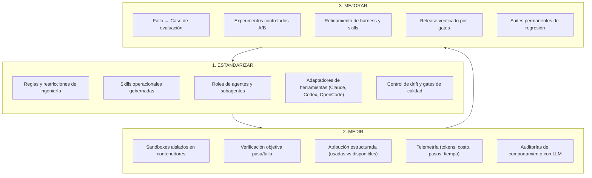
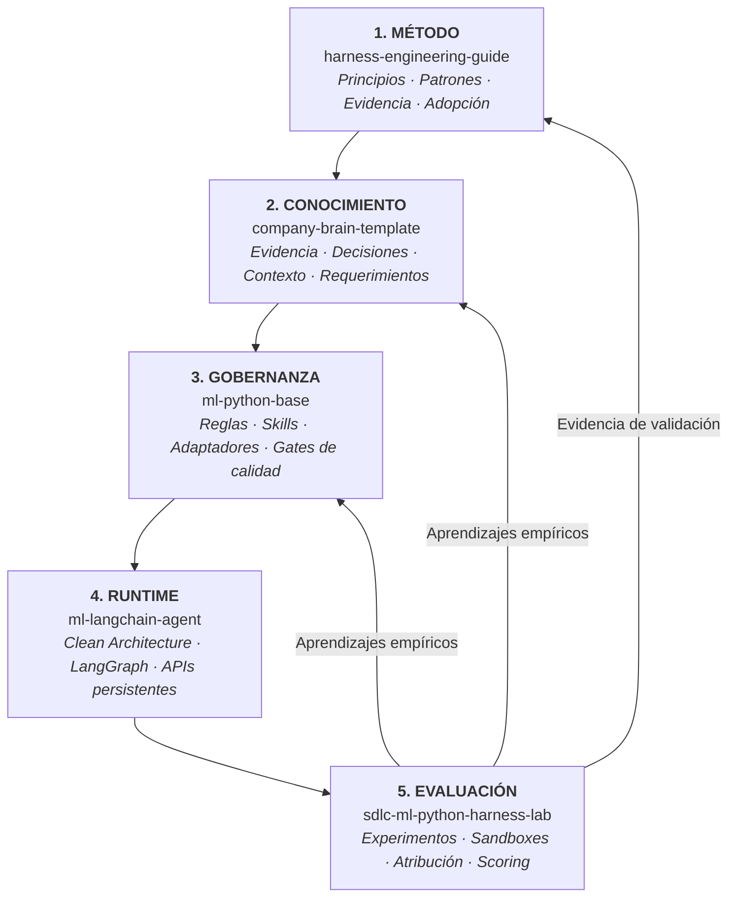

# Guía de Harness Engineering

**La disciplina de ingeniería para construir, evaluar y mejorar continuamente el ciclo de vida del software asistido por agentes.**

[Harness Engineering Guide](https://marcosdh1987.github.io/harness-engineering-guide/) es una metodología pública y neutral frente a proveedores para organizaciones de ingeniería que buscan pasar del uso individual y ad-hoc de IA a un ciclo de vida sistemático, medible y en mejora continua.

---

---

## La pregunta central

> **¿Cómo pasa una organización de desarrolladores individuales usando herramientas de IA a gestionar, medir y mejorar sistemáticamente un sistema de desarrollo asistido por agentes?**

A medida que los asistentes de programación con IA evolucionan desde el autocompletado de un solo turno hacia agentes autónomos de múltiples turnos (que ejecutan comandos de terminal, editan repositorios, corren suites de pruebas y llaman a herramientas externas), el prompt engineering aislado resulta insuficiente.

Las organizaciones enfrentan desafíos recurrentes:
- **Regresiones silenciosas y drift**: Los agentes generan código que pasa verificaciones superficiales pero viola límites de arquitectura, políticas de seguridad o reglas de migración de bases de datos.
- **Evaluación basada en percepciones**: Los equipos juzgan a los agentes por impresiones anecdóticas individuales en lugar de evidencia cuantitativa y reproducible.
- **Aprendizaje efímero**: Las lecciones aprendidas de los errores de los agentes quedan perdidas en historiales de chat en lugar de acumularse en capacidades organizacionales permanentes.

**Harness Engineering** resuelve esto tratando al sistema alrededor del modelo (las reglas, contexto, skills, herramientas, entornos de ejecución, gates de calidad, observabilidad y evaluaciones) como un sistema de software formal bajo control de versiones.

---

## La metodología guía: Estandarizar → Medir → Mejorar

El marco completo se organiza en torno a tres pilares fundamentales:

1. **Estandarizar**: Definir y versionar cómo deben trabajar los agentes, incluyendo límites arquitectónicos, herramientas aprobadas, skills reutilizables y gates de validación.
2. **Medir**: Reemplazar la percepción subjetiva con casos de evaluación reproducibles ejecutados dentro de entornos controlados. Registrar atribución exacta, costos en tokens, trazas de pasos y auditorías de comportamiento.
3. **Mejorar**: Cerrar el ciclo de feedback. Convertir fallos en casos reproducibles de evaluación, probar mejoras en condiciones controladas y preservarlas como pruebas permanentes de regresión.

---

## Dónde comenzar

-   :material-presentation: **[Agentic SDLC para equipos](start-here/agentic-sdlc-for-teams.md)**

    ---

    Un informe técnico y ejecutivo de 10 minutos. Cubre el problema central, el Modelo de Madurez, el caso de estudio de migración de bases de datos y la hoja de ruta de adopción.

-   :material-school: **[¿Qué es Harness Engineering?](start-here/what-is-harness-engineering.md)**

    ---

    Explora el Harness Stack completo: context engineering, arquitectura de reglas, skills gobernadas, gates de calidad y adaptadores de herramientas.

-   :material-chart-line: **[Modelo de madurez del Agentic SDLC](adoption/maturity-model.md)**

    ---

    Evalúa la posición de tu organización a través de 6 niveles (desde Nivel 0: IA Ad-hoc hasta Nivel 5: Agentic SDLC en mejora continua).

-   :material-flask: **[Entornos controlados y Sandboxing](evaluation/controlled-environments-sandboxing.md)**

    ---

    Comprende por qué evaluar agentes requiere aislamiento de ejecución para garantizar reproducibilidad, seguridad y validez experimental, respaldado por evidencia de la industria.

---

## El ecosistema de cinco capas

Esta guía articula cinco capas modulares de ingeniería con agentes en un ciclo cerrado de mejora continua:

1. **Metodología**: [`harness-engineering-guide`](https://github.com/marcosdh1987/harness-engineering-guide), que define las bases conceptuales, superficies operativas y patrones.
2. **Plano de Conocimiento**: [`company-brain-template`](https://github.com/marcosdh1987/company-brain-template), que estructura la memoria organizacional y el pipeline de promoción de evidencia.
3. **Gobernanza de Ingeniería**: [`ml-python-base`](https://github.com/marcosdh1987/ml-python-base), el harness de repositorio gobernado con reglas centralizadas, skills y adaptadores multi-herramienta.
4. **Runtime de Productos Agentic**: [`ml-langchain-agent`](https://github.com/marcosdh1987/ml-langchain-agent), la plantilla para construir y desplegar servicios de agentes con LangGraph.
5. **Plano de Evaluación**: [`sdlc-ml-python-harness-lab`](https://github.com/xmartlabs/sdlc-ml-python-harness-lab), la plataforma de evaluación continua, benchmarking en Docker y suites de regresión.

---

## Niveles de afirmación y rigor técnico

Para mantener la claridad ingenieril y el rigor metodológico, esta documentación distingue estrictamente tres niveles de afirmación:

1. **Evidencia de la industria**: Investigaciones públicas, hallazgos empíricos y documentos técnicos de laboratorios de frontera y benchmarks estándar (ej. Anthropic, OpenAI, SWE-bench, Princeton, Microsoft Research).
2. **Recomendación de la guía**: Las propuestas metodológicas, modelos de madurez y patrones arquitectónicos desarrollados en esta guía.
3. **Implementación de referencia**: Las decisiones de diseño específicas implementadas en nuestros repositorios de referencia (`ml-python-base`, `ml-langchain-agent`, `company-brain-template` y `sdlc-ml-python-harness-lab`).
