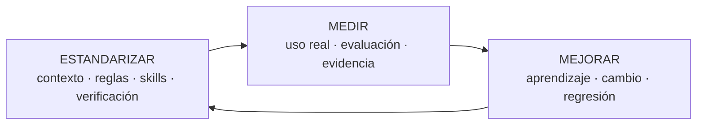
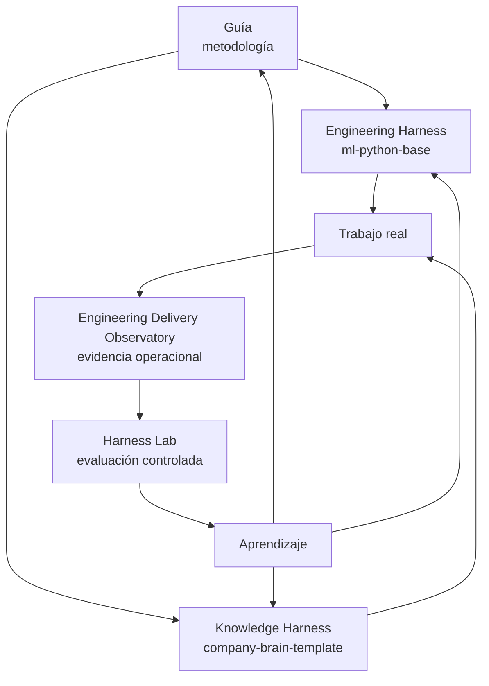

# Guía de Harness Engineering

!!! info "Sobre esta guía"
    **Qué vas a aprender:** cómo contexto, reglas, skills, herramientas, verificación y evaluación forman una manera durable de trabajar con IA.

    **Para quién:** developers, tech leads, engineering managers, PMs, AI champions y knowledge workers.

    **Leela cuando:** quieras la explicación más corta del sistema y una ruta hacia la profundidad adecuada.

Harness Engineering no intenta predecir cuál será la mejor herramienta, modelo o agente dentro de seis meses. Define una base estable de contexto, reglas, skills, herramientas, verificación y evaluación para que los equipos evolucionen sin redefinir su forma de trabajar cada vez que cambia el ecosistema.

Claude, Codex, OpenCode, Copilot, Gemini, modelos open source, frameworks, servidores MCP y runtimes pueden cambiar. Los principios pueden seguir siendo útiles.

## Estandarizar, Medir, Mejorar

Este ciclo aplica a software engineering y knowledge work. Estandarizá cómo se fundamenta y verifica el trabajo. Medí qué ocurre en la práctica y bajo condiciones controladas. Mejorá el sistema compartido y volvé a estandarizar lo aprendido.

## Elegí tu camino

-   :material-map-marker-path: **[Elegí tu camino](use/elegi-tu-camino.md)**

    ---

    Encontrá un punto de partida según tu rol u objetivo.

-   :material-code-braces: **[Construí software](start-here/agentic-sdlc-for-teams.md)**

    ---

    Seguí la ruta de Engineering Harness hacia `ml-python-base`.

-   :material-book-open-variant: **[Organizá conocimiento](use/trabajo-de-conocimiento.md)**

    ---

    Empezá conceptualmente con un Company Brain, Team Brain, Role Brain o Second Brain.

-   :material-chart-timeline-variant: **[Medí y mejorá](medir-y-mejorar/index.md)**

    ---

    Conectá el uso real del Observatory con el trabajo controlado de Harness Lab.

## El ecosistema

| Pieza | Rol |
| --- | --- |
| Harness Engineering Guide | Metodología, conceptos, patrones y guía de adopción |
| `ml-python-base` | Engineering Harness para developers y equipos de software |
| `company-brain-template` | Knowledge Harness para contexto organizacional compartido |
| Engineering Delivery Observatory | Vista operacional del uso de IA y evidencia de ingeniería |
| Harness Lab | Plano de evaluación para experimentos controlados y regresiones |

La guía no es un runtime ni un producto. Los repositorios de referencia muestran implementaciones posibles y permanecen separados del método.

## Un ciclo de trabajo común

**Understand → Planificar o diseñar cuando haga falta → Execute → Testear → Verify → Review → Learn**

Un cambio pequeño puede recorrer este ciclo rápidamente. Un cambio arquitectónico puede necesitar brainstorming, una especificación, un plan incremental y varios puntos de review. El harness debe reducir incertidumbre, no agregar ceremonia por sí misma. Consultá el [ciclo de trabajo](patterns/working-loop.md).

## Niveles de evidencia

Esta guía mantiene separados tres niveles: evidencia de la industria, recomendaciones de la guía y hechos de implementaciones de referencia. Esa distinción es parte del modelo de confianza del sistema. Empezá por [Entender](concepts/harness-engineering.md) o pasá directamente a [Referencia](reference-implementation/index.md).
