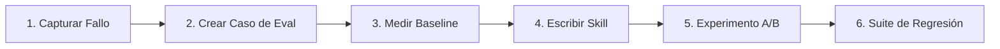
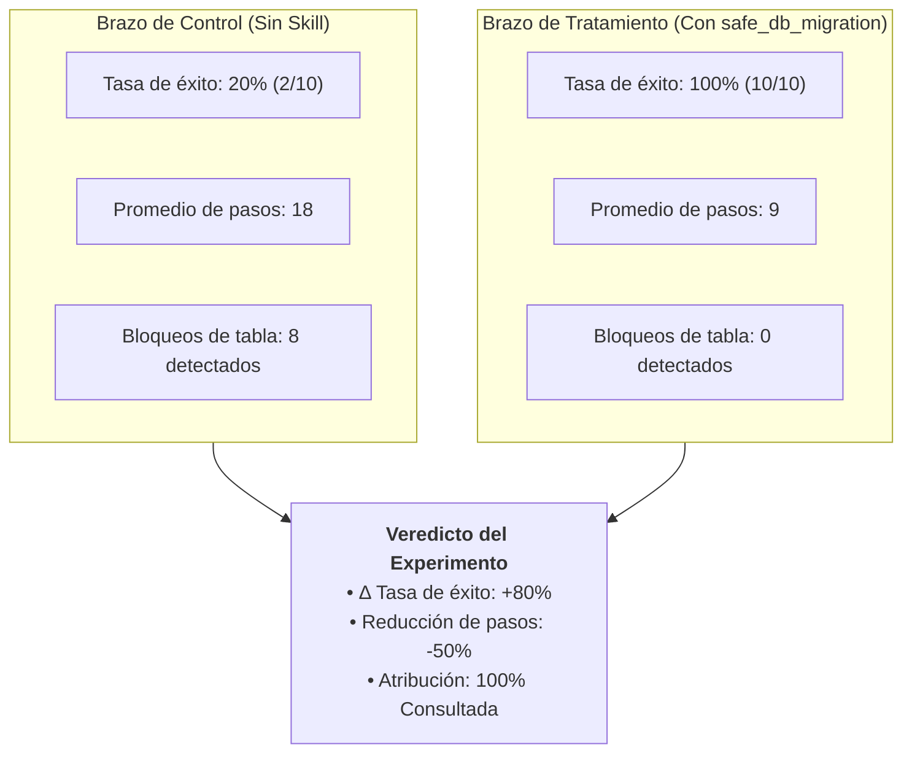

# Laboratorio: Caso empresarial de seguridad en migraciones

En este laboratorio práctico recorrerás el ciclo completo de **Estandarizar → Medir → Mejorar** resolviendo un desafío empresarial real: **evitar que los coding agents generen migraciones de base de datos inseguras que bloqueen tablas en producción.**

---



---

## 1. El incidente (Definición del problema)
Se le solicitó a un agente de código agregar una columna `is_verified` a la tabla `users` en una base de datos PostgreSQL utilizando Alembic.

El agente generó la siguiente migración estándar:
```python
# Migración insegura: Bloquea de forma exclusiva tablas con millones de filas
def upgrade():
    op.add_column('users', sa.Column('is_verified', sa.Boolean(), nullable=False, server_default='false'))
```
En una base de datos de producción con millones de usuarios activos, agregar una columna no-nullable con valor por defecto sin procedimientos de zero-downtime provoca un **bloqueo exclusivo de tabla (`ACCESS EXCLUSIVE`)**, congelando todas las consultas de lectura y escritura y provocando una caída del servicio.

---

## 2. Creación del caso de evaluación

Extraemos el incidente en un caso de evaluación determinista en `cases/safe_migration_case.yaml`:

```yaml
id: "custom-db-migration-zero-downtime"
title: "Agregar columna no-nullable is_verified a users sin bloqueo de tabla"
target_repo: "company/core-service"
base_commit: "d41d8cd"

task_description: |
  Agrega una columna booleana no-nullable `is_verified` con valor por defecto `false` a la
  tabla `users` en Alembic. Sigue los estándares corporativos de migraciones sin downtime:
  agregar primero como nullable, popular el valor en lotes y agregar la restricción NOT NULL al final.

environment:
  docker_image: "harness-runner:latest"
  timeout_seconds: 240

validation_commands:
  - "pytest tests/test_migration_locks.py"
  - "python scripts/lint_alembic_locks.py"
```

---

## 3. Medición del baseline

En **Agentic Harness Lab**, ejecuta 10 corridas de baseline del caso con `claude-3-7-sonnet` sin la skill especializada.

### Resultados de las corridas de baseline:
- **Tasa de éxito**: `2 / 10 (20%)`
- **Modo de fallo**: En 8 de cada 10 corridas, el modelo generó un `op.add_column` en un solo paso aplicando un bloqueo exclusivo de tabla.
- **Atribución**: No había ninguna guía de seguridad de migraciones disponible ni consultada.

---

## 4. Creación de la skill gobernada

Crea `.github/skills/safe_db_migration.md` en tu repositorio:

```markdown
---
name: safe_db_migration
description: Reglas para migraciones de base de datos sin downtime en PostgreSQL y Alembic.
---

# Migraciones de base de datos sin downtime

## Reglas
1. **Nunca agregues una columna no-nullable directamente** a tablas existentes con datos.
2. **Patrón de migración en tres fases**:
   - **Fase 1**: Agregar la columna como `nullable=True`.
   - **Fase 2**: Popular las filas existentes con el valor por defecto en lotes en background.
   - **Fase 3**: Agregar la restricción `NOT NULL` mediante un `CHECK` constraint o `ALTER COLUMN SET NOT NULL` únicamente tras haber populado todas las filas.
3. **Creación de índices**: Siempre utiliza `op.create_index(..., postgresql_concurrently=True)`.
```

Sincroniza la skill en los adaptadores multi-herramienta:
```bash
make check-sync
```

---

## 5. Ejecución del experimento A/B controlado

En el lab, ejecuta un ensayo A/B comparando:
- **Brazo de Control**: Modelo sin la skill ($N=10$)
- **Brazo de Tratamiento**: Modelo con `safe_db_migration` habilitada ($N=10$)



---

## 6. Cierre del ciclo: Suite de regresión permanente

1. **Mergear la skill**: Commitea `.github/skills/safe_db_migration.md` y publica la versión `v1.4.0` en tu repositorio de gobernanza.
2. **Bloquear en la suite de regresión**: Agrega `custom-db-migration-zero-downtime` a la matriz de tests de CI de releases.

Toda futura migración de modelo o actualización del harness ejecutará automáticamente este caso de prueba, garantizando que la seguridad en migraciones de base de datos quede permanentemente protegida.

---

### Recursos relacionados
- **[Construir una suite interna de evaluación](../adoption/internal-evaluation-suite.md)**
- **[Patrón: De fallo a regresión](../patterns/failure-to-regression.md)**
- **[Flujo de evaluación en el Lab](../reference-implementation/ai-agentic-harness-lab/evaluation-workflow.md)**
