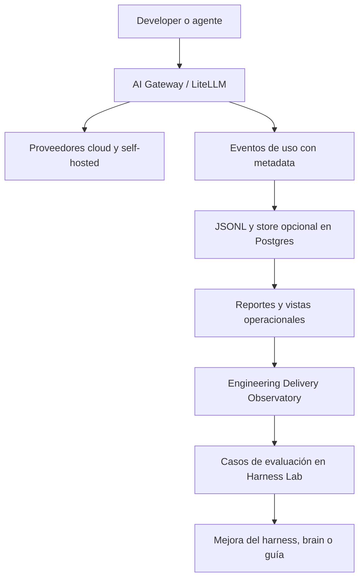

# Engineering Delivery Observatory

!!! info "Sobre esta página"
    **Qué vas a aprender:** qué puede revelar una superficie operacional de observabilidad y qué no puede demostrar.

    **Para quién:** engineering managers, tech leads, AI champions, equipos de plataforma y Harness Engineers.

    **Leela cuando:** quieras relacionar uso de IA con evidencia de ingeniería sin inventar un score de productividad.

El Observatory es una arquitectura de referencia para observar el uso de IA en el workflow cotidiano de ingeniería. Se relaciona con el proyecto `ai-gateway`, pero es más amplio que un proxy de LLM.

## Evaluación y observabilidad son diferentes

| Evaluación | Observabilidad |
| --- | --- |
| Experimento controlado | Actividad real del sistema en ejecución |
| Pregunta qué alternativa funciona mejor | Pregunta qué ocurrió realmente |
| Harness Lab, casos, baselines y regresiones | Tráfico del gateway, traces y datos de delivery |
| Confirma o rechaza una hipótesis | Encuentra patrones y fallos candidatos |

## Qué puede observar el gateway actual

La implementación local de `ai-gateway` registra metadata como requests, modelo y proveedor, tokens de prompt y completion, costo, latencia, estado, atribución por virtual key, tool, harness, repositorio, benchmark, run, environment y tags cuando los clientes los envían. Escribe una captura JSONL de solo metadata y puede ingerirla en un feature store de Postgres. La exportación opcional a Langfuse agrega observabilidad orientada a traces.

El proyecto actual también ofrece comandos de resumen, perfiles por developer, detección de anomalías, forecast y segmentación. Un proxy no ve por sí solo el historial de git, las acciones del editor, los cambios aceptados ni los transcripts de agentes. Esas señales requieren collectors adicionales y atribución responsable.

## Capas de métricas recomendadas

| Capa | Ejemplos | Interpretación |
| --- | --- | --- |
| Usage | Requests, tokens, costo, latencia, modelos, errores | Qué pasó por el gateway |
| Process | Tareas, agent runs, skills, tool calls, intentos de verificación, ejecuciones de CI | Cómo se hizo el trabajo, cuando exista el dato |
| Delivery | Lead time, ciclo de PR, iteraciones de review, fallos de tests, frecuencia de deploy, change failure rate | Qué ocurrió en delivery, cuando existan integraciones |
| Quality | Tasa de verificación exitosa, regresiones, retrabajo, violaciones de arquitectura, hallazgos de seguridad | Evidencia sobre resultados |

Son recomendaciones, no un estándar obligatorio. Más tokens no significan más productividad. Más uso de IA no significa mejor ingeniería. Menos tiempo transcurrido no implica necesariamente un mejor resultado.

## Privacidad y atribución responsable

La metadata debería clasificar actividad, no capturar prompts o respuestas por defecto. No pongas secretos ni contenido personal en tags. Definí ownership y acceso de la telemetría operacional por separado de los datos del Company Brain y del Second Brain personal.

La medición debe ayudar a formular preguntas, no convertir la telemetría de IA en una métrica individual de performance. Evitá afirmaciones causales si los datos y el diseño del estudio no las sostienen.

!!! note "Estado actual"
    El gateway, el contrato de metadata, el store local, la ingesta a Postgres, los reportes y la exportación opcional a Langfuse son capacidades de referencia. Un collector de delivery, un dashboard unificado y un análisis causal de productividad son integraciones futuras, no garantías actuales.
