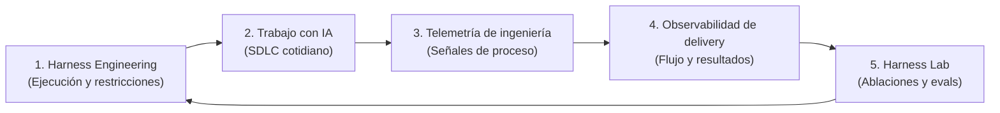
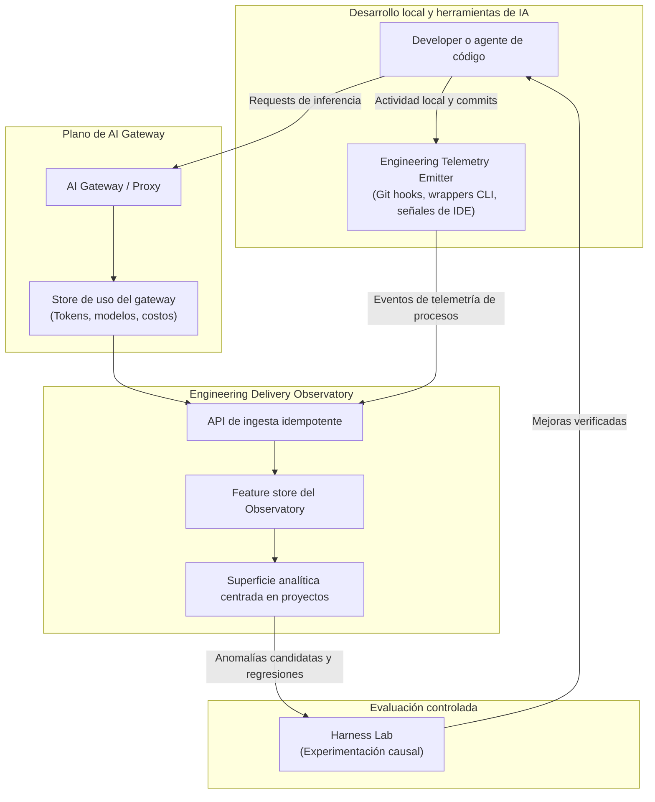
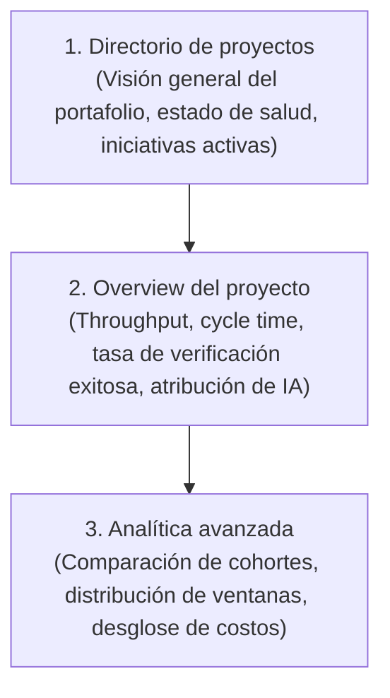
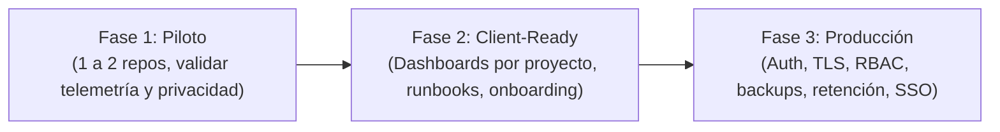
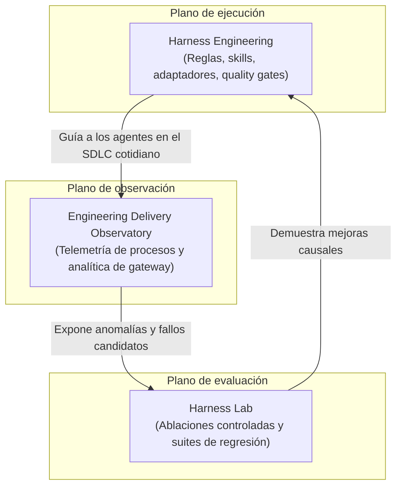

# Patrón Engineering Delivery Observatory

!!! info "Sobre esta página"
    **Qué vas a aprender:** cómo cerrar el ciclo de feedback en el SDLC asistido por IA observando flujo de ingeniería, actividad, calidad y uso de IA sin inspeccionar código fuente privado.

    **Para quién:** engineering managers, tech leads, AI champions, equipos de plataforma y Harness Engineers.

    **Leela cuando:** quieras ir más allá de ajustar prompts y verificar si tu sistema de ingeniería realmente está mejorando.

Un harness de ingeniería de software está incompleto hasta que el sistema de ingeniería puede observar si efectivamente está mejorando. La adopción de flujos asistidos por IA suele detenerse en incorporar mejores agentes, prompts más ricos o skills modulares. Sin observabilidad operacional, los equipos dependen de impresiones subjetivas en lugar de evidencia empírica.

El **Patrón Engineering Delivery Observatory** establece un plano de medición que preserva la privacidad a lo largo del desarrollo cotidiano. Captura telemetría de procesos, correlaciona la inversión en IA con el flujo de entrega y expone patrones candidatos para su evaluación controlada en el [Harness Lab](../reference-implementation/ai-agentic-harness-lab/index.md).

---

## 1. Cerrar el ciclo de feedback

Harness Engineering conecta la ejecución de agentes con la entrega verificada mediante un ciclo empírico:



Para cerrar este ciclo de forma responsable, el Observatory monitorea seis dimensiones equilibradas:

1. **Throughput:** unidades de trabajo completadas, velocidad de merge e iniciativas entregadas.
2. **Flujo:** lead time, cycle time, iteraciones de review y tamaño de lotes.
3. **Calidad:** tasa de éxito en verificaciones, suites de test aprobadas, tasa de regresiones y defectos que escapan a producción.
4. **Actividad de ingeniería:** cadencia de commits locales, ventanas de ingeniería activa y churn en el repositorio.
5. **Uso de IA:** selección de modelos, tokens de prompt y completion, tasa de aciertos de cache y volumen de requests.
6. **Señales de eficiencia:** ratio de retrabajo, estabilidad del ciclo y costo computacional equivalente a APIs.

---

## 2. El principio central de privacidad

> "Medir el proceso de ingeniería sin observar el contenido de ingeniería."

La observabilidad jamás debe degradarse en vigilancia. El sistema registra cómo se mueve el trabajo a través del ciclo de vida de desarrollo, excluyendo estrictamente artefactos propietarios, contenido fuente y prompts personales.

| Categoría de telemetría | Incluido en telemetría de procesos | Excluido por defecto (Contenido de ingeniería) |
| --- | --- | --- |
| **Identificadores** | Slug canónico del proyecto, nombre del repo, tipo de branch | Identidad de vigilancia individual del developer, email, username |
| **Datos temporales** | Timestamps de eventos, ventanas de duración, latencia | Registro de pulsaciones de teclas, temporizadores continuos |
| **Cambios de código** | Líneas agregadas y eliminadas agregadas (+/- LOC), conteo de commits | Código fuente, diffs, árboles de sintaxis abstracta, rutas de archivos |
| **Verificación** | Códigos de salida éxito/fallo, estado de ejecución de tests | Salida de terminal, dumps de error estándar, stack traces de fallos |
| **Unidades de trabajo** | Referencias de issues, identificadores de tareas, números de pull request | Descripciones de tickets, requerimientos confidenciales de clientes |
| **Interacciones con IA** | Nombre del modelo, conteo de tokens, duración de request, costo | Prompts, completions, trazas de razonamiento, secretos embebidos |

---

## 3. Arquitectura de referencia

La arquitectura separa responsabilidades en emisión ligera de telemetría, enrutamiento centralizado de IA y agregación centrada en proyectos:



### Roles arquitectónicos

- **AI Gateway:** actúa como proxy unificado para proveedores de modelos cloud y self-hosted. Registra uso de modelos, tokens de prompt y completion, códigos de estado, latencias y costo financiero equivalente a APIs sin almacenar el cuerpo de los prompts.
- **Engineering Telemetry Emitter:** opera en los entornos de desarrollo, runners de CI automatizados o runtimes de agentes. Emite eventos ante commits, comandos de verificación y cambios de estado en tareas.
- **Engineering Observatory:** almacena, normaliza e indexa eventos de proceso, ofreciendo vistas de flujo de entrega acotadas a cada proyecto.
- **Implementación agnóstica de proveedores:** el patrón funciona con proxies open source (como LiteLLM), gateways de API a medida, motores SQL estándar (como PostgreSQL o ClickHouse) y plataformas de visualización estándar (como Metabase, Grafana o portales dedicados).

---

## 4. Identidad común del proyecto: Slug canónico de proyecto

Correlacionar el tráfico del AI gateway con la entrega en repositorios requiere un identificador compartido entre herramientas desconectadas. El **slug canónico de proyecto** funciona como clave única de unión:

```text
Telemetría de repositorios: project_slug = "customer-portal"
Alias de clave en gateway:   key_alias    = "customer-portal"
Proyecto en Observatory:     project_id   = "customer-portal"
```

Usar un slug de proyecto consistente elimina la necesidad de rastrear developers individualmente o propagar headers complejos entre APIs externas de proveedores. El Observatory correlaciona la inversión agregada en modelos con la entrega agregada del repositorio simplemente cruzando por `customer-portal`.

---

## 5. Semántica de entrega: At-Least-Once con ingesta idempotente

Interrupciones de red, desarrollo offline y reintentos de hooks de pre-commit implican que no se puede garantizar transporte exactamente una vez. El patrón adopta:

$$\text{Entrega At-Least-Once} + \text{Ingesta Idempotente}$$

- **Resiliencia en clientes:** los emisores de telemetría bufferean eventos localmente y reintentan cuando vuelve la conectividad.
- **Identidad determinística de eventos:** cada payload de evento posee un identificador determinístico (derivado de timestamp, hash del repositorio, SHA de commit o UUID generado por el cliente).
- **Ingesta idempotente:** el backend almacena eventos mediante upsert o claves de deduplicación. Los envíos duplicados devuelven respuesta HTTP 200/201 exitosa.
- **Realidad operacional:** los eventos duplicados representan reintentos habituales de red, no fallos de infraestructura.

---

## 6. Actividad de desarrollo vs Evidencia de entrega

Un error recurrente en la medición de ingeniería es confundir el esfuerzo en curso con los resultados entregados. El Observatory distingue explícitamente dos ciclos de vida:

| Dimensión | Actividad de desarrollo | Evidencia de entrega |
| --- | --- | --- |
| **Alcance** | En curso, exploratorio, local | Merged, verificado, entregable |
| **Señales clave** | Árbol con cambios locales, ramas locales, churn de LOC sin stagear, sesiones activas de IA, commits locales | Aprobaciones de pull requests, builds de CI exitosos, merges a trunk, deploys a producción |
| **Interpretación** | Representa razonamiento activo de ingeniería, debugging exploratorio e iteración de agentes | Representa valor organizacional verificado y progreso desplegable |
| **Riesgos** | Mucha actividad sin entrega evidencia bloqueos o desvíos improductivos | Mirar solo métricas de entrega ignora el costo real de la exploración previa |

Un developer o agente que realiza 15 commits locales depurando un algoritmo complejo representa actividad genuina de ingeniería. Esa actividad aún no constituye evidencia de entrega hasta que supera los quality gates y se integra en trunk.

---

## 7. Tiempo de ingeniería activa: Aproximación por ventanas de eventos

El seguimiento tradicional de horas es impreciso, invasivo y contraproducente. El Observatory aproxima el foco agrupando eventos en ventanas temporales:

```mermaid
flowchart LR
    E1["Evento 1<br/>10:00"] -->|5 min gap| E2["Evento 2<br/>10:05"]
    E2 -->|8 min gap| E3["Evento 3<br/>10:13"]
    E3 -->|45 min gap (> umbral)| E4["Evento 4<br/>10:58"]
    
    subgraph W1["Ventana 1 (18 min)"]
        E1
        E2
        E3
    end
    
    subgraph W2["Ventana 2 (Activa)"]
        E4
    end
```

- **Umbral de inactividad:** cuando el intervalo entre eventos consecutivos supera un umbral definido (por ejemplo 20 o 30 minutos), la ventana actual se cierra.
- **Aproximación de foco:** la suma de ventanas activas estima la atención de ingeniería dedicada a un proyecto durante un ciclo determinado.
- **Límites claros:** es una heurística operacional para estimar carga de trabajo, nunca un reloj de fichaje para evaluar personas.

---

## 8. El uso de IA como dimensión de atribución

La asistencia por IA es una dimensión de contexto en la ingeniería moderna, no una medida aislada de productividad. El Observatory clasifica las unidades de trabajo en tres estados explícitos:

1. `observed`: la telemetría de procesos o los logs del gateway confirman que se utilizaron herramientas de IA durante la unidad de trabajo.
2. `no_observed_signal`: no se detectó actividad de gateway ni sesiones de herramientas para esta unidad de trabajo.
3. `unknown`: la metadata está incompleta, desvinculada o sin verificar.

!!! warning "Evitar el sesgo de datos faltantes"
    Nunca asumas que `no_observed_signal` demuestra que no se usó IA. Los developers pueden usar interfaces web en navegadores, cuentas personales o herramientas no instrumentadas. Asumir que el trabajo sin señales fue estrictamente manual introduce sesgos.

---

## 9. Interpretación multidimensional de la productividad

No existe un score único de productividad en ingeniería de software. Un sistema de ingeniería saludable equilibra múltiples fuerzas en tensión:

```text
Salud del sistema = (Throughput ↑) + (Cycle Time ↓) + (Calidad estable/↑) + (Retrabajo estable/↓) + (Costo unitario estable/↓)
```

- **Throughput:** unidades de trabajo completadas y cadencia de funcionalidades.
- **Velocidad de flujo:** cycle time desde el primer commit hasta el deploy en producción.
- **Presión de defectos:** ratios de retrabajo, frecuencias de rollback y tasas de regresión.
- **Inversión de recursos:** gasto en tokens y costos de runtime en infraestructura.

Líneas de código, cantidad de commits y uso bruto de tokens son indicadores descriptivos de actividad. Tratarlos como objetivos de productividad activa la ley de Goodhart, degradando la calidad del código e incentivando soluciones innecesariamente complejas.

---

## 10. Rigor causal y lenguaje descriptivo

La telemetría observacional muestra asociaciones estadísticas en entornos de producción. No demuestra causalidad.

| Fraseo permitido (Asociación descriptiva) | Fraseo prohibido (Causalidad no justificada) |
| --- | --- |
| "Las unidades de trabajo observadas con IA mostraron una mediana de cycle time 22% menor en el último trimestre." | "El uso de agentes de IA causó una reducción del 22% en el cycle time." |
| "Los repositorios con skills gobernadas experimentaron menos fallos de verificación." | "Las skills gobernadas eliminaron los defectos de verificación." |
| "Un mayor gasto en tokens en el gateway estuvo correlacionado con mayor churn inicial de código." | "Más tokens generaron más churn de código." |

Para probar si una regla de harness, skill o configuración de agente causa directamente una mejora, llevá el patrón candidato al [Harness Lab](../reference-implementation/ai-agentic-harness-lab/index.md) para realizar experimentos controlados de ablación.

---

## 11. Experiencia de usuario centrada en proyectos

Las interfaces de observabilidad deben servir para tomar decisiones de entrega, no para administrar bases de datos. La navegación principal sigue una jerarquía centrada en proyectos:



Líderes de ingeniería y tech leads deben comprender de inmediato la salud del proyecto sin escribir consultas SQL, inspeccionar tablas internas ni configurar filtros complejos de telemetría.

---

## 12. Baselines y comparaciones históricas

Los equipos deben evaluar su evolución contra su propia trayectoria interna antes que contra benchmarks externos arbitrarios:

- **Ventana de comparación interna:** contrastar el rendimiento actual contra períodos anteriores (por ejemplo los últimos 30 días contra los 90 días previos).
- **Drift contextual:** los equipos evolucionan, las bases de código crecen y las arquitecturas cambian. Los baselines internos controlan de forma natural el stack tecnológico, la complejidad del dominio y el tamaño del equipo.
- **Benchmarks externos:** datos de la industria (como métricas generales de encuestas DORA) aportan contexto referencial, pero no representan una verdad universal aplicable a cualquier entorno.

---

## 13. Modelo de madurez del Observatory

Las organizaciones avanzan a través de seis etapas diferenciadas en su capacidad de medición:

| Nivel | Nombre | Descripción | Capacidades clave |
| :---: | --- | --- | --- |
| **0** | **Ad-hoc AI** | Uso individual sin instrumentación | Los developers usan herramientas de IA aisladas sin visibilidad ni control de costos |
| **1** | **Gateway Visibility** | Telemetría centralizada en proxy | Registro de tokens, enrutamiento de modelos, tasas de error y gasto en APIs |
| **2** | **Engineering Telemetry** | Captura de eventos de proceso locales | Hooks de git capturan commits, ventanas activas e intentos de verificación |
| **3** | **Delivery Observability** | Ciclo de vida correlacionado por proyecto | Slugs canónicos unifican gasto de IA con flujo de PRs y métricas de entrega |
| **4** | **Cohort Association** | Comparaciones de IA frente a entrega | Análisis sistemático de cycle time, retrabajo y calidad según el estado de atribución |
| **5** | **Closed-Loop Improvement** | La producción retroalimenta la evaluación | Las anomalías de telemetría nutren suites de evaluación y regresión en Harness Lab |

---

## 14. Patrón de rollout: De piloto a producción empresarial

La adopción del patrón Observatory debe realizarse en tres etapas incrementales:



1. **Fase Piloto:**
    - Instrumentar 1 o 2 repositorios representativos.
    - Validar el contrato de datos de telemetría y confirmar que ningún contenido propietario o secreto se escape.
    - Confirmar la alineación del slug canónico entre las claves del gateway y los emisores en repositorios.
2. **Fase Client-Ready:**
    - Desplegar navegación clara por proyectos y dashboards automatizados para los equipos.
    - Publicar runbooks de onboarding y smoke tests automatizados para los hooks de clientes.
    - Capacitar a líderes técnicos en la interpretación no causal de métricas.
3. **Fase Producción:**
    - Asegurar la API de ingesta con autenticación mutua, cifrado TLS y control de acceso basado en roles (RBAC).
    - Establecer backups automatizados de bases de datos y políticas de retención de datos.
    - Integrar single sign-on (SSO) y registros de auditoría para cumplimiento organizacional.

---

## 15. El ecosistema completo: Harness, Observatory y Lab

El Engineering Delivery Observatory trabaja de forma coordinada con la metodología general de Harness Engineering:



- **Harness Engineering:** mejora la forma en que trabajan los agentes mediante reglas, skills, adaptadores y gates de seguridad.
- **Engineering Observatory:** mide lo que ocurre en el sistema de ingeniería a lo largo de los ciclos de producción.
- **Harness Lab:** evalúa si las variaciones observadas son genuinamente causales mediante experimentos A/B reproducibles y aislados.

---

## 16. Checklist práctica de implementación

Utilizá esta lista de verificación antes de iniciar mediciones, comparar períodos o publicar conclusiones:

### Antes de medir
- [ ] **Identidad canónica de proyecto:** los slugs canónicos de proyecto están definidos y alineados entre repositorios, claves de gateway y vistas analíticas.
- [ ] **Límites de privacidad:** los filtros excluyen estrictamente prompts, código fuente, diffs, métricas de vigilancia individual y secretos.
- [ ] **Contrato de telemetría:** los esquemas de eventos y sus payloads están versionados, documentados y validados.
- [ ] **Atribución configurada:** las virtual keys del AI gateway y los emisores cliente proveen atributos de proyecto coincidentes.

### Antes de comparar
- [ ] **Ventana de observación suficiente:** los períodos de muestra cubren al menos 30 a 60 días de actividad representativa del equipo.
- [ ] **Alcance por proyecto:** las métricas se analizan por proyecto en lugar de mezclarse entre bases de código no comparables.
- [ ] **Sin contaminación cruzada entre proyectos:** librerías compartidas o monorepos aplican límites claros de slug.
- [ ] **Sesgo de datos faltantes contemplado:** el trabajo sin señales de telemetría se clasifica como `no_observed_signal` o `unknown`, jamás como trabajo manual garantizado.

### Antes de formular conclusiones
- [ ] **Visión multidimensional:** throughput, tiempos de flujo, calidad, retrabajo y costo se evalúan en conjunto.
- [ ] **Calidad incorporada:** las tasas de verificación exitosa y el conteo de defectos acompañan a las métricas de velocidad.
- [ ] **Retrabajo evaluado:** el churn de código y los rollbacks post-merge se analizan junto con la velocidad inicial.
- [ ] **Costo evaluado:** los costos de inferencia de modelos y la infraestructura se contemplan en el balance de eficiencia.
- [ ] **Lenguaje causal evitado:** los hallazgos expresan asociaciones descriptivas; las afirmaciones causales se reservan para experimentos controlados en el [Harness Lab](../reference-implementation/ai-agentic-harness-lab/index.md).
