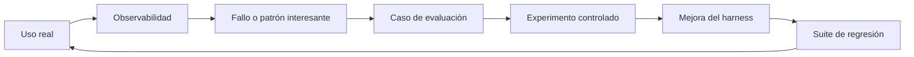

# Medir y Mejorar

!!! info "Sobre esta sección"
    **Qué vas a aprender:** cómo se conectan el uso real, la evaluación controlada y la mejora.

    **Para quién:** engineering managers, tech leads, AI champions, Harness Engineers y equipos que adoptan IA.

    **Leela cuando:** necesites evidencia sobre si un cambio mejoró el sistema.

El objetivo no es reducir ingeniería a un score. Es volver respondibles preguntas útiles: si una regla ayudó, si una skill mejoró el comportamiento, si una fuente agregó señal y si un cambio regresó bajo otro modelo o herramienta.

## Dos superficies complementarias

| Superficie | Pregunta principal | Salida habitual |
| --- | --- | --- |
| Engineering Delivery Observatory | ¿Cómo se usa realmente la IA y qué ocurre alrededor de ese uso? | Evidencia operacional, patrones y casos candidatos |
| Harness Lab | ¿Qué configuración funciona mejor bajo condiciones comparables? | Scores, atribución, resultados experimentales y regresiones |

La observabilidad descubre patrones de actividad. La evaluación prueba hipótesis en condiciones controladas. Ninguna superficie alcanza por sí sola para la mejora continua.

Empezá por [Observabilidad vs Evaluación](../concepts/observability-vs-evaluation.md), seguí con [Engineering Delivery Observatory](engineering-delivery-observatory.md) y después consultá [Harness Lab](../reference-implementation/ai-agentic-harness-lab/index.md).

!!! note "Medir el sistema"
    Evaluamos el sistema alrededor del modelo: contexto, reglas, skills, herramientas, routing, verificación y workflow humano. La elección del modelo es una variable, no todo el sistema.
