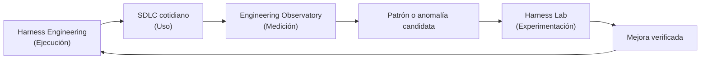

# Medir y Mejorar

!!! info "Sobre esta sección"
    **Qué vas a aprender:** cómo se conectan el uso real de ingeniería, la observabilidad de delivery, la evaluación controlada y la mejora continua.

    **Para quién:** engineering managers, tech leads, AI champions, Harness Engineers y equipos que adoptan IA.

    **Leela cuando:** necesites evidencia empírica sobre si un harness de ingeniería realmente está mejorando tu sistema de delivery.

El objetivo no es reducir la ingeniería a un único score de productividad. Es cerrar el ciclo de feedback de ingeniería: si una regla ayudó, si una skill mejoró el comportamiento, si una fuente de contexto aportó señal y si un cambio regresó bajo otro modelo o herramienta.

Harness Engineering está incompleto hasta que el sistema de ingeniería puede observar si efectivamente está mejorando.

## Dos superficies complementarias

| Superficie | Pregunta principal | Salida habitual | Principio central |
| --- | --- | --- | --- |
| [Engineering Delivery Observatory](engineering-delivery-observatory.md) | ¿Qué ocurre realmente en nuestros proyectos de ingeniería, el flujo y la inversión en IA? | Telemetría de procesos operacionales, ventanas de actividad, métricas de flujo y anomalías | Medir el proceso sin observar el contenido |
| [Harness Lab](../reference-implementation/ai-agentic-harness-lab/index.md) | ¿Qué configuración del harness funciona mejor bajo condiciones controladas y comparables? | Scores de benchmark, atribución de skills, resultados de ablaciones y suites de regresión | Aislar variables para establecer prueba causal |

La observabilidad descubre patrones, asociaciones y regresiones operacionales en la actividad real. La evaluación prueba hipótesis en condiciones aisladas y reproducibles. Ninguna superficie por sí sola alcanza para sostener la mejora organizacional continua.

## Por dónde empezar

1. **Comprender el límite conceptual:** leé [Observabilidad vs Evaluación](../concepts/observability-vs-evaluation.md) para entender por qué la telemetría indica asociación mientras que la evaluación determina causalidad.
2. **Desplegar el patrón operacional:** seguí el [Patrón Engineering Delivery Observatory](engineering-delivery-observatory.md) para instrumentar emisores ligeros, establecer slugs canónicos de proyectos y observar el flujo sin capturar código fuente propietario.
3. **Ejecutar experimentos controlados:** explorá el [Harness Lab](../reference-implementation/ai-agentic-harness-lab/index.md) para poner a prueba mejoras candidatas con casos reproducibles, ablaciones y suites de regresión.

!!! note "Medir el sistema, no solo el modelo"
    Evaluamos y observamos el sistema completo alrededor del modelo: contexto, reglas, skills, adaptadores de herramientas, gates de verificación, flujo de delivery y colaboración humana. La elección del modelo es una variable, no todo el sistema de ingeniería.
