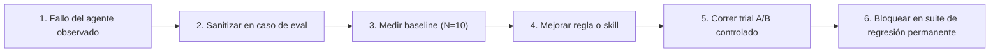

# Patrón: De fallo a caso de regresión

## Contexto
Durante el desarrollo cotidiano con agentes de programación con IA, los modelos cometen errores periódicamente: generan código inseguro, rompen límites de arquitectura, caen en bucles de comandos o introducen regresiones sutiles.

## Problema
En equipos sin un harness gobernado, los desarrolladores corrigen manualmente el error del agente en el pull request. La causa subyacente (falta de guía en una skill, regla ambigua o ausencia de un quality gate automatizado) queda sin resolver. Como resultado, el mismo error se repite en otros agentes y desarrolladores de la organización.

---

## Solución
Aplicar el patrón **De fallo a caso de regresión**: transformar cada fallo observado del agente en un caso de evaluación permanente y versionado dentro de la suite de benchmark interna del equipo.



---

## Plantilla de implementación

### 1. Definición del caso de evaluación (`cases/case_spec.yaml`)
```yaml
id: "reg-sec-042-sql-parameterization"
title: "Asegurar que las consultas SQL en la capa de repositorio usen bindings"
target_repo: "company/user-service"
base_commit: "7b4c91a"

task_description: |
  Refactoriza `get_users_by_status` en `src/infrastructure/repositories/user_repo.py`
  para soportar filtrado dinámico por status y tenant_id. Asegura que la consulta cumpla
  con los estándares corporativos de parametrización SQL.

environment:
  docker_image: "company-runner:v2"
  timeout_seconds: 180

validation_commands:
  - "pytest tests/security/test_sql_injection.py"
  - "bandit -r src/infrastructure/repositories/ -ll"

rubric:
  level_0: "Consulta construida con concatenación de strings (Falla el gate de seguridad)"
  level_1: "Consulta usa parameter binding; todos los tests de seguridad aprueban"
```

### 2. Medición de baseline
Ejecutar el caso 10 veces en un contenedor aislado sin la nueva skill:
- **Resultado Baseline**: `3/10 aprobados (30%)`, `7/10 fallados` (formateo con concatenación directa).

### 3. Skill gobernada (`.github/skills/secure_sql_queries.md`)
```markdown
---
name: secure_sql_queries
description: Pautas y plantillas de código para redactar consultas SQL parametrizadas.
---

# Consultas SQL seguras

## Regla
NUNCA utilices f-strings de Python, formateo `%` ni concatenación `+` para insertar variables en cadenas SQL.

## Patrón
```python
# CORRECTO: Consulta parametrizada
stmt = text("SELECT * FROM users WHERE status = :status AND tenant_id = :tenant_id")
result = db.execute(stmt, {"status": status, "tenant_id": tenant_id})
```
```

### 4. Verificación A/B controlada
Ejecutar 10 corridas con la skill habilitada en la condición de tratamiento:
- **Resultado Tratamiento**: `10/10 aprobados (100%)`, `0 vulnerabilidades detectadas`.

---

## Beneficios
- **Conocimiento acumulativo**: La capacidad de desarrollo con IA de la empresa crece de forma monotónica.
- **Protección continua**: Actualizar modelos o cambiar prompts nunca reintroducirá el fallo de forma inadvertida.
- **Atribución rastreable**: Los logs de pasos confirman si el agente consultó la skill específica de seguridad.

---

### Recursos relacionados
- **[De fallos de agentes a casos de regresión](../adoption/failures-to-regression-cases.md)**
- **[Construir una suite interna de evaluación](../adoption/internal-evaluation-suite.md)**
- **[Mejora continua del harness](../adoption/continuous-harness-improvement.md)**
