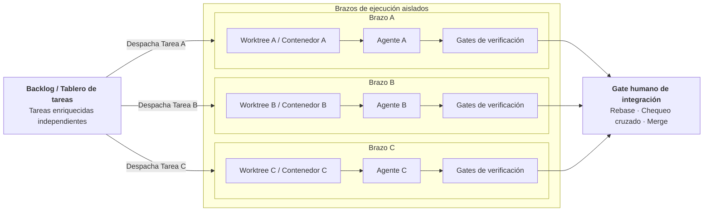

# Ejecución paralela de agentes

A medida que los equipos de ingeniería escalan el uso de agentes autónomos, procesar tareas de forma secuencial a través de un único agente se convierte en un cuello de botella. Sin embargo, ejecutar múltiples agentes en paralelo sobre el mismo árbol de trabajo provoca colisiones en archivos, estados corruptos y ejecuciones de prueba cruzadas.

El principio rector de la concurrencia con agentes es:

$$\mathbf{El\ paralelismo\ exige\ estado\ mutable\ aislado.}$$



---

## 1. Por qué importa el aislamiento

Cuando los desarrolladores colaboran en un proyecto, utilizan ramas separadas, computadoras personales y entornos locales independientes. Los agentes de programación requieren el mismo nivel de aislamiento físico y lógico.

Si múltiples agentes operan sobre una misma carpeta compartida, se producen fallos graves:

- **Árboles de trabajo sucios**: El Agente B modifica un archivo mientras el Agente A lo compila, produciendo errores de compilación fantasma.
- **Colisiones de puertos**: El Agente A levanta un servidor de pruebas en el puerto 8000 mientras el Agente B intenta vincularse al mismo puerto.
- **Contención en bases de datos**: Dos suites de prueba paralelas que corren sobre la misma base de datos local sobrescriben los fixtures de la otra.
- **Bloqueos del índice de Git**: Comandos simultáneos de git generan errores de `.git/index.lock`, terminando la ejecución de forma abrupta.

---

## 2. Dimensiones del aislamiento de estado

La verdadera ejecución paralela requiere aislar cinco capas:

| Capa | Requerimiento de aislamiento | Mecanismos concretos |
|---|---|---|
| **Sistema de archivos** | Copias de trabajo independientes del repositorio | Git worktrees (`git worktree add`), clones separados |
| **Procesos** | Entornos de ejecución aislados | Contenedores (Docker, Podman), shells independientes |
| **Red y puertos** | Puertos dedicados por instancia de agente | Puertos efímeros (asignación puerto 0), bridges de red |
| **Bases de datos** | Bases de datos y colas separadas | Esquemas efímeros, contenedores dedicados por tarea |
| **Artefactos** | Archivos de log y coberturas separados | Rutas de artefactos por corrida (ej. `artifacts/{run_id}/`) |

---

## 3. Git Worktrees como primitiva de aislamiento

Los Git worktrees proporcionan una primitiva de aislamiento nativa y ligera. Permiten vincular múltiples árboles de trabajo al mismo repositorio `.git`, lo que permite a distintos agentes trabajar en ramas diferentes de forma simultánea sin el costo de clonar todo el historial:

```bash
# Crear worktree aislado para el Agente A
git worktree add -b feat/oauth-auth ../worktrees/oauth-auth main

# Crear worktree aislado para el Agente B
git worktree add -b fix/payment-retry ../worktrees/payment-retry main
```

Cada worktree cuenta con su propio directorio de trabajo, su propio índice y sus propios archivos no rastreados, compartiendo el almacenamiento interno de objetos. Cuando el agente termina y verifica sus cambios, el worktree se elimina de manera limpia:

```bash
git worktree remove ../worktrees/oauth-auth
```

Los worktrees aíslan archivos, pero no aíslan procesos de red ni bases de datos. Para aislamiento completo, combínalos con entornos en contenedores.

---

## 4. Cuándo una tarea es realmente independiente

El paralelismo solo funciona cuando las tareas están desacopladas. Intentar paralelizar tareas estrechamente acopladas genera conflictos de integración difíciles de resolver y divergencia arquitectónica.

Las tareas son buenas candidatas para ejecución paralela cuando cumplen:

1. **Conjunto de archivos ortogonales**: modifican archivos o módulos que no se solapan.
2. **Límites de interfaz claros**: interactúan a través de interfaces estables existentes.
3. **Sin dependencias de esquema cruzadas**: ninguna depende de migraciones de base de datos no integradas de la otra.
4. **Suites de prueba independientes**: las pruebas corren sin depender de estados compartidos.

Si dos tareas modifican los mismos modelos centrales o las mismas tablas de base de datos, ejecútalas de forma secuencial.

---

## 5. Planos de control y orquestación

Investigaciones recientes de la industria, como la arquitectura Symphony de OpenAI (2026), destacan la separación entre la orquestación de tareas y la capacidad del modelo. En este enfoque:

- El **sistema de gestión de proyectos** (Issue Tracker, Jira, Linear o GitHub Projects) actúa como el **Plano de Control**.
- Los agentes son trabajadores transitorios que toman tareas acotadas de una cola compartida.
- El plano de control coordina dependencias, despacha trabajo a worktrees aislados y recopila el estado.

Asimismo, la investigación de Anthropic sobre equipos de agentes (2026) resalta que la coordinación entre pares de agentes autónomos genera una sobrecarga alta si no hay un plano de control central y límites físicos claros.

---

## 6. El gate humano de integración

Las ramas generadas por agentes en paralelo nunca deben integrarse de forma automática a ramas de producción. Se requiere un gate centralizado:

1. **Rebase y Fast-Forward**: la rama candidata se actualiza sobre la rama de integración más reciente.
2. **Gate completo del repositorio**: `make check` corre sobre todo el proyecto para asegurar que los contratos globales sigan intactos.
3. **Revisión humana**: un ingeniero revisa el diff integrado para asegurar coherencia arquitectónica, rendimiento y ausencia de efectos colaterales.
