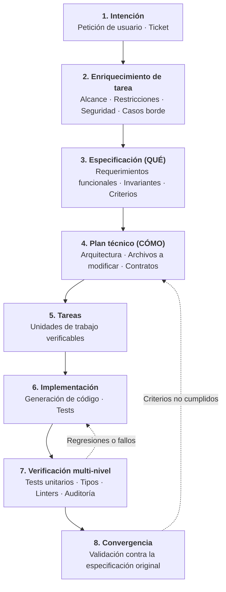

# Trabajo agentic guiado por especificaciones (Spec-Driven)

Spec-Driven Agentic Work es un patrón de ingeniería que introduce especificaciones explícitas y verificables en el desarrollo autónomo de software. Reemplaza la práctica frágil de instruir a un agente con prompts vagos esperando que el código generado cumpla requerimientos implícitos.



---

## 1. El problema central que resuelve

Sin especificaciones formales, los agentes autónomos de código caen con frecuencia en un patrón de fallo recurrente:

```text
Petición inicial vaga
       ↓
Generación masiva y autónoma de código
       ↓
El camino feliz parece funcionar
       ↓
Casos límite ausentes, requerimientos no funcionales rotos, fallos de seguridad
```

Si se le pide a un modelo "Agrega soporte para webhooks de Stripe", generará código con sintaxis válida que funciona en el escenario ideal. Sin embargo, omitirá habitualmente la validación de firmas criptográficas, el procesamiento idempotente de eventos, la protección contra ataques de repetición, límites de tasa y logging estructurado.

El trabajo guiado por especificaciones evita esto al exigir que el **QUÉ** del sistema se defina, revise y acuerde antes de escribir el **CÓMO**.

---

## 2. El ciclo de vida Spec-Driven

### 1. Intención y enriquecimiento de tareas

Los tickets brutos y peticiones iniciales rara vez son especificaciones completas. El enriquecimiento transforma una solicitud ambigua en un informe estructurado que incluye:

- **Intención de negocio**: qué problema se resuelve y por qué.
- **Dentro y fuera de alcance**: límites claros para evitar desviaciones.
- **Requerimientos funcionales**: comportamientos del sistema, entradas y salidas esperadas.
- **Requerimientos no funcionales (NFR)**: presupuestos de latencia, límites de consumo de memoria, concurrencia.
- **Invariantes de seguridad**: controles de autorización, gestión de secretos y sanitización de datos.
- **Casos límite y modos de fallo**: timeouts de red, caídas parciales de bases de datos, cargas inválidas.
- **Criterios de aceptación**: condiciones binarias que determinan si la tarea está terminada.
- **Preguntas abiertas**: dudas que requieren aclaración humana antes de implementar.

### 2. Especificación (QUÉ)

La especificación describe el comportamiento del sistema con independencia de la implementación técnica. Establece:

- Modelos de datos y contratos de interfaz.
- Reglas de transición de estados y restricciones de validación.
- Criterios concretos de aceptación en formato Dado/Cuando/Entonces.

### 3. Plan técnico (CÓMO)

El plan técnico define cómo el código satisfará la especificación. Detalla:

- Diagramas de arquitectura y flujo de dependencias.
- Archivos concretos a crear, modificar o eliminar.
- Migraciones de bases de datos y cambios en esquemas.
- Variables de configuración y entorno.

### 4. Tareas (Unidades verificables)

El plan técnico se descompone en unidades de trabajo pequeñas y ordenadas. Cada tarea debe poder completarse en un único turno de agente y declarar su propio comando de verificación.

### 5. Implementación y verificación

El agente implementa las tareas de forma secuencial. Tras cada tarea, ejecuta controles deterministas (tests, linters, tipos). Si algún control falla, corrige la implementación antes de avanzar a la siguiente tarea.

### 6. Convergencia

Una tarea no se considera terminada solo porque se hayan editado archivos o el agente afirme que terminó. **Convergencia** significa que el estado final del sistema satisface:

- Todos los criterios de aceptación funcionales de la especificación.
- Todos los invariantes no funcionales del plan técnico.
- Todos los gates automatizados de calidad del harness del repositorio.

---

## 3. Implementaciones representativas

Spec-Driven Agentic Work es una metodología independiente de proveedores. Las organizaciones la implementan mediante diversos enfoques:

### GitHub Spec Kit 1.x

GitHub Spec Kit implementa un flujo de trabajo estructurado basado en artefactos para agentes de programación. Organiza las interacciones en fases explícitas: `Specify`, `Plan`, `Tasks`, `Implement` y `Converge`. Cada fase produce documentos Markdown en el repositorio, facilitando la colaboración entre humanos y agentes.

### OpenSpec

OpenSpec se orienta al desarrollo en proyectos brownfield y refactors complejos. Mantiene un grafo de dependencias de artefactos que conecta propuestas, especificaciones de dominio, diseños técnicos y tareas verificables.

### Flujos nativos del repositorio

Muchos equipos implementan flujos spec-driven utilizando convenciones propias del repositorio:

- Plantillas de issues que exigen completar campos de enriquecimiento.
- Una carpeta `docs/specs/` con especificaciones y criterios de aceptación.
- Checks automatizados en CI que verifican cobertura de pruebas contra los criterios definidos.

El harness no exige una herramienta obligatoria; exige que los requerimientos y criterios de aceptación sean explícitos y verificables por máquinas.
