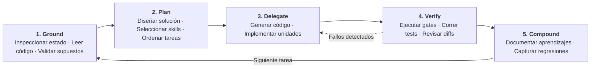

# El ciclo de trabajo de ingeniería: Ground, Plan, Delegate, Verify, Compound

La disciplina central de Harness Engineering es el ciclo operativo de cinco etapas:

$$\mathbf{Ground} \longrightarrow \mathbf{Plan} \longrightarrow \mathbf{Delegate} \longrightarrow \mathbf{Verify} \longrightarrow \mathbf{Compound} \circlearrowleft$$

Este ciclo gobierna cómo colaboran los desarrolladores humanos y los agentes autónomos de código dentro de un repositorio. Reemplaza la edición caótica de prueba y error con una cadencia de ingeniería disciplinada y reproducible.



---

## 1. Explicación de las cinco etapas

### 1. Ground (Anclaje)
Antes de editar cualquier archivo, el agente debe anclarse en la realidad del repositorio:
- Leer el código fuente pertinente, los tests existentes y las guías de arquitectura (`AGENTS.md`, `.github/standards.md`).
- Verificar el comportamiento actual ejecutando la suite de pruebas.
- Responder a las cinco preguntas de continuidad: ¿Dónde estoy? ¿Qué se ha hecho? ¿Qué queda pendiente? ¿Qué supuestos están activos? ¿Qué debe verificarse?
- Identificar restricciones, dependencias e interfaces activas.

### 2. Plan (Planificación)
El agente formula un plan de implementación concreto y paso a paso:
- Especificar qué archivos se crearán, modificarán o eliminarán.
- Descomponer iniciativas grandes en unidades de trabajo pequeñas y verificables.
- Seleccionar skills operacionales gobernadas aplicables a la tarea (como migraciones de bases de datos o creación de endpoints).
- Solicitar revisión y aprobación humana para cambios arquitectónicos antes de programar.

### 3. Delegate (Delegación)
Con un plan aprobado, el agente ejecuta las tareas de implementación:
- Realizar modificaciones modulares y enfocadas respetando los estándares del proyecto.
- Escribir pruebas unitarias y de integración junto con los cambios de código.
- Evitar desviaciones de alcance modificando únicamente los archivos declarados en el plan.

### 4. Verify (Verificación)
Ningún cambio se acepta basado en la afirmación del agente de que funciona. La verificación exige prueba empírica:
- Ejecutar linters, formateadores y verificadores de tipos locales (`make lint`).
- Ejecutar pruebas unitarias focalizadas y suites completas (`make test`).
- Realizar la validación completa del gate de calidad (`make check`).
- Inspeccionar el git diff integrado para asegurar que no se hayan filtrado ediciones accidentales o código de depuración.

### 5. Compound (Capitalización)
El paso final asegura que las lecciones aprendidas durante la tarea se conviertan en activos organizacionales duraderos:
- Actualizar documentación técnica y contratos de APIs.
- Si se resolvió un bug, convertir la prueba de reproducción en un test permanente de regresión.
- Registrar descubrimientos arquitectónicos o casos límite en la memoria del repositorio (`memory/` o ADRs).
- Confirmar que el repositorio quede en un estado limpio y desplegable.

---

## 2. Análisis arquitectónico: Evolución del ciclo de trabajo

Durante la evolución de Harness Engineering, analizamos si convenía expandir el mantra universal a seis etapas agregando `Specify`:

$$\mathbf{Ground} \longrightarrow \mathbf{Specify} \longrightarrow \mathbf{Plan} \longrightarrow \mathbf{Delegate} \longrightarrow \mathbf{Verify} \longrightarrow \mathbf{Compound}$$

### La decisión: Mantener el mantra de cinco etapas

Decidimos conservar el ciclo conciso de cinco etapas como la línea base universal en `ml-python-base`, `ml-langchain-agent` y la guía.

### Razones

1. **Evitar sobre-scaffolding en tareas simples**: Para tareas cotidianas (como corregir un typo, actualizar una dependencia o ajustar un estilo), forzar una etapa formal de especificación introduce burocracia y consumo innecesario de tokens. El mejor harness no es el más grande.
2. **Compatibilidad hacia atrás**: El mantra de cinco etapas está consolidado en documentación de desarrollo, plantillas de skills y prompts automatizados.
3. **Spec-Driven Work como subflujo explícito**: Para funcionalidades complejas, migraciones y cambios arquitectónicos, el [trabajo guiado por especificaciones](spec-driven-agentic-work.md) opera como el subflujo riguroso que conecta Ground y Plan:

```text
Ground (Enriquecer y comprender)
   ↓
Specify (QUÉ: Requerimientos, Invariantes, Criterios de aceptación)
   ↓
Plan (CÓMO: Arquitectura, Archivos a modificar, Unidades de tarea)
   ↓
Delegate (Implementar)
   ↓
Verify (Convergencia multi-nivel)
   ↓
Compound (Capturar aprendizajes y regresiones)
```

Esta articulación mantiene la simplicidad conceptual para el trabajo diario mientras ofrece rigor y profundidad de especificación cuando la complejidad de la tarea lo justifica.
