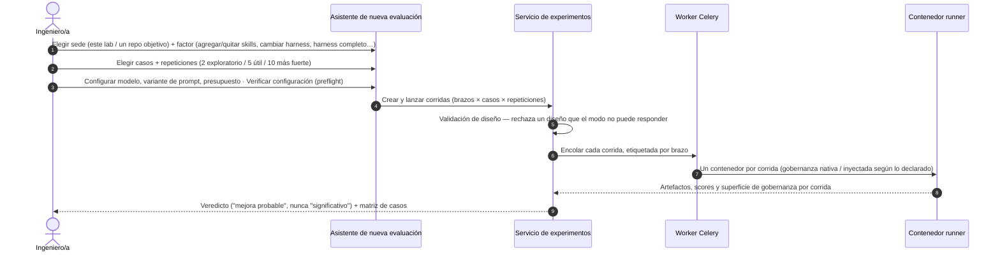
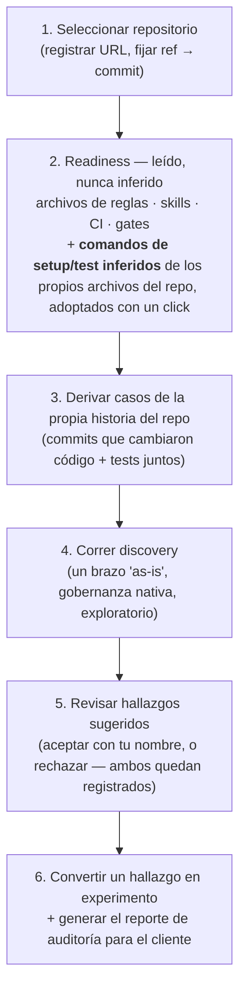
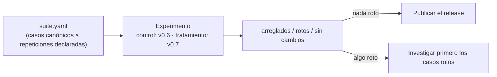

# Flujo de evaluación en el Lab

El lab se organiza alrededor de **cuatro recorridos**, uno por cada pregunta con la que un equipo realmente llega. Cada recorrido empieza en la pantalla de inicio ("¿Qué querés aprender?") y termina en evidencia accionable — un veredicto con matriz de casos, un mapa de robustez, un reporte de auditoría o una decisión de release.

---

## Recorrido A — Evaluar un cambio del harness (Modo A)

*"¿Esta skill / regla / cambio de prompt realmente mejora algo?"*

Propiedades clave:

- **El formulario no puede expresar un diseño inválido.** Varía un factor; repositorio, casos y modelo quedan fijados entre brazos. El backend valida de nuevo y rechaza contradicciones.
- **El factor "Harness completo"** corre la comparación fundacional: un brazo pelado (prompt plano, todas las skills gobernadas ocultas) contra el harness entero — un tratamiento, una afirmación sobre el harness como unidad.
- **El lanzamiento bloquea la configuración.** Las rondas siguientes la reutilizan tal cual (así crecen las repeticiones); otro modelo es otro experimento.
- **El resultado abre con un veredicto de diez segundos** — si mejoró, en qué métricas, a qué costo y con cuánta evidencia — seguido de la **matriz de casos** (arreglados / rotos / sin cambios), que es el número que sobrevive a un promedio.

---

## Recorrido B — Probar entre repositorios (Modo B)

*"¿Nuestro harness se sostiene fuera del repositorio donde nació?"*

El mismo asistente, en modo cross-repo: el harness y el modelo quedan fijos, cada repositorio seleccionado se vuelve su propio brazo, y el primero es una **referencia** (un ancla de lectura, no un baseline — nada acá es causal). El resumen es deliberadamente por repositorio: agrupar scores de códigos distintos los trataría como una sola condición, que no son.

---

## Recorrido C — Auditar un repositorio (Modo C)

*"¿Qué podemos aprender de cómo este proyecto o equipo trabaja hoy con IA?"* — incluido el repositorio de un cliente que nunca viste.

Las afirmaciones de la auditoría se mantienen estrechas en cada paso: el readiness se *detecta* ("No detectado" cuando no es observable), los casos se *proponen* desde commits reales que el equipo ya hizo, los hallazgos son *sugeridos* hasta que alguien los firma, y el reporte markdown generado **solo dice lo que la evidencia sostiene** — sin corridas, dice "lectura, no medición".

El experimento natural de cierre de cualquier auditoría: **nativo vs inyectado** — el repositorio exactamente como lo tiene el equipo, contra el mismo repositorio con tu harness proyectado adentro, mismos casos, 5+ repeticiones por brazo. Esa es la pregunta con la que termina todo engagement con un cliente, respondida como medición.

---

## Recorrido D — Validar un release del harness

*"¿Es seguro publicar v0.7 sobre v0.6?"*

La suite de regresión (`suite.yaml`) es un **productor de experimentos**, no un segundo ejecutor: aporta los casos canónicos y sus conteos de repetición por caso; vos aportás los dos brazos (release anterior como control, candidato como tratamiento). Todo lo que sigue — validación de diseño, la columna de "¿más allá del ruido?", la matriz de casos — es la misma maquinaria que cualquier otra comparación.

Un release se lee como *"arregló cuatro, no rompió ninguno, treinta sin cambios"* — nunca como un único número compuesto que podría esconder los dos que rompió.

---

## El ciclo de mejora (mismo espíritu, forma más precisa)

Cuando una corrida expone una debilidad del harness, el ciclo hacia el template gobernado sigue cerrándose igual:

1. Abrir la corrida — encabeza con su **condición** (experimento, brazo, repositorio @ commit, fuente de gobernanza) antes que con sus logs.
2. Correr la **auditoría LLM** (juzgada contra la superficie de gobernanza que esa corrida realmente tuvo) y sintetizar **propuestas de mejora**.
3. Reunir propuestas de varias corridas en la pantalla **Improvements** y generar un único **issue combinado y sanitizado** para el template gobernado (rutas privadas y tokens eliminados).
4. Corregir, publicar release, y validar la versión nueva con el **Recorrido D**.

---

### Recursos relacionados
- **[Visión general de Agentic Harness Lab](index.md)**
- **[Las tres preguntas (Modos de evaluación)](../../evaluation/the-three-questions.md)**
- **[Suites de regresión](../../evaluation/regression-suites.md)**
- **[Mejora continua del harness](../../adoption/continuous-harness-improvement.md)**
