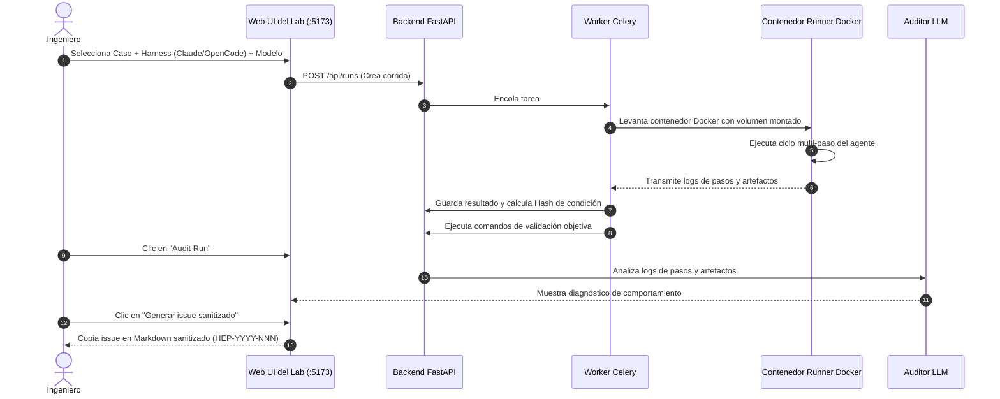

# Flujo de evaluación en el Lab

Esta guía detalla el flujo de trabajo operativo integral para ejecutar evaluaciones, diagnosticar el comportamiento de los agentes y generar mejoras verificadas utilizando **Agentic Harness Lab** (`ai-agentic-harness-lab`).

---

## El ciclo operativo de extremo a extremo



---

## Guía paso a paso del flujo de trabajo

### Paso 1: Encolar una corrida de benchmark
1. Abre la Web UI en `http://localhost:5173` (o ejecuta `make app-up`).
2. Ve a la pantalla **Runs** y haz clic en **"New Run"** (o usa **Batch Runs** para encolar una matriz completa de combinaciones).
3. Configura los parámetros del experimento:
   - **Caso**: Selecciona un caso interno personalizado o una instancia de SWE-bench.
   - **Harness**: Elige `claude` (Claude Code), `opencode`, `codex` o `antigravity`.
   - **Modelo**: Selecciona modelos cloud (vía AI Gateway) o endpoints locales (Ollama/LM Studio).
   - **Variante de Prompt**: Selecciona `swe_harness` o `sdlc` (para cargar reglas y skills gobernadas).
   - **Ablación de Skills**: (Opcional) Desactiva o inyecta una skill específica para medir su impacto marginal.

---

### Paso 2: Ejecución en contenedor aislado
- El worker de Celery toma la tarea y levanta un contenedor Docker dedicado (`harness-runner`).
- El workspace del repositorio se monta con permisos de lectura/escritura bajo un usuario sin privilegios.
- El watchdog de ejecución supervisa los procesos, aplicando límites de CPU, RAM, tiempo y pasos máximos.
- Las trazas de stdout/stderr, llamadas a herramientas (`read`, `edit`, `bash`) y permisos se transmiten a `data/runs/<id>/steps/step-*.log`.

---

### Paso 3: Indexación de atribución y validación
Al completarse la corrida:
- **Análisis de atribución**: La API analiza los logs de pasos para calcular el **Registro de atribución**:
  - Archivos distintos leídos vs editados (`permission=edit`).
  - Cobertura de la superficie de gobernanza (qué reglas de `.github/` fueron leídas).
  - Consulta explícita de skills (eventos de lectura de `SKILL.md`).
- **Validación objetiva**: El worker ejecuta los `validation_commands` del caso (ej. `pytest tests/test_case.py`).
  - Si los tests pasan $\to$ Objetivo: `PASS`.
  - Si los tests fallan $\to$ Objetivo: `FAIL` (Score compuesto limitado a 1.0).

---

### Paso 4: Auditoría de comportamiento y generación de propuestas
1. En la Web UI, abre la corrida finalizada y haz clic en **"Audit"**.
2. El Auditor LLM analiza la transcripción y genera `audit.md`, evaluando:
   - Calidad de la planificación y adherencia al SDLC.
   - Bucles de comandos y llamadas repetitivas que fallan.
   - Flags alucinados o parámetros incorrectos.
3. Haz clic en **"Generar issue sanitizado"** (o ejecuta `make harness-proposal RUN=<id>`).
4. El sistema asigna un identificador inmutable `HEP-YYYY-NNN`, elimina tokens privados y rutas locales, y genera un issue formateado para `ml-python-base`.

---

### Paso 5: Implementar la mejora en `ml-python-base`
1. Abre el issue en [`ml-python-base`](https://github.com/marcosdh1987/ml-python-base).
2. Crea una rama de desarrollo y edita la skill gobernada bajo `.github/skills/`.
3. Ejecuta los quality gates locales:
   ```bash
   make check        # Linting con Ruff, formateo y tipado
   make check-sync   # Sincronización de CLAUDE.md, AGENTS.md, OPENCODE.md
   ```
4. Mergea el PR y crea un tag inmutable con SemVer (ej. `v1.4.0`).

---

### Paso 6: Validar en worktree candidato y cerrar el ciclo
1. Apunta el lab a la nueva versión de gobernanza mediante un worktree aislado:
   ```bash
   make harness-status                    # Compara versión actual vs último release
   make harness-sync-preview REF=v1.4.0   # Previsualiza diff de solo lectura
   make harness-sync-branch REF=v1.4.0    # Prepara worktree candidato
   ```
2. Vuelve a ejecutar exactamente el mismo caso de evaluación con la versión candidata.
3. Verifica que:
   - El síntoma original desapareció.
   - La validación objetiva aprobó.
   - La corrida produjo **cero propuestas nuevas** (Outcome Gate limpio).
4. Mergea la rama candidata en tus repositorios de producción.

---

### Recursos relacionados
- **[Visión general de Agentic Harness Lab](index.md)**
- **[Mejora continua del harness](../../adoption/continuous-harness-improvement.md)**
- **[Entornos controlados y Sandboxing](../../evaluation/controlled-environments-sandboxing.md)**
