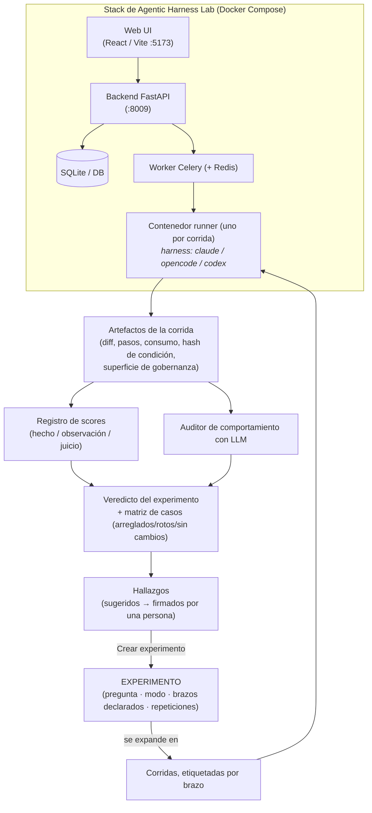

# Agentic Harness Lab: Visión general

**Agentic Harness Lab** (`ai-agentic-harness-lab`) es un instrumento de evaluación open source y local para harnesses de programación con IA. Su identidad en una frase: *un instrumento de evaluación para mejorar continuamente sistemas de ingeniería de software asistida por IA* — no un dashboard de corridas de benchmark.

La plataforma v2 se organiza por **intención**, no por entidades internas. La pantalla de inicio hace una sola pregunta — **"¿Qué querés aprender?"** — y ofrece los [tres modos de evaluación](../../evaluation/the-three-questions.md) como puertas de entrada:

- **Evaluar un cambio del harness** (Modo A): ¿esta skill, regla, prompt o cambio del harness realmente mejora el rendimiento? El único modo que soporta una afirmación causal — y solo con suficientes repeticiones.
- **Probar entre repositorios** (Modo B): ¿este harness generaliza? Los resultados quedan por repositorio, nunca agrupados.
- **Auditar un repositorio** (Modo C): ¿qué podemos aprender de cómo trabaja hoy este proyecto con IA? Exploratorio por diseño — produce casos, observaciones y hallazgos sugeridos, nunca un veredicto causal.

---

La abstracción que sostiene todo es que **el experimento está por encima de la corrida**. Una corrida es un dato; un experimento enuncia la pregunta *antes* de ejecutar nada, declara sus brazos y su control, y rechaza diseños que su modo no puede responder. El resultado llega como un veredicto prudente ("mejora probable", nunca "significativo") más la matriz por caso.

---

## Capacidades principales

### 1. Experimentación guiada por intención
Un asistente construye diseños de Modo A / Modo B que **no pueden expresar un experimento inválido**: varía un factor a la vez (agregar/quitar skills, cambiar el harness, gobernanza nativa vs inyectada, modelo pelado vs **harness completo**), todo lo demás queda fijado, y configuración + preflight + lanzamiento ocurren en un solo lugar. Una vez lanzado, la configuración del experimento queda **bloqueada** — relanzar con otro modelo se rechaza, porque un experimento es una medición.

### 2. Repositorios objetivo y la condición de gobernanza
Los casos pueden correr contra cualquier repositorio registrado, clonado fresco y fijado a un commit por corrida. El harness que el agente *ve* es una condición de primera clase: `native` (el setup propio del repo — un control verdadero), `injected` (el harness del lab proyectado adentro) o `lab_root`. Cada corrida se audita contra la superficie de gobernanza **que realmente tuvo**, con la lista de archivos y su huella persistidas.

### 3. Auditoría guiada de repositorios (Modo C)
Un flujo de seis pasos para auditar cualquier repositorio — incluido el de un cliente: detección de readiness (nunca inferida: "No detectado" cuando no es observable), **inferencia del gate de validación** desde los archivos del propio repo (targets del Makefile, lockfiles, config de pytest — adoptada con un click, nunca en silencio), **derivación de casos desde la propia historia de commits**, un experimento de discovery explícito, hallazgos sugeridos, y un **reporte de auditoría para el cliente** generado en markdown que solo afirma lo que la evidencia sostiene.

### 4. Registro de scores con procedencia
Cada métrica se archiva bajo una definición versionada (`name@version`) y se etiqueta como **hecho** (un comando terminó), **observación** (parseada de artefactos) o **juicio** (la opinión de un modelo). Una métrica que no puede computarse devuelve *ningún score con razón declarada* — nunca un cero.

### 5. Métricas de trayectoria (DeepEval) en el perfil por defecto
`task_completion`, `step_efficiency` y `tool_correctness` viajan en el scoring ordinario, juzgadas a través del propio gateway de modelos del lab sin configuración extra. Cada métrica se saltea con gracia — sin librería, sin juez, sin trayectoria → sin score. Las métricas juzgadas importan más en repositorios **sin** gate objetivo de tests: aportan un juicio etiquetado donde un pass/fail no puede existir.

### 6. Hallazgos: las máquinas sugieren, las personas firman
El corpus se mina en busca de patrones — regresiones, casos que nunca pasaron, skills que el auditor sigue juzgando sin uso — y llegan a una cola de revisión etiquetados como **sugeridos**. Aceptar uno requiere el nombre de un autor; los rechazos se registran para que los patrones no se re-propongan. Un hallazgo aceptado enlaza a un experimento pre-cargado que puede zanjarlo.

### 7. Suite de regresión como experimento
`suite.yaml` es un *productor* de experimentos, no un segundo ejecutor: harness `v0.6` vs `v0.7` sobre los casos canónicos, leído como **arreglados / rotos / sin cambios** a través de la misma matriz de casos que cualquier otra comparación. Es el mecanismo estándar para validar un release del harness.

### 8. Ciclo de vida honesto
Los experimentos pueden **abandonarse** (se ocultan; sus corridas quedan en el corpus — "dejá de mostrarme esto", nunca "esto nunca pasó") o **borrarse** junto con sus corridas, scores y artefactos (media eliminación dejaría mediciones huérfanas sesgando cada agregado, así que se rechaza).

---

## Stack técnico

| Capa | Tecnología |
|---|---|
| **Frontend** | React, TypeScript, Vite — tokens de diseño semánticos, set de íconos SVG local (sin framework CSS) |
| **Backend** | Python 3.11+, FastAPI, Pydantic v2, SQLModel, SQLite (WAL) |
| **Ejecución asíncrona** | Celery, Redis, Docker (un contenedor runner por corrida; node + pnpm/yarn + uv incluidos) |
| **Evaluación** | Registro de scores versionado, auditorías de comportamiento con LLM, adapter de trayectoria DeepEval |
| **Telemetría y gateway** | AI Gateway LiteLLM, trazas con Langfuse |
| **Tooling y gates** | `uv`, `ruff`, `pytest`, `make app-up`, `make ci` (solo lectura) |

---

### Recursos relacionados
- **[Flujo de evaluación en el Lab](evaluation-workflow.md)** — los cuatro recorridos, paso a paso.
- **[Las tres preguntas (Modos de evaluación)](../../evaluation/the-three-questions.md)** — la metodología que el lab implementa.
- **[Mejora continua del harness](../../adoption/continuous-harness-improvement.md)**
- **[Repositorio en GitHub](https://github.com/marcosdh1987/ai-agentic-harness-lab)**
