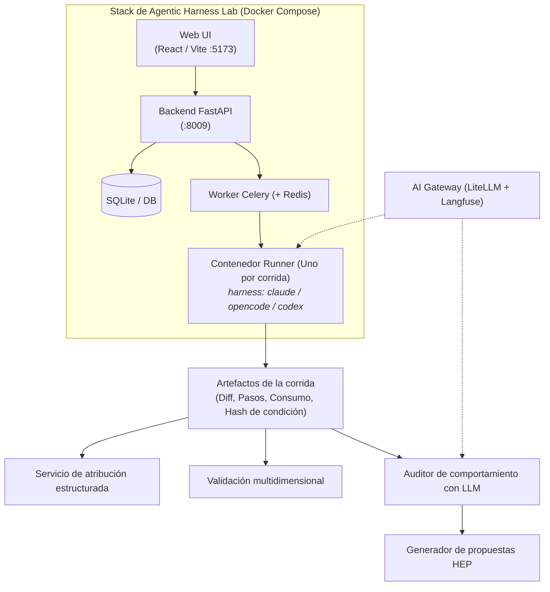

# Agentic Harness Lab: Visión general

**Agentic Harness Lab** (`ai-agentic-harness-lab`) es una aplicación web local y plataforma de benchmarking open source diseñada para evaluar harnesses de programación asistida por IA (Claude Code, OpenCode, Codex, Antigravity) en tareas reales de código, retroalimentando las observaciones obtenidas en el template de gobernanza compartido (`ml-python-base`) en forma de mejoras concretas de skills.

---

---

## Capacidades principales

### 1. Carriles de benchmark (Casos personalizados y SWE-bench)
- **Casos personalizados**: Tareas específicas de la organización definidas en YAML/Python (ej. migraciones sin downtime, endpoints FastAPI, refactorizaciones).
- **SWE-bench / SWE-bench Pro**: Issues reales de GitHub ejecutados en contenedores Docker aislados y reproducibles.

### 2. Ejecución multi-harness y multi-modelo
- Selección de qué CLI conduce la corrida (**Claude Code**, **OpenCode**, **Codex** o **Antigravity**) y qué modelo utilizar (modelos cloud vía AI Gateway o modelos locales auto-hospedados vía Ollama/LM Studio).

### 3. Procedencia enriquecida y hash de condición
- Cada corrida calcula automáticamente un `condition_hash` y `harness_fingerprint` deterministas que capturan la variante de prompt, conjunto de skills ablacionadas, configuración del modelo y dependencias del contenedor.

### 4. Atribución estructurada (Usado vs Disponible)
- Analiza los logs de ejecución para determinar qué documentos de gobernanza y skills consultó efectivamente el agente frente a lo que estaba disponible en el repositorio.

### 5. Scoring multidimensional y piso objetivo
- Evalúa objetivamente la ejecución del código (`pass/fail` en comandos de prueba) registrando cantidad de pasos, costo de tokens, latencia y puntuación de rúbrica.

### 6. Auditorías de comportamiento con LLM y generador de issues sanitizados
- Un auditor LLM inspecciona las trazas de pasos para detectar bucles de comandos, flags alucinados y desvíos del SDLC.
- El botón **"Generar issue sanitizado"** produce un issue en Markdown listo para copiar (`HEP-YYYY-NNN`) sin rutas privadas, credenciales ni tokens.

---

## Stack tecnológico

| Capa | Tecnología |
|---|---|
| **Frontend** | React, TypeScript, Vite, Tailwind CSS, Lucide Icons |
| **Backend** | Python 3.11+, FastAPI, Pydantic v2, SQLAlchemy, SQLite |
| **Ejecución asíncrona** | Celery, Redis, Docker SDK (Docker-out-of-Docker) |
| **Telemetría y Gateway** | LiteLLM AI Gateway, tracing con Langfuse, OpenTelemetry |
| **Herramientas y Gates** | `uv`, `ruff`, `pytest`, `make app-up`, `make ci` |

---

### Recursos relacionados
- **[Flujo de evaluación en el Lab](evaluation-workflow.md)**
- **[Entornos controlados y Sandboxing](../../evaluation/controlled-environments-sandboxing.md)**
- **[Mejora continua del harness](../../adoption/continuous-harness-improvement.md)**
- **[Repositorio en GitHub](https://github.com/marcosdh1987/ai-agentic-harness-lab)**
