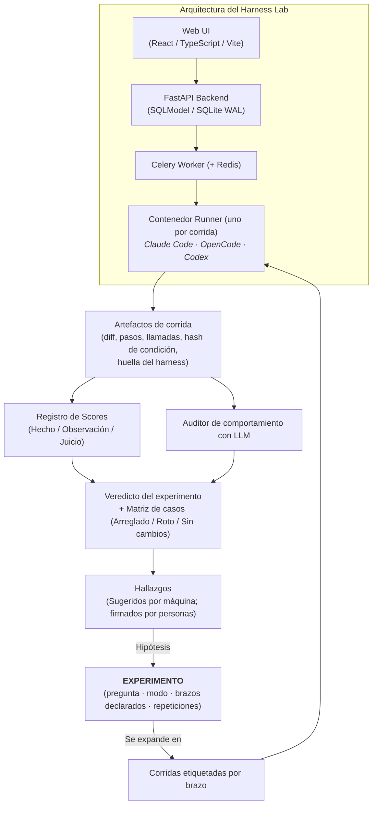

# Harness Lab: Plataforma de evaluación

El **Harness Lab** es la implementación de referencia del **Plano de Evaluación** en Harness Engineering. Proporciona un instrumento empírico para evaluar harnesses de programación con IA, comparar modelos de frontera en tareas reales y alimentar las fallas observadas de regreso a las plantillas de gobernanza compartida.

La plataforma existe en dos implementaciones relacionadas:

1. **`sdlc-ml-python-harness-lab`**: La plataforma empresarial activa desarrollada en Xmartlabs, que incorpora verificaciones completas de validez experimental (ADR-0046), exploración de fuentes locales y reportes de auditoría para clientes.
2. **`ai-agentic-harness-lab`**: La línea base abierta inicial que demostró el aislamiento de ejecuciones en contenedores Docker, hashes de condición y atribución estructurada.

---

## 1. Arquitectura central: El Experimento sobre la Corrida

Una decisión arquitectónica fundamental del lab es que **la entidad Experimento se sitúa por encima de la Corrida (Run)** (ADR-0033).

Una corrida individual es solo un dato aislado. Un experimento define la pregunta científica *antes* de que comience la ejecución, declara sus brazos, fija la condición de control y rechaza diseños experimentales que el modo declarado no pueda responder.

---

## 2. Los tres modos de evaluación

El lab estructura los experimentos en tres modos explícitos (ADR-0028), previniendo afirmaciones causales inválidas:

- **Modo A (Evaluación de Harness)**: ¿Mejora el rendimiento este cambio de skill, regla, prompt o harness? El repositorio objetivo, el caso de prueba, el modelo y el entorno se mantienen estrictamente constantes; solo varía el harness. Es el único modo que permite sostener una conclusión causal.
- **Modo B (Validación cruzada entre repositorios)**: ¿Generaliza este harness a diferentes bases de código? Los resultados se desglosan por repositorio y nunca se promedian en una media global engañosa.
- **Modo C (Auditoría exploratoria de repositorio)**: ¿Qué podemos aprender de cómo trabaja hoy con IA un repositorio desconocido? Genera casos de línea base, observaciones y hallazgos sugeridos, sin emitir un veredicto comparativo.

---

## 3. Capacidades verificadas de la plataforma

### Preflight de validez de comparaciones (ADR-0046)

Antes de reportar un veredicto comparativo entre dos brazos, el lab ejecuta verificaciones automatizadas de validez:

- Comprueba que ambos brazos se hayan evaluado sobre conjuntos de casos y commits idénticos.
- Verifica que las condiciones de infraestructura (límites de sandbox, imágenes Docker) hayan sido constantes.
- Rechaza comparaciones donde existan factores de confusión (como cambiar el modelo y el harness a la vez) que invaliden la atribución.

### Registro de scores con procedencia (ADR-0034, ADR-0038)

Las métricas están versionadas (`nombre@version`) y categorizadas explícitamente según su autoridad:

- **Hecho (Fact)**: reproducible sin necesidad de juicio (como códigos de salida de procesos o existencia de archivos).
- **Observación (Observation)**: extraída de artefactos de ejecución (como conteo de pasos o llamadas a herramientas).
- **Juicio (Judgment)**: opiniones evaluativas emitidas por modelos o humanos (como legibilidad del código o utilidad de una skill).

### Métricas de trayectoria con DeepEval y auditorías de comportamiento

El lab incorpora la evaluación de trayectorias directamente en el scoring:

- **Completitud de tarea (Task Completion)**: verificada contra runners de tests objetivos.
- **Eficiencia de pasos (Step Efficiency)**: proporción de acciones productivas frente a bucles exploratorios.
- **Corrección de herramientas (Tool Correctness)**: cumplimiento de esquemas y recuperación de errores.

### Atribución estructurada y hashes de condición (ADR-0003, ADR-0005)

Cada corrida captura un `condition_hash` y una `harness_fingerprint` inmutables. El rastreo de atribución registra qué skills gobernadas estaban disponibles, cuáles leyó realmente el agente y cuáles contribuyeron directamente a resolver la tarea.

### Hallazgos y evaluación de madurez curada por humanos (ADR-0035)

Los logs de auditoría se analizan para detectar patrones de fallo recurrentes. Las debilidades detectadas se presentan en una cola de revisión como hallazgos sugeridos. Un hallazgo requiere revisión y firma humana antes de convertirse en una tarea o suite de regresión.

---

## 4. Stack técnico

| Capa | Tecnología |
|---|---|
| **Frontend** | React, TypeScript, Vite, tokens semánticos, iconografía SVG local |
| **Backend** | Python 3.11+, FastAPI, Pydantic v2, SQLModel, SQLite con modo WAL |
| **Ejecución** | Celery, Redis, sandboxes aislados en contenedores Docker por corrida |
| **Evaluación** | Registro de scores, auditor de comportamiento con LLM, adaptador DeepEval |
| **Telemetría** | LiteLLM AI Gateway, trazabilidad con Langfuse |
| **Gates de calidad** | `uv`, `ruff`, `pytest`, `make check` |

---

### Recursos relacionados

- **[Flujo de evaluación en el Lab](evaluation-workflow.md)**: recorrido paso a paso de un experimento.
- **[Las tres preguntas (Modos de evaluación)](../../evaluation/the-three-questions.md)**: metodología de evaluación.
- **[Harnesses adaptativos y desmantelamiento de scaffolding](../../evaluation/adaptive-harnesses.md)**: retiro de scaffolding obsoleto.
- **[Repositorio del Lab Empresarial](https://github.com/xmartlabs/sdlc-ml-python-harness-lab)**: plataforma corporativa de evaluación.
- **[Repositorio de la Línea Base Abierta](https://github.com/marcosdh1987/ai-agentic-harness-lab)**: implementación abierta inicial.
