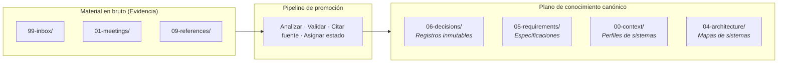

# Template de Company Brain: Plano de Conocimiento

El `company-brain-template` es la implementación de referencia del **Plano de Conocimiento** en el desarrollo de software asistido por agentes en entornos multi-repositorio. Proporciona la memoria persistente y legible por agentes para una organización o proyecto de consultoría, almacenando contexto canónico, decisiones, requerimientos, convenciones y mapas de sistemas.

Mientras que el harness de ingeniería (`ml-python-base`) gobierna el **plano de ejecución**, el Company Brain gobierna el **plano de conocimiento**.

---

## 1. El principio central: Evidencia vs Conocimiento

Un Company Brain no es una wiki desordenada ni un depósito de minutas de reuniones. Su principio arquitectónico es:

$$\mathbf{Evidencia} \neq \mathbf{Conocimiento\ Canónico}$$

Las transcripciones en bruto, exportaciones de chat y presentaciones de clientes representan **evidencia**, no hechos verificados. El Company Brain aplica un pipeline estructurado de promoción:



Cada afirmación promovida a documento canónico cuenta con:

1. **Procedencia explícita de la fuente**: cita de la reunión, documento o pull request que le dio origen.
2. **Vocabulario estandarizado de estados**:
   - `CONFIRMED`: validado por partes interesadas autorizadas o verificación del sistema.
   - `PENDING VALIDATION`: extraído de evidencia pero pendiente de confirmación humana o técnica.
   - `INFERRED`: deducido por agentes o desarrolladores a partir del contexto circundante.
   - `SUPERSEDED`: históricamente certero pero reemplazado por una decisión canónica posterior.
   - `BLOCKED`: dependencias externas impiden su verificación o ejecución.

---

## 2. Estructura de carpetas y gobernanza

El template organiza el conocimiento organizacional en espacios de nombres numerados y predecibles:

```text
00-context/        # Perfiles organizacionales, glosarios de dominio, mapas de entornos
01-meetings/       # Notas de reuniones con fecha, asistentes y compromisos en bruto
02-organization/   # Estructura de equipos, roles de partes interesadas y canales
03-projects/       # Iniciativas activas, hojas de ruta e hitos de entrega
04-architecture/   # Diagramas de límites de sistemas, flujos de datos e integraciones
05-requirements/   # Reglas de negocio, modelos de dominio y especificaciones
06-decisions/      # Registros de Decisiones Arquitectónicas inmutables (ADR-YYYY-NNN)
07-delivery/       # Cadencia de sprints, calendarios de releases y runbooks
08-vendors/        # Contratos SaaS de terceros, límites de APIs y canales de soporte
09-references/     # Enlaces a documentación técnica, whitepapers y esquemas
99-inbox/          # Material en bruto sin procesar a la espera de promoción
```

---

## 3. El Brain no es el Prompt

Una distinción arquitectónica esencial en Harness Engineering es:

$$\mathbf{Company\ Brain} \longrightarrow \mathbf{Contexto\ Selectivo} \longrightarrow \mathbf{Prompt\ de\ la\ Tarea}$$

Un agente no debe ni puede cargar el Company Brain completo en su ventana de contexto en cada turno. El Brain actúa como una base de conocimiento gobernada. El harness de ingeniería:

1. Evalúa la tarea o ticket entrante.
2. Navega los índices del Company Brain (`00-context/index.md`, `06-decisions/index.md`).
3. Selecciona únicamente el conjunto mínimo de documentos pertinentes.
4. Compila este contexto de alta señal en el estado activo de trabajo.

---

## 4. Sin RAG obligatorio: La complejidad debe ganarse

El Company Brain no requiere bases de datos vectoriales, modelos de embeddings ni grafos de conocimiento para ser eficaz.

Para la mayoría de los equipos (de 1 a 20 repositorios):

- Los archivos Markdown estructurados en carpetas predecibles ofrecen legibilidad inmediata para los agentes.
- Las lecturas estándar de archivos, búsquedas con `grep` y navegación por herramientas (`find_files`, `view_file`) proporcionan alta precisión sin sobrecarga de infraestructura.
- Los repositorios Git ofrecen historial auditable, flujos de revisión en pull requests y control inmutable de cambios.

Los mecanismos avanzados de recuperación (búsqueda semántica, RAG, grafos de conocimiento) solo deben incorporarse cuando el volumen documental sobrepase lo que la navegación directa puede indexar eficazmente. **La complejidad debe ganarse por escala.**

---

## 5. Cuándo adoptar un Company Brain

| Alcance del proyecto | Estrategia de conocimiento recomendada |
|---|---|
| **Un único repositorio** | Memoria dentro del repo (`docs/adr/`, `memory/`). Un Company Brain es sobrecarga innecesaria. |
| **Arquitectura multi-repositorio** | Company Brain compartido vinculando decisiones que cruzan límites de servicios. |
| **Relación de consultoría** | Company Brain para rastrear requerimientos del cliente, acuerdos y traspasos entre equipos. |
| **Plataforma empresarial** | Company Brain centralizado como fuente única de verdad para equipos de plataforma. |
