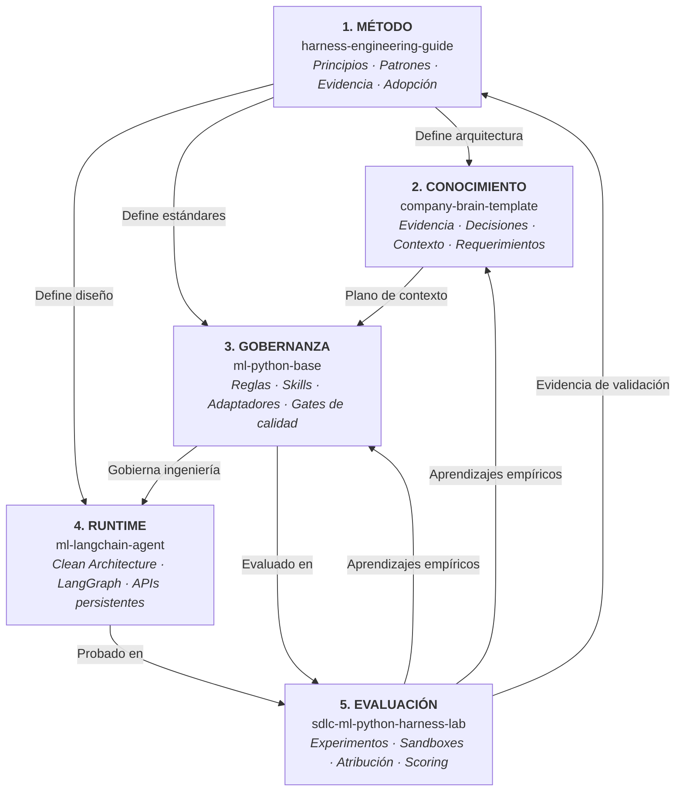

# Implementaciones de referencia y el ecosistema de cinco capas

La metodología de **Harness Engineering** no es una teoría abstracta. Está fundamentada en un ecosistema modular de cinco capas en funcionamiento que conecta metodología, conocimiento canónico, gobernanza técnica, runtimes de productos y evaluación empírica en un ciclo continuo de mejora.



---

## Las dos perspectivas arquitectónicas

El ecosistema resuelve dos necesidades complementarias:

### 1. Perspectiva de contexto organizacional

Cómo fluye el conocimiento desde los sistemas corporativos hacia los repositorios de desarrollo:

```text
Sistemas de registro corporativos
GitHub · Jira · Slack · Notion · Fuentes de clientes
                    │
                    ▼
               COMPANY BRAIN
           Plano de Conocimiento
 evidencia · decisiones · requerimientos · capacidades · contexto
                    │
                    ▼
            ENGINEERING HARNESS
               ml-python-base
 reglas · skills · herramientas · gates · entorno · ciclo de trabajo
```

### 2. Perspectiva del ciclo de vida completo

Cómo el sistema de agentes opera, mide, aprende y mejora de forma continua:

```text
Evidencia
   ↓
Conocimiento gobernado
   ↓
Contexto seleccionado + Gobernanza ejecutable
   ↓
Ejecución del agente
   ↓
Resultados medidos
   ↓
Aprendizaje revisado
   ↓
Mejora del harness y del conocimiento
   ↺
```

---

## Los cinco repositorios del ecosistema

### 1. Metodología: `harness-engineering-guide`
*La base de conocimiento pública, referencia de arquitectura y catálogo de patrones.*
- **Rol**: Explica principios centrales, las Cinco Superficies Operativas, Estado y Continuidad, Desarrollo guiado por especificaciones (Spec-Driven) e Ingeniería de evaluación.
- **Repositorio**: [`marcosdh1987/harness-engineering-guide`](https://github.com/marcosdh1987/harness-engineering-guide).

### 2. Plano de Conocimiento: `company-brain-template`
*La memoria persistente y legible por agentes para una organización o proyecto.*
- **Rol**: Estructura la evidencia organizacional en conocimiento canónico mediante un pipeline de promoción con vocabulario estandarizado de estados (`CONFIRMED`, `PENDING VALIDATION`, `INFERRED`, `SUPERSEDED`, `BLOCKED`).
- **Repositorio**: [`marcosdh1987/company-brain-template`](https://github.com/marcosdh1987/company-brain-template).
- **Documentación**: [Guía de referencia de Company Brain](company-brain-template/index.md).

### 3. Gobernanza de Ingeniería: `ml-python-base`
*La plantilla de nivel de producción para un harness de repositorio gobernado.*
- **Rol**: Gobierna cómo programan los agentes de código dentro del repositorio mediante reglas centralizadas (`.github/`), skills gobernadas (`.github/skills/`), adaptadores de herramientas (Claude Code, Codex, OpenCode, Antigravity, Copilot) y gates estrictos de CI (`make check`).
- **Repositorio**: [`marcosdh1987/ml-python-base`](https://github.com/marcosdh1987/ml-python-base).
- **Documentación**: [Guía de referencia de ml-python-base](ml-python-base/index.md).

### 4. Runtime de Productos Agentic: `ml-langchain-agent`
*La plantilla de aplicación para construir y desplegar productos basados en agentes.*
- **Rol**: Provee Clean Architecture, bucles de LangGraph dirigidos por stop reasons del proveedor, persistencia de conversaciones (thread_id, resume, fork) y contratos de servicio FastAPI para redes de agentes.
- **Repositorio**: [`marcosdh1987/ml-langchain-agent`](https://github.com/marcosdh1987/ml-langchain-agent).
- **Documentación**: [Guía de referencia de ml-langchain-agent](ml-langchain-agent/index.md).

### 5. Plano de Evaluación: `sdlc-ml-python-harness-lab`
*La plataforma empresarial de evaluación, benchmarking y mejora continua.*
- **Rol**: Ejecuta experimentos controlados entre harnesses candidatos y modelos en sandboxes de Docker. Implementa Modos de evaluación A/B/C, hashes de condición, huellas digitales de harness, atribución, métricas de DeepEval, auditorías de comportamiento y un registro de scores que separa Hechos, Observaciones y Juicios.
- **Repositorio**: `git@github.com:xmartlabs/sdlc-ml-python-harness-lab.git` (con línea base abierta inicial en [`marcosdh1987/ai-agentic-harness-lab`](https://github.com/marcosdh1987/ai-agentic-harness-lab)).
- **Documentación**: [Guía de referencia del Harness Lab](ai-agentic-harness-lab/index.md).

---

## Adopción incremental: La complejidad debe ganarse

No todos los proyectos requieren los cinco componentes desde el primer día. Los equipos adoptan el ecosistema paso a paso:

- **Proyecto Python normal**: `ml-python-base` por sí solo provee reglas, skills y gates de calidad inmediatos.
- **Proyecto de producto agentic**: `ml-python-base` para la gobernanza del código y `ml-langchain-agent` para el runtime del producto.
- **Cliente u organización multi-repositorio**: Se incorpora Company Brain para enlazar requerimientos y arquitectura entre servicios.
- **Organización madura**: Company Brain centralizado, harnesses compartidos, múltiples runtimes de dominio y una plataforma de evaluación ejecutando suites de regresión continuas.

---

### Explora las implementaciones

- **[Template de Company Brain: Plano de Conocimiento](company-brain-template/index.md)**
- **[ml-python-base: Harness Gobernado](ml-python-base/index.md)**
- **[ml-langchain-agent: Runtime de Productos Agentic](ml-langchain-agent/index.md)**
- **[Harness Lab: Plataforma de Evaluación](ai-agentic-harness-lab/index.md)**
