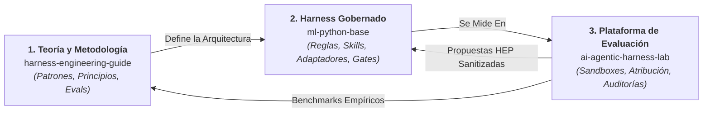
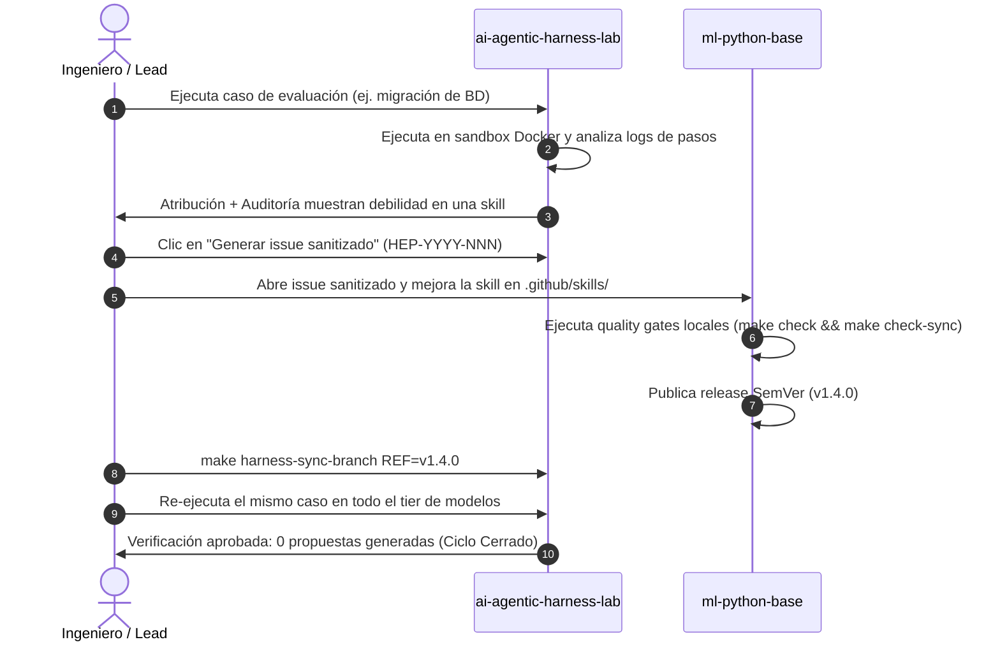

# Implementaciones de referencia y el ecosistema de 3 repositorios

La metodología de **Harness Engineering** no es una abstracción teórica. Está completamente respaldada en un **ecosistema público de tres repositorios en funcionamiento** que conecta metodología, gobernanza técnica y evaluación empírica en un ciclo continuo de mejora:

---

$$\mathbf{MÉTODO} \longrightarrow \mathbf{IMPLEMENTAR} \longrightarrow \mathbf{MEDIR} \longrightarrow \mathbf{APRENDER} \longrightarrow \mathbf{MEJORAR} \circlearrowleft$$

---

## Los tres repositorios

### 1. Guía de Harness Engineering (`harness-engineering-guide`)
*La base de conocimiento pública y la metodología.*
- **Rol**: Explica los conceptos, el Modelo de Madurez del Agentic SDLC, el ciclo Estandarizar-Medir-Mejorar, principios de sandboxing, ingeniería de evaluación y patrones de diseño.
- **Independencia**: **Autocontenida.** No necesitas clonar ni ejecutar los otros repositorios para aprender y aplicar esta metodología en tu propia organización.
- **Repositorio**: [`marcosdh1987/harness-engineering-guide`](https://github.com/marcosdh1987/harness-engineering-guide).

---

### 2. ML Python Base (`ml-python-base`)
*La implementación de referencia de un harness gobernado.*
- **Rol**: Funciona como un template listo para producción para repositorios de ingeniería.
- **Características clave**:
  - Capa centralizada de reglas bajo `.github/` (`standards.md`, `architecture.md`, `automation.md`).
  - Catálogo de skills gobernadas (`.github/skills/`) con procedimientos estructurados.
  - Motor de sincronización declarativo en Python que genera adaptadores nativos (`CLAUDE.md`, `AGENTS.md`, `OPENCODE.md`, `GEMINI.md`, `.github/copilot-instructions.md`).
  - Quality gates de CI de solo lectura (`make check`, `make check-sync`) que verifican la integridad de lockfiles y evitan el drift no comprometido.
- **Repositorio**: [`marcosdh1987/ml-python-base`](https://github.com/marcosdh1987/ml-python-base).
- **Documentación**: [Guía de referencia de ml-python-base](ml-python-base/index.md).

---

### 3. Agentic Harness Lab (`ai-agentic-harness-lab`)
*La implementación de referencia de una plataforma de evaluación, benchmarking y mejora continua.*
- **Rol**: Proporciona una aplicación web local y backend de ejecución para evaluar harnesses de agentes y retroalimentar las observaciones en los templates de gobernanza.
- **Características clave**:
  - Ejecución aislada en contenedores Docker por corrida con workers en Celery + Redis.
  - Soporte multi-harness (Claude Code, OpenCode, Codex, Antigravity).
  - Hash de condición (`condition_hash`) y fingerprinting de harness.
  - Atribución estructurada (skills usadas vs disponibles).
  - Auditorías de comportamiento mediante LLMs y scoring multidimensional.
  - Generador de propuestas sanitizadas de ciclo cerrado (`HEP-YYYY-NNN`).
- **Repositorio**: [`marcosdh1987/ai-agentic-harness-lab`](https://github.com/marcosdh1987/ai-agentic-harness-lab).
- **Documentación**: [Guía de referencia de ai-agentic-harness-lab](ai-agentic-harness-lab/index.md).

---

## Cómo se cierra el ciclo en la práctica

---

### Explorar las implementaciones
- **[ml-python-base: Harness gobernado](ml-python-base/index.md)**
- **[ai-agentic-harness-lab: Plataforma de evaluación](ai-agentic-harness-lab/index.md)**
- **[Flujos de evaluación en el Lab](ai-agentic-harness-lab/evaluation-workflow.md)**
