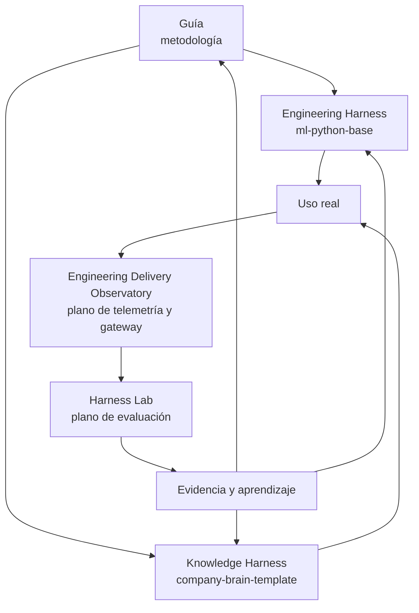

# Implementaciones de referencia y ecosistema

!!! info "Sobre esta página"
    **Qué vas a aprender:** qué repositorios ilustran la metodología y cuál es la responsabilidad de cada uno.

    **Para quién:** practitioners técnicos, managers que evalúan adopción y lectores que pasan de conceptos a implementación.

    **Leela cuando:** quieras inspeccionar evidencia sin tratar un repositorio como si fuera todo el método.

La guía define el método. Los repositorios siguientes ilustran responsabilidades separadas. Pueden adoptarse de forma incremental y no forman un stack obligatorio.

## Cinco responsabilidades

| Pieza | Rol | No confundir con |
| --- | --- | --- |
| Harness Engineering Guide | Metodología, conceptos, patrones y adopción | Un runtime o producto |
| `ml-python-base` | Engineering Harness para developers y equipos de software | Un requisito para lectores no técnicos |
| `company-brain-template` | Knowledge Harness para fuentes, decisiones, provenance y contexto organizacional | Un Second Brain personal por defecto |
| Engineering Delivery Observatory | Plano de medición de telemetría operacional y gateway | Una herramienta de vigilancia invasiva o un score único de productividad |
| Harness Lab | Plano de evaluación para experimentos controlados, atribución y regresiones | Un dashboard de observabilidad de producción |

`ml-langchain-agent` sigue siendo una referencia útil de runtime de producto. Está enlazado desde la navegación de Referencia, pero no es el centro conceptual de Harness Engineering.

## Adoptá de forma incremental

- **Individuo o equipo pequeño:** empezá por el ciclo de trabajo, un registro de fuentes o reglas de repositorio y un hábito de verificación.
- **Equipo de software:** adoptá `ml-python-base` para reglas, skills, adapters, gates de calidad y una base de ingeniería común.
- **Equipo de conocimiento:** usá conceptos de Company Brain para fuentes, decisiones, provenance y ownership. La infraestructura es opcional al principio.
- **Equipo de adopción:** agregá el Observatory para entender el uso real y el Lab para probar cambios en condiciones comparables.

La página [Engineering Harness y Knowledge Harness](../understand/engineering-vs-knowledge-harness.md) explica cómo se relacionan las dos aplicaciones principales.

## Niveles de afirmación

Cada página de referencia debería distinguir evidencia de la industria, recomendación de la guía y hecho de implementación. Una capacidad documentada en un repositorio no es automáticamente un estándar universal.

### Explorar

- [Engineering Harness: `ml-python-base`](ml-python-base/index.md)
- [Knowledge Harness: `company-brain-template`](company-brain-template/index.md)
- [Engineering Delivery Observatory](../medir-y-mejorar/engineering-delivery-observatory.md)
- [Harness Lab](ai-agentic-harness-lab/index.md)
- [Runtime de producto: `ml-langchain-agent`](ml-langchain-agent/index.md)
