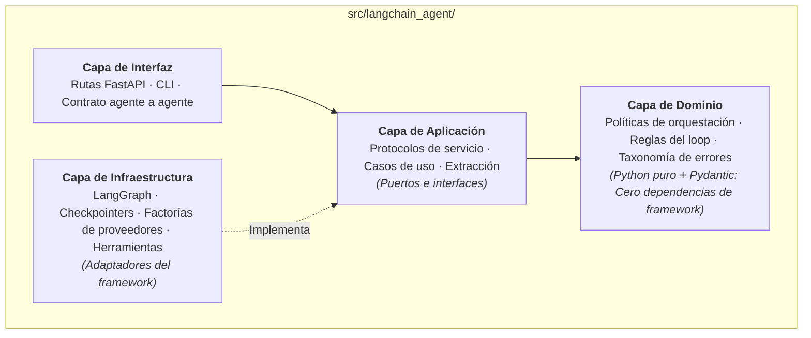

# ml-langchain-agent: Runtime de productos agentic

`ml-langchain-agent` es la implementación de referencia de un **Runtime de Productos Agentic**. Proporciona una plantilla de nivel de producción para equipos que construyen agentes autónomos de IA, redes multi-agente y microservicios con APIs agentic.

Mientras que [`ml-python-base`](../ml-python-base/index.md) gobierna cómo las herramientas de IA programan dentro del repositorio, `ml-langchain-agent` gobierna cómo los desarrolladores construyen productos de software basados en agentes.

---

## 1. El problema arquitectónico que resuelve

Desarrollar productos con agentes suele derivar en una maraña difícil de mantener de prompts en texto plano, llamadas ad-hoc a APIs, acoplamiento al framework y bucles frágiles:

- **Inestabilidad del bucle**: agentes que ciclan infinitamente basados en contadores o devuelven respuestas cortadas cuando el modelo alcanza su límite de tokens.
- **Acoplamiento al framework**: la lógica de negocio importa directamente clases de LangChain o LangGraph, complicando las pruebas unitarias y el cambio de proveedores.
- **Falta de contratos programáticos**: los agentes se diseñan como widgets de chat interactivo en lugar de microservicios direccionables con APIs formales.
- **Ausencia de persistencia**: las conversaciones se pierden al reiniciar el proceso, impidiendo flujos con intervención humana, reanudación de sesiones o bifurcación de estados.

`ml-langchain-agent` resuelve estos retos mediante clean architecture, enrutamiento en grafo guiado por stop-reason, persistencia de conversaciones y contratos de servicio estandarizados.



---

## 2. Capacidades arquitectónicas centrales

### Límites estrictos de Clean Architecture

La base de código exige una separación rigurosa de responsabilidades:

- **Dominio (`domain/`)**: solo biblioteca estándar y Pydantic. Contiene políticas del loop, reglas de escalado y taxonomía de errores. Se prohíben imports de frameworks.
- **Aplicación (`application/`)**: contiene diez definiciones de protocolos (`ports.py`) que definen la superficie completa de contratos.
- **Infraestructura (`infrastructure/`)**: contiene los adaptadores concretos que interactúan con LangChain, LangGraph, bases de datos o la red.

Este límite no es sugerido: `tests/test_architecture_boundaries.py` recorre el Árbol de Sintaxis Abstracta (AST) de Python durante `make check` y hace fallar la compilación si los módulos de dominio o aplicación importan librerías de infraestructura.

### Topología guiada por el Stop-Reason del proveedor

En lugar de depender de contadores arbitrarios de iteraciones, el enrutamiento del grafo se basa en el `stop_reason` estandarizado del proveedor:

```text
START
  │
  ▼
llm_call ── route_after_llm ──[tool_use]────► tools ──► llm_call   (tool loop)
                 │
                 ├──[end_turn]──────────────► reflect ──► END / revisión
                 │
                 └──[max_tokens | refusal]──► escalate ────────────► END
```

El estado `escalate` es terminal por diseño. Una respuesta cortada por `max_tokens` o rechazada por filtros de seguridad nunca se devuelve a los llamadores como una respuesta válida.

### Tres Blueprints iniciales

Los nuevos proyectos instancian uno de tres blueprints pre-probados mediante `make init`:

- **`reflection` (por defecto)**: bucle de herramientas combinado con un crítico automatizado que valida la respuesta antes de finalizar.
- **`tool_loop`**: bucle estándar de ejecución de herramientas sin reflexión.
- **`minimal`**: interacción básica de un solo turno sin herramientas ni reflexión.

Ejecutar `make init NAME=mi_agente TYPE=tool_loop` renombra el paquete, configura la topología elegida y elimina los archivos de blueprints no utilizados.

### Persistencia de conversaciones y bifurcación (Fork)

La persistencia se implementa sobre los checkpointers de LangGraph:

- **Rastreo por hilos**: cada sesión lleva un `thread_id` explícito.
- **Reanudación de estado**: permite pausar la ejecución para revisión humana y continuar después.
- **Bifurcación de estado**: la función `fork()` permite ramificar la ejecución desde un punto anterior para explorar trayectorias alternativas.

### Contrato de servicio agente a agente

El agente expone una interfaz FastAPI estandarizada:

- `GET /health`: liveness, readiness y conectividad con el modelo.
- `GET /capabilities`: declaración legible por máquinas de herramientas, skills y restricciones.
- `POST /invoke`: endpoint estructurado para que otros servicios o agentes despachen tareas.
- `/v1/chat/completions` y `/v1/embeddings`: rutas compatibles con OpenAI para integrarse con Open WebUI.

---

## 3. Relación con el Engineering Harness compartido

`ml-langchain-agent` está construido a su vez sobre el engineering harness de `ml-python-base`:

- Incluye un archivo `.template-version` que rastrea la sincronización con el template base.
- Hereda la capa centralizada de reglas, hooks de pre-commit y gates de CI.
- Sus agentes internos de programación están gobernados por `CLAUDE.md`, `AGENTS.md` y `OPENCODE.md`.

En resumen: **`ml-python-base` gobierna cómo se programa el agente, mientras que `ml-langchain-agent` gobierna cómo se ejecuta el agente en producción.**
