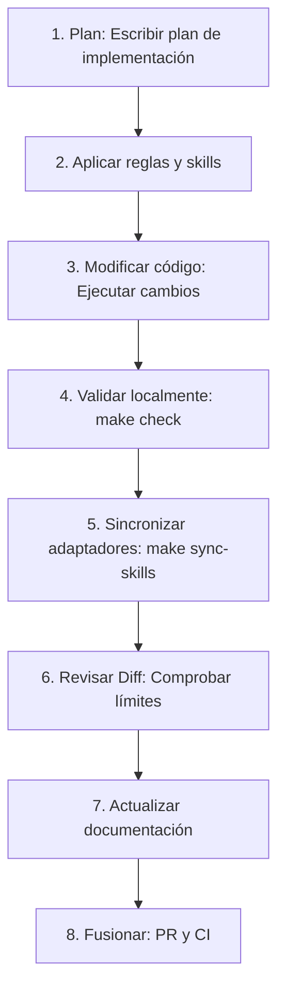

# Ciclo de trabajo del Harness

> [!NOTE]
> **Contenido generado**: Esta página se genera automáticamente a partir del snapshot de la plantilla.
> - **Commit de referencia**: [587ac29](https://github.com/marcosdh1987/ml-python-base/commit/587ac29d30cb50d5c307f41e942c14d3f0bba298) en la rama `main`
> - **Última sincronización**: `2026-06-25T14:51:49.011688Z`
> *Nota: Este es un resumen de estudio e índice. La implementación y gobernanza autoritativas permanecen en el repositorio de origen.*
## Pasos del ciclo de desarrollo

La implementación de referencia impone un ciclo de desarrollo de software altamente estructurado y repetible. Este ciclo garantiza que todas las modificaciones se sometan a una verificación rigurosa antes de fusionarse.

### Desglose de pasos

1. **Planificar**: Nunca escriba código directamente. Elabore primero un `implementation_plan.md`, detallando componentes afectados y comandos de validación.
2. **Aplicar reglas y skills**: Compruebe si una skill interna existente cubre el alcance del cambio (por ejemplo, `create_domain_contract`).
3. **Modificar código**: Realice las modificaciones de código en su directorio local.
4. **Validar localmente**: Ejecute `make check` (Ruff, Bandit, Mypy, Pytest) para asegurar la calidad.
5. **Sincronizar adaptadores**: Si las reglas o skills cambiaron, ejecute `make sync-skills` para actualizar los adaptadores.
6. **Revisar Diff**: Realice una revisión del diff de Git para identificar efectos secundarios no deseados.
7. **Actualizar documentación**: Mantenga `docs/` sincronizado con los cambios de código.
8. **Fusionar**: Envíe una Pull Request. La CI ejecuta `make ci` (tanto el quality gate como el control de sincronización) antes de permitir la fusión.
