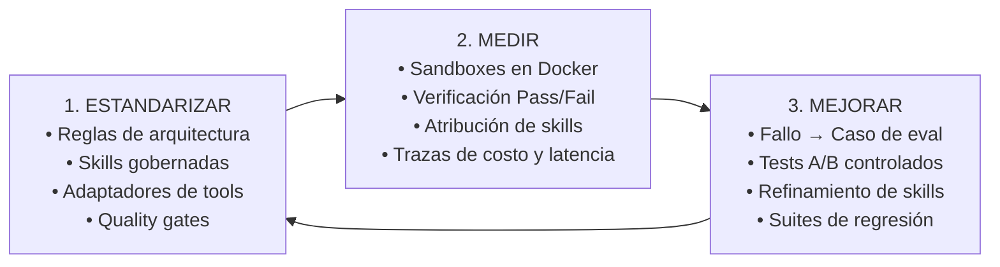
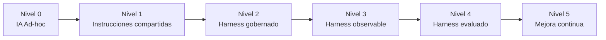
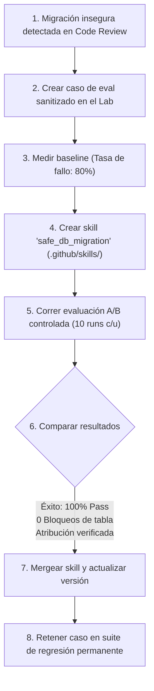
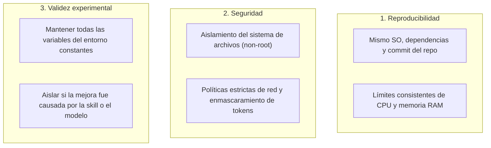

# Agentic SDLC para equipos de ingeniería

!!! info "Sobre esta página"
    **Qué vas a aprender:** cómo pasar del uso individual de herramientas de IA a un Engineering Harness gobernado.

    **Para quién:** developers, tech leads, engineering managers y AI champions.

    **Leela cuando:** quieras un plan de adopción que termine en una base de repositorio funcional, no solo en un marco conceptual.

**Del uso individual de herramientas de IA a un sistema de desarrollo asistido por agentes, medible y en mejora continua**

*Tiempo estimado de lectura: ~10 minutos*

---

## Resumen ejecutivo

Prácticamente todas las organizaciones de software han adoptado asistentes de programación con IA. Los desarrolladores utilizan herramientas como Claude Code, GitHub Copilot, Codex, Cursor o OpenCode para generar código base, refactorizar funciones o diseñar componentes.

Sin embargo, la mayoría de las empresas permanecen atrapadas en un **paradigma ad-hoc**:
- El conocimiento sobre cómo guiar a los modelos queda atrapado en sesiones de chat individuales o en mensajes dispersos de Slack.
- Los agentes cometen violaciones arquitectónicas sutiles, eluden patrones de seguridad o generan migraciones de bases de datos inseguras que pasan desapercibidas en revisiones iniciales.
- Los equipos evalúan la eficacia de la IA a partir de "sensaciones subjetivas" y no con benchmarks reproducibles.
- Cuando un agente comete un error, un ingeniero lo arregla manualmente, pero el sistema no aprende nada: el mismo fallo volverá a ocurrir la semana siguiente.

**Harness Engineering** aporta la metodología para superar este estancamiento. Transforma la asistencia de IA en un **Agentic Software Development Lifecycle (SDLC)** versionado, observable, evaluable y en mejora continua.

---

## El motor rector: Estandarizar → Medir → Mejorar

Para construir un sistema de ingeniería sólido alrededor de agentes autónomos, los equipos siguen tres fases disciplinadas:



1. **Estandarizar**: Definir y versionar los estándares de ingeniería en la configuración del repositorio (`.github/rules/`, `.github/skills/`). Garantizar que todas las herramientas (Claude, Codex, OpenCode, Copilot) lean la misma fuente de verdad mediante adaptadores automatizados.
2. **Medir**: Dejar de confiar en impresiones. Ejecutar los agentes frente a casos de prueba reproducibles en entornos sandbox aislados. Medir resultados objetivos de tests, adherencia al SDLC, uso exacto de skills, pasos y consumo de tokens.
3. **Mejorar**: Cerrar el ciclo. Cuando un agente falle, tratar el error como un bug de software tradicional: reproducirlo en un caso de evaluación, mejorar el harness (reglas, skills o gates de validación), verificar la mejora con un test A/B controlado e incorporar el caso a la suite de regresión permanente.

---

## Modelo de madurez del Agentic SDLC

¿En qué nivel se encuentra tu organización hoy?



| Nivel | Nombre | Características |
|---|---|---|
| **Nivel 0** | **IA Ad-hoc** | Cada desarrollador utiliza herramientas de IA por su cuenta, sin reglas comunes, skills compartidas ni validación automatizada. |
| **Nivel 1** | **Instrucciones compartidas** | El equipo comparte prompts y archivos `AGENTS.md` o `CLAUDE.md` básicos, pero la sincronización y los gates de calidad son manuales. |
| **Nivel 2** | **Harness gobernado** | Reglas, skills y adaptadores multi-herramienta versionados en `.github/`; CI valida el drift y ejecuta checks de pre-commit. |
| **Nivel 3** | **Harness observable** | Telemetría que captura logs de pasos, costo de tokens, latencia, herramientas ejecutadas y atribución estructurada (skills usadas vs disponibles). |
| **Nivel 4** | **Harness evaluado** | El equipo mantiene una suite interna de evaluación, corriendo comparaciones A/B y ablaciones de skills en sandboxes aislados. |
| **Nivel 5** | **Agentic SDLC en mejora continua** | Los incidentes de producción y revisiones de PR alimentan automáticamente nuevos casos de evaluación, impulsando mejoras medibles del harness y protección contra regresiones. |

*(Nota: Este modelo es una propuesta metodológica desarrollada en esta guía).*

---

## Ejemplo empresarial concreto: Seguridad en migraciones de base de datos

Un reto frecuente en organizaciones de ingeniería: **los coding agents generan migraciones de base de datos inseguras que bloquean tablas en producción.**

### El enfoque tradicional (Ad-Hoc)
1. Un agente genera una migración que altera una tabla de alto tráfico mediante un bloqueo exclusivo.
2. Un Staff Engineer detecta el problema en el code review del PR y explica manualmente por qué es peligroso.
3. El desarrollador reescribe manualmente la migración.
4. Dos semanas más tarde, otro desarrollador solicita al agente agregar una columna en otra tabla y el agente vuelve a generar el mismo patrón inseguro.

### El enfoque de Harness Engineering



1. **Captura**: El equipo sanitiza la migración fallida en un caso de evaluación reproducible.
2. **Baseline**: El caso se ejecuta 10 veces en contenedores Docker aislados sin asistencia especializada. La tasa de fallo es del 80%.
3. **Mejora del harness**: El equipo escribe una skill gobernada (`.github/skills/safe_db_migration.md`) que instruye patrones de zero-downtime (columnas nullable, backfills por lotes, creación de índices en background).
4. **Experimento controlado**: El laboratorio de evaluación ejecuta un trial A/B (*Control* vs *Tratamiento con Skill*).
5. **Validación**: El grupo de tratamiento alcanza el 100% de cumplimiento sin bloqueos de tabla y con atribución confirmada de la skill.
6. **Conocimiento acumulativo**: La skill se mergea al repositorio compartido y el caso de evaluación se convierte en un test de regresión permanente. La organización no vuelve a sufrir ese fallo.

---

## Por qué el Sandboxing y los entornos controlados son indispensables

Un agente de programación no es un simple generador de texto. Puede:
- Leer y reescribir archivos en el repositorio.
- Ejecutar comandos de terminal y compilar código.
- Ejecutar suites de pruebas y linters.
- Instalar paquetes externos.
- Interactuar con el estado del sistema y la red.

Evaluar un agente exige controlar su **entorno de ejecución**. Existen tres razones ingenieriles diferenciadas:



### Evidencia de la industria
- **SWE-bench**: Utiliza entornos Docker aislados por instancia de problema para evaluar patches frente a suites de pruebas estandarizadas sin contaminación cruzada.
- **OpenAI ("Running Codex safely at OpenAI")**: Documenta el uso de sandboxing a nivel de sistema operativo (Seatbelt, Landlock), políticas de permisos y telemetría con OpenTelemetry para contener la ejecución autónoma.
- **Anthropic ("Demystifying evals for AI agents" y "Quantifying infrastructure noise in agentic coding evals")**: Demuestra empíricamente que variaciones en recursos de CPU/RAM pueden generar oscilaciones de hasta **6 puntos porcentuales** en benchmarks de código, evidenciando que el entorno es una variable experimental activa que debe controlarse estrictamente.

---

## Observabilidad vs Evaluación vs Experimentación

Muchos equipos instalan una plataforma de observabilidad de LLMs y asumen que ya cuentan con un sistema de evaluación. Son tres disciplinas distintas:

```
Observabilidad:   "¿Qué ocurrió?"                         (Trazas, tokens, pasos, errores)
Evaluación:      "¿El resultado fue correcto y de calidad?" (Tests aprobados, rúbrica, adherencia)
Experimentación: "¿Este cambio específico causó la mejora?" (Control vs Tratamiento, A/B)
```

- La **observabilidad** proporciona la transcripción de la ejecución.
- La **evaluación** aplica validadores objetivos y jueces para puntuar el resultado.
- La **experimentación** controla variables para demostrar causalidad: que una nueva regla o skill fue la causa real del aumento en la tasa de éxito.

---

## Construcción de una suite interna de evaluación

Si bien los benchmarks públicos como SWE-bench aportan referencias generales, el mayor valor estratégico para una organización reside en sus **suites internas de evaluación** que reflejan su arquitectura propietaria:

```
Fuentes de casos de evaluación interna:
├── Separación de capas de arquitectura (Dominio vs Infraestructura)
├── Migraciones de base de datos sin downtime
├── Patrones de concurrencia y seguridad de hilos
├── Convenciones de Infraestructura como Código (Terraform)
├── Políticas de autenticación y autorización interna
└── Incidentes de producción sanitizados
```

Con el tiempo, esta suite se transforma en un **benchmark organizacional para el desarrollo asistido por IA**, garantizando que los agentes respeten las normas de la empresa conforme los modelos evolucionan.

---

## Plan de adopción en 4 pasos

1. **Empezar desde una base de Engineering Harness**: Para un developer o equipo de software, cloná [`ml-python-base`](https://github.com/marcosdh1987/ml-python-base) y usalo como punto de inicio avanzado. Provee reglas gobernadas, skills, adapters, gates de calidad y el ciclo de ingeniería común. Para una adopción conceptual, un manager puede empezar por los mismos principios sin operar el repositorio.
2. **Adaptar la base al equipo**: Mantené la fuente de verdad compartida en `.github/`, entendé las skills por [familia e intención](../use/skills-por-intencion.md) y agregá solo la guía de dominio que el equipo pueda mantener. Usá [Crear tu primera skill](create-your-first-skill.md) para agregar una capacidad y [Usar y modificar skills](use-and-modify-skills.md) para cambiar una existente.
3. **Medir trabajo representativo**: Configurá sandboxes de ejecución cuando haga falta y capturá los primeros casos internos a partir de fallos, incidentes o fricciones recientes de code review. Usá [Harness Lab](../reference-implementation/ai-agentic-harness-lab/index.md) cuando corresponda una comparación controlada.
4. **Establecer el ciclo de mejora**: Cuando un agente falle, generá una propuesta, mejorá la regla o skill, medí el impacto, revisá la [proyección de adapters](../reference-implementation/ml-python-base/adapters.md) e incorporá el caso a [regresión](../evaluation/regression-suites.md).

!!! tip "Punto de inicio para developers"
    Si construís software, cloná [`ml-python-base`](https://github.com/marcosdh1987/ml-python-base) como tu workspace gobernado inicial:

    ```bash
    git clone https://github.com/marcosdh1987/ml-python-base.git
    cd ml-python-base
    make check
    ```

    Después leé [Skills por intención](../use/skills-por-intencion.md) para la ruta corta, [Skills gobernadas](../reference-implementation/ml-python-base/skills.md) para el inventario completo y [Diseño de skills](../patterns/skill-design.md) antes de crear o cambiar una skill. La implementación autoritativa permanece en el repositorio clonado.

---

## Implementaciones de referencia

Esta guía se respalda en las referencias de ingeniería más relevantes para este camino:

- **[`ml-python-base`](https://github.com/marcosdh1987/ml-python-base)**: Implementación de referencia de un **Harness gobernado** (reglas centralizadas, sincronización de skills, adaptadores multi-herramienta, gates de CI).
- **[`ai-agentic-harness-lab`](https://github.com/marcosdh1987/ai-agentic-harness-lab)**: Implementación de referencia de una **Plataforma de evaluación y mejora continua** (ejecución en Docker, atribución, auditorías con LLM, generación de propuestas sanitizadas).

---

### Profundizar
- **[¿Qué es Harness Engineering?](what-is-harness-engineering.md)**
- **[Modelo de madurez del Agentic SDLC](../adoption/maturity-model.md)**
- **[Entornos controlados y Sandboxing](../evaluation/controlled-environments-sandboxing.md)**
- **[Construir una suite interna de evaluación](../adoption/internal-evaluation-suite.md)**
