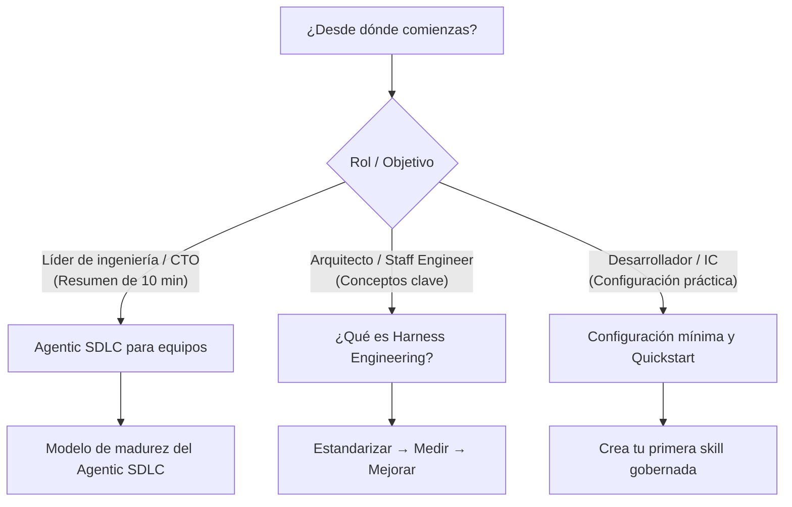

# Empieza aquí

Bienvenido a la **Guía de Harness Engineering**. Esta sección está diseñada para orientarte rápidamente en los conceptos fundamentales, la metodología rectora y la configuración práctica.

---

## Rutas recomendadas

### 1. Para líderes de ingeniería y arquitectos
- **[Agentic SDLC para equipos de ingeniería](agentic-sdlc-for-teams.md)**: Resumen ejecutivo y técnico de 10 minutos que explica el problema, la progresión de madurez, el caso de estudio de migraciones de bases de datos y la metodología de ciclo cerrado.
- **[¿Qué es Harness Engineering?](what-is-harness-engineering.md)**: Fundamentos conceptuales y la arquitectura del Harness Stack.
- **[Estandarizar → Medir → Mejorar](standardize-measure-improve.md)**: Análisis detallado del ciclo de mejora continua en tres fases.

### 2. Para desarrolladores y practitioners
- **[Configuración mínima](minimal-setup.md)**: Instrucciones paso a paso para configurar tu primer repositorio gobernado.
- **[Fundamentos de Claude Code](claude-code-basics.md)**: Mecánicas del CLI, `CLAUDE.md` y patrones de comandos personalizados.
- **[Crea tu primera skill](create-your-first-skill.md)**: Construcción de skills estructuradas y deterministas con validación de entradas.
- **[El template de Company Brain](company-brain-template.md)**: Estructuración de bases de conocimiento organizacionales para recuperación multi-agente.
- **[Adopción en un proyecto existente](adopt-existing-project.md)**: Cómo incorporar un harness en un repositorio legacy existente.

### 3. Aprendizaje estructurado
- **[Ruta de aprendizaje](../learning-path.md)**: Secuencias de estudio específicas según tu rol (desarrollador individual, tech lead o platform engineer).
