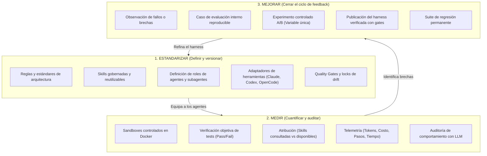
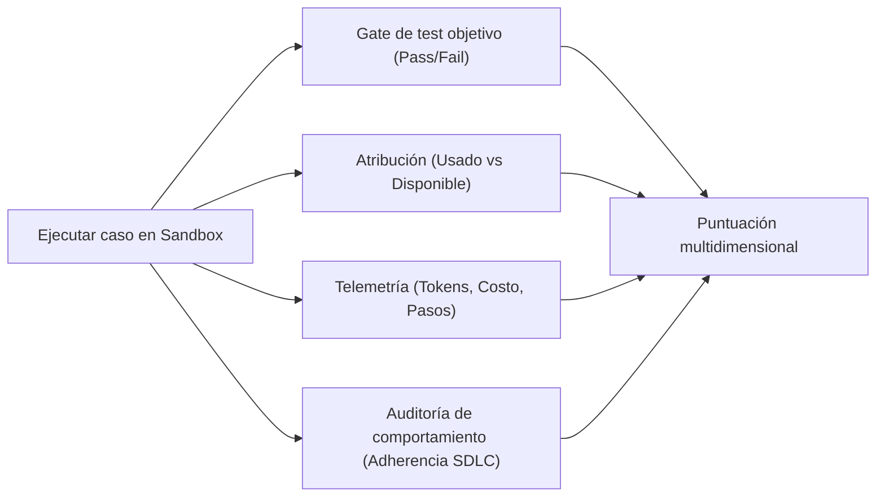

# Estandarizar → Medir → Mejorar

!!! info "Sobre esta página"
    **Qué vas a aprender:** cómo aplica el ciclo de mejora a ingeniería y knowledge work.

    **Para quién:** todos, especialmente managers, tech leads, AI champions y Harness Engineers.

    **Leela cuando:** quieras convertir aprendizajes recurrentes en una práctica operativa estable.

Casi siempre empieza con un hilo de Slack. Alguien dice que el agente "empeoró esta semana"; otro jura que la skill nueva de planificación "hace todo más lento"; un tercero pega una transcripción brillante como prueba de que está todo bien. Tres opiniones, cero mediciones, sobre un sistema del que todo el equipo depende a diario. El ciclo de abajo es la salida: no más disciplina en las discusiones, sino un método que vuelve innecesarias las discusiones.

El hilo conductor de Harness Engineering es el ciclo de ingeniería continua:

$$\mathbf{ESTANDARIZAR} \longrightarrow \mathbf{MEDIR} \longrightarrow \mathbf{MEJORAR}$$

Esta metodología permite a un equipo de ingeniería gestionar, verificar y evolucionar de forma sistemática su sistema de desarrollo asistido por agentes.

---



---

## 1. ESTANDARIZAR: Definir y versionar la superficie de trabajo del agente

Antes de poder evaluar o mejorar a los agentes de IA, debemos establecer una definición clara y versionada en Git de cómo esperamos que operen dentro del repositorio.

### ¿Qué se estandariza?
- **Reglas de ingeniería**: Límites explícitos de arquitectura en capas (Dominio, Aplicación, Infraestructura), convenciones de importaciones absolutas, estándares de tipado estricto y antipatrones prohibidos.
- **Skills gobernadas**: Documentos Markdown ejecutables y estructurados (`.github/skills/`) que guían al agente en procedimientos de varios pasos (ej. debugging sistemático, generación de pruebas end-to-end, migraciones seguras de bases de datos).
- **Roles de agentes y subagentes**: Roles especializados (*Planner*, *Implementer*, *Reviewer*, *Tester*) con contratos de delegación y políticas de revisión bien delimitados.
- **Adaptadores multi-herramienta**: Motores de sincronización automatizados que proyectan las reglas centrales de `.github/` a los formatos nativos de cada herramienta (`CLAUDE.md`, `AGENTS.md`, `OPENCODE.md`, `GEMINI.md`, `.github/copilot-instructions.md`).
- **Quality Gates y control de drift**: Hooks de pre-commit, verificaciones de CI y comprobaciones de lockfiles (`make check`, `make check-sync`) que fallan de inmediato ante cualquier modificación no comprometida o violación de reglas.

> [!NOTE]
> **Implementación de referencia**: [`marcosdh1987/ml-python-base`](https://github.com/marcosdh1987/ml-python-base) funciona como implementación de referencia pública de esta capa gobernada, mostrando reglas centralizadas, sincronización de skills en Python y gates de CI de solo lectura.

---

## 2. MEDIR: Reemplazar percepciones por evidencia reproducible

En muchas organizaciones, las herramientas de IA se evalúan por "intuición": un desarrollador prueba una tarea, observa si funcionó o falló y comparte una opinión subjetiva en Slack. Este enfoque no es viable para la ingeniería de software profesional.

Harness Engineering reemplaza la percepción subjetiva por una **medición multidimensional y reproducible** en entornos aislados:



### ¿Qué medimos?
1. **Corrección objetiva**: ¿El patch del agente resolvió el problema y pasó todas las pruebas unitarias y de integración? (Si los tests objetivos fallan, las puntuaciones subjetivas se limitan a un valor mínimo).
2. **Adherencia al SDLC**: ¿El agente siguió las prácticas de ingeniería requeridas (ej. elaborar un plan previo, correr pruebas locales, verificar regresiones) en lugar de editar código a ciegas?
3. **Atribución estructurada**: ¿Qué reglas gobernadas, archivos de documentación y skills fueron efectivamente consultados por el agente durante su ejecución multi-paso?
4. **Métricas de eficiencia**: Cantidad de pasos, consumo de tokens, costo económico y tiempo de respuesta (latencia).
5. **Integridad de comportamiento**: Auditorías mediante LLM para detectar bloqueos en bucles de comandos, flags inexistentes o llamadas erráticas a herramientas.


!!! tip "El instrumento honesto"
    La medición solo es confiable si el instrumento es honesto sobre qué *es* cada número. Cuatro reglas que cuestan poco y cambian todo:

    1. **Etiquetar la procedencia**: el exit code de un test (*hecho*), un valor parseado de artefactos (*observación*) y la opinión de un juez LLM (*juicio*) nunca deben verse como el mismo tipo de número.
    2. **"No medido" nunca es cero**: una métrica que no pudo computarse se saltea con razón declarada en lugar de envenenar el agregado.
    3. **Lenguaje prudente en los veredictos**: con pocas repeticiones, decí *exploratorio*; nunca digas *significativo*, un harness a escala de equipo no corre tests de hipótesis.
    4. **Leer la matriz de casos antes que el promedio**: "+8 puntos" puede ser "arregló cuatro, rompió dos".

    La doctrina completa: **[Las tres preguntas (Modos de evaluación)](../evaluation/the-three-questions.md)**.

### Fuentes de evaluación
Los equipos deben combinar diferentes orígenes para sus casos de prueba:
- **Benchmarks públicos**: SWE-bench / SWE-bench Lite para comparar capacidades generales de resolución de bugs.
- **Casos sintéticos diseñados**: Tareas preparadas para evaluar casos extremos (concurrencia compleja, refactorización de interfaces públicas).
- **Incidentes reales sanitizados**: Errores reales del equipo, hallazgos de code review y vulnerabilidades de seguridad convertidos en casos reproducibles.
- **Suites de regresión**: Un banco creciente de desafíos internos que todo nuevo harness debe superar.

> [!NOTE]
> **Implementación de referencia**: [`marcosdh1987/ai-agentic-harness-lab`](https://github.com/marcosdh1987/ai-agentic-harness-lab) demuestra la evaluación por ejecuciones en contenedores Docker, análisis automatizado de atribución y scoring multidimensional.

---

## 3. MEJORAR: Cerrar el ciclo de retroalimentación

La medición solo tiene valor si impulsa mejoras concretas. Harness Engineering establece un ciclo sistemático para que el conocimiento de la organización se acumule de forma acumulativa:

```
fallo del agente / observación
       ↓
caso de evaluación reproducible
       ↓
medición de baseline
       ↓
cambio puntual (regla / skill / agente / herramienta / prompt)
       ↓
experimento controlado A/B
       ↓
comparación de evaluación y atribución
       ↓
aprobación o rechazo
       ↓
incorporación a la suite de regresión permanente
```

### Reglas de la mejora controlada
1. **Aislar una variable a la vez**: Modificar un único elemento en cada experimento (ej. comparar *Modelo A + Harness v1* vs *Modelo A + Harness v2*, o *con skill* vs *sin skill*).
2. **Contemplar el comportamiento estocástico**: Los agentes basados en LLMs presentan varianza entre ejecuciones. Se deben realizar múltiples corridas por condición para garantizar significancia estadística.
3. **Sanitización determinista**: Eliminar credenciales, endpoints internos y rutas locales al transferir hallazgos de evaluación a repositorios públicos o compartidos.
4. **Protección permanente contra regresiones**: Una vez resuelta una debilidad, el caso permanece en la suite de regresión para asegurar que futuras actualizaciones de modelos o prompts no reintroduzcan el problema.

---

## Cuadro comparativo

| Dimensión | Programación con IA Ad-Hoc | Harness Gobernado | Agentic SDLC Evaluado y Mejorado |
|---|---|---|---|
| **Entrega de instrucciones** | Prompts manuales en chat | Reglas y skills centralizadas en `.github/` | Conjunto de skills versionadas, dinámicas y ablacionables |
| **Adaptación a herramientas** | Copiar y pegar entre herramientas | Adaptadores multi-CLI sincronizados | Generación determinista de adaptadores |
| **Verificación de calidad** | Inspección visual humana | Quality gates automatizados en CI | Suites de prueba en sandboxes con múltiples evaluadores |
| **Método de evaluación** | Percepción anecdótica del desarrollador | Pruebas unitarias pre-merge | Benchmarks A/B multi-corrida y atribución estructurada |
| **Gestión de fallos** | Modificación del prompt en el chat | Fix directo en el repositorio | Caso incorporado a suite de regresión permanente |
| **Aprendizaje organizacional** | Efímero (se pierde en Slack) | Documentación estática | Activo de evaluación acumulativo |

---

### Próximos pasos
- Consulta el **[Modelo de madurez del Agentic SDLC](../adoption/maturity-model.md)** para diagnosticar el estado actual de tu equipo.
- Aprende a **[Construir una suite de evaluación interna](../adoption/internal-evaluation-suite.md)** basada en flujos reales.
- Explora los detalles de **[Entornos controlados y Sandboxing](../evaluation/controlled-environments-sandboxing.md)**.
