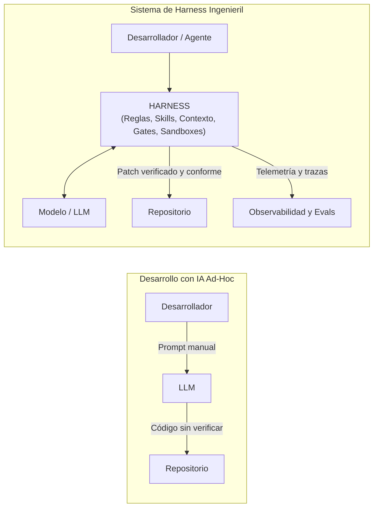
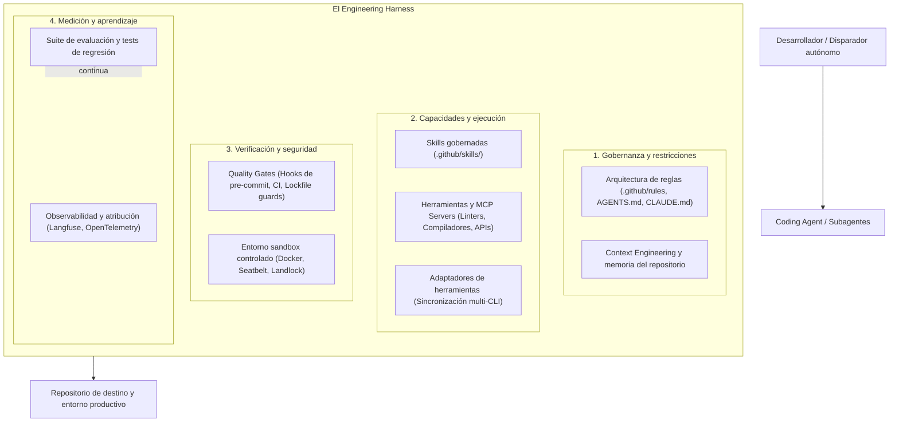
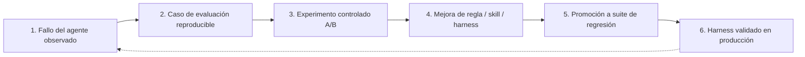

# ¿Qué es Harness Engineering?

**Harness Engineering** es la disciplina de ingeniería enfocada en diseñar, gobernar, observar, evaluar y mejorar de forma continua el sistema integral alrededor de los agentes de inteligencia artificial aplicados al desarrollo de software.

En lugar de concebir la asistencia de IA simplemente como una sesión de chat efímera o una colección de prompts aislados, Harness Engineering trata el entorno de ejecución del agente, sus reglas de comportamiento, su memoria contextual, sus herramientas, sus sandboxes de ejecución, sus gates de calidad y sus suites de evaluación como un producto de software unificado y versionado en Git.

---

## Más allá del "Vibe Coding" y los prompts individuales

En las primeras etapas de adopción, los desarrolladores suelen interactuar con los modelos mediante autocompleción de líneas o prompts manuales ("vibe coding"). Si bien esto acelera la creación rápida de prototipos individuales, no escala en una organización de ingeniería:

### Limitaciones de los prompts aislados
1. **Pérdida de contexto**: Las instrucciones ingresadas manualmente en un chat se olvidan en cuanto se cierra la sesión.
2. **Falta de límites en herramientas**: Un agente sin restricciones puede ejecutar comandos peligrosos en terminal, sobreescribir archivos críticos o instalar dependencias incompatibles.
3. **Falta de verificabilidad**: Un prompt no puede garantizar que el código generado compile, pase las pruebas unitarias, respete el tipado estricto o mantenga los límites arquitectónicos en capas.
4. **Fragmentación de herramientas**: Distintos ingenieros utilizan diferentes herramientas de IA (Claude Code, GitHub Copilot, Codex, OpenCode, Antigravity) con reglas divergentes y sin sincronización.

---

## El Harness Stack

Un harness de desarrollo completo se sitúa entre el modelo de razonamiento y el repositorio/entorno de ejecución. Consta de múltiples capas coordinadas:

### Componentes del Harness Stack

| Componente | Responsabilidad | Ejemplo en la implementación de referencia |
|---|---|---|
| **Reglas y restricciones** | Define capas de arquitectura, estándares de código, límites de dominio y patrones prohibidos. | `.github/standards.md`, `.github/architecture.md` |
| **Context Engineering** | Curación de memoria del proyecto, contratos de dominio e índices optimizados para el presupuesto de tokens. | Verificación de ventana de contexto, esquemas de dominio |
| **Skills gobernadas** | Capacidades modulares y de múltiples pasos con validación estricta de entradas y flujos deterministas. | `.github/skills/systematic_debugging.md`, `generate_e2e_tests.md` |
| **Acceso a herramientas y MCP** | Interfaz controlada para leer archivos, modificar ASTs, ejecutar pruebas o consultar APIs internas. | Servidores MCP nativos, permisos de Read/Edit/Bash |
| **Adaptadores multi-herramienta** | Genera configuraciones nativas de cada CLI a partir de una única capa centralizada de reglas. | `CLAUDE.md`, `AGENTS.md`, `OPENCODE.md`, `GEMINI.md` |
| **Quality Gates** | Verificaciones automatizadas de solo lectura que bloquean cambios no conformes antes del merge. | `make check`, detección de drift en `uv.lock`, hooks de Git |
| **Sandboxes controlados** | Entornos de ejecución aislados que evitan efectos colaterales y aseguran reproducibilidad. | Un contenedor Docker por run, usuario no-root, políticas de red |
| **Observabilidad y atribución** | Telemetría que captura pasos, latencia, costo en tokens y uso exacto de skills. | Logs por pasos, trazas en Langfuse, atribución usado vs disponible |
| **Suites de evaluación** | Casos reproducibles que miden si los cambios del agente resuelven tareas reales sin introducir regresiones. | Casos personalizados en `ai-agentic-harness-lab`, lanes SWE-bench |

---

## El ciclo de mejora continua

Harness Engineering no es una configuración estática, sino una **práctica de mejora continua**. Cuando un agente comete un error en desarrollo o genera un patrón inseguro:

1. El fallo se captura y sanitiza en un **caso de evaluación interno**.
2. Se mide un baseline en un sandbox aislado.
3. Se modifica el harness (refinando una skill, actualizando una regla o incorporando un gate de validación).
4. Un experimento A/B evalúa si el cambio corrigió el problema a lo largo de múltiples ejecuciones.
5. El caso se incorpora de forma permanente a la **suite de regresión** del equipo, garantizando que futuras actualizaciones de modelos o reglas no reintroduzcan el error.

---

## Resumen

Harness Engineering permite a las organizaciones dejar de preguntarse *"¿Qué tan bueno es este modelo de IA para programar?"* y pasar a responder:

> **"¿Con qué eficacia nuestro sistema de ingeniería guía, restringe, verifica, evalúa y mejora de forma continua el trabajo autónomo de los coding agents?"**

---

### Recursos relacionados
- **[Estandarizar → Medir → Mejorar](standardize-measure-improve.md)**: La metodología paso a paso.
- **[Agentic SDLC para equipos](agentic-sdlc-for-teams.md)**: Resumen ejecutivo de 10 minutos para líderes técnicos.
- **[Modelo de madurez del Agentic SDLC](../adoption/maturity-model.md)**: Evaluación de la madurez organizacional.
