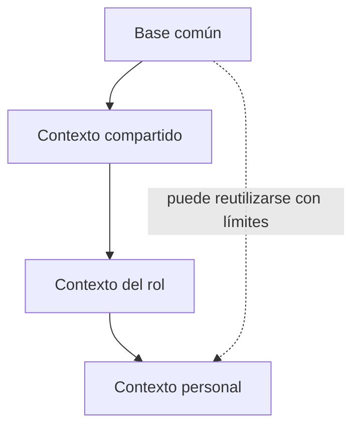

# Company Brain, Role Brain y Second Brain

!!! info "Sobre esta página"
    **Qué vas a aprender:** cómo distinguir alcances de conocimiento, ownership y límites de privacidad.

    **Para quién:** managers, PMs, AI champions, knowledge workers y equipos que diseñan contexto compartido.

    **Leela cuando:** estés decidiendo qué conocimiento compartir, especializar o mantener personal.

Estos nombres describen alcances de contexto. No exigen cuatro repositorios, cuatro productos ni una única jerarquía física.

| Concepto | Alcance | Ownership | Contenido habitual |
| --- | --- | --- | --- |
| Company Brain | Conocimiento organizacional | Organización | Políticas, decisiones, sistemas, convenciones y fuentes confiables |
| Team Brain | Contexto de equipo | Equipo | Forma de trabajo, objetivos actuales, decisiones locales y runbooks |
| Role Brain | Contexto funcional | Rol o función | Responsabilidades, workflows recurrentes y conocimiento específico |
| Second Brain | Contexto personal | Individuo | Notas, proyectos, fuentes, preferencias, decisiones y aprendizajes |

## Un modelo de composición

Las capas pueden componerse lógicamente. No tienen que implementarse como repositorios anidados. La búsqueda, el retrieval, los conectores, las skills, las reglas, la provenance y la seguridad pueden compartirse, mientras los datos, el acceso, la retención y los owners permanecen diferenciados.

## Adopción sin infraestructura

La adopción conceptual puede comenzar con un registro de fuentes, un decision log, reglas de ownership y un hábito de revisión. Una implementación de referencia resulta útil cuando un equipo necesita automatización repetible, conectores, validación o acceso de agentes.

!!! warning "Privacidad y confianza"
    El conocimiento organizacional compartido, el conocimiento personal privado, la telemetría operacional y la gestión de performance son categorías distintas. Un Second Brain no se convierte automáticamente en un activo organizacional. La telemetría individual tampoco es automáticamente una señal de performance.

Para el template técnico, consultá [company-brain-template](../reference-implementation/company-brain-template/index.md).
